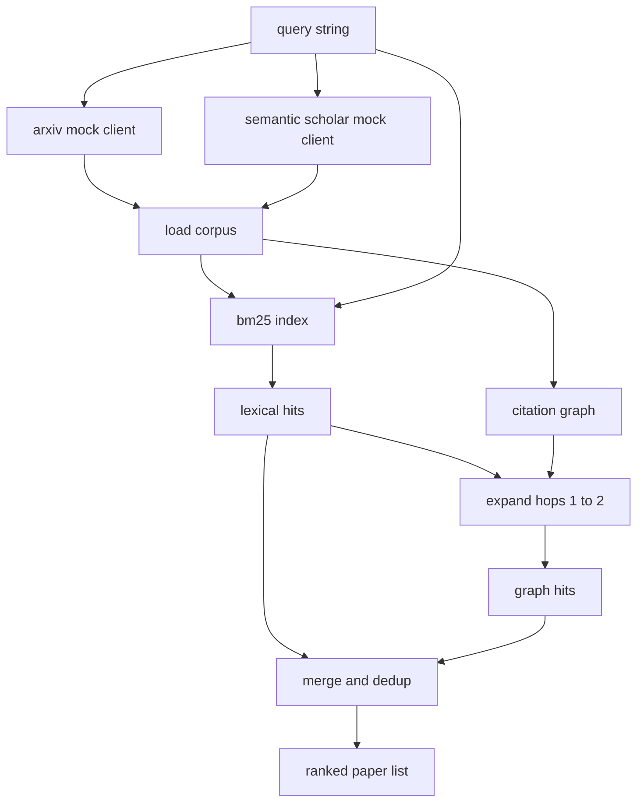

# 文献检索

> 一个假设是廉价的。知道是否有人已经证明了它才是昂贵的部分。构建检索层，在运行器启动沙盒之前回答这个问题。

**Type:** Build
**Languages:** Python
**Prerequisites:** Phase 19 Track A lessons 20-29
**Time:** ~90 minutes

## Learning Objectives
- 用循环下游将读取的字段建模一个小型论文记录。
- 仅用标准库数据结构在摘要上构建 BM25 索引。
- 遍历引用图以找到词汇搜索遗漏的论文。
- 通过稳定的论文 ID 对词汇遍历和图遍历的结果去重。
- 将两个模拟外部 API 包装在单个客户端后面，以便在真实端点到位时，上游调用点保持不变。

## 为什么需要两次检索遍历

对摘要的关键词搜索返回与查询共享词汇的论文。这覆盖了大部分表面。但遗漏了两种情况。第一种是基础论文使用不同的词汇；例如查询 "sparse attention" 会遗漏标题为 "block selection in transformer routing" 的论文。第二种是相关论文是引用已知锚点的后作；找到锚点并向前遍历比暴力扫描摘要池更高效。

本课构建两种遍历。BM25 在摘要上捕获词汇命中。引用图遍历将种子集向前和向后扩展一到两跳。并集按论文 ID 去重，并按一个小的综合分数排名。

## 论文的形状

```text
Paper
  id          : str           (stable identifier, "p001" for the mock corpus)
  title       : str
  abstract    : str
  year        : int
  authors     : list[str]
  references  : list[str]     (paper ids this paper cites)
  citations   : list[str]     (paper ids that cite this paper)
  source      : str           (which mock api supplied it, "arxiv" or "s2")
```

references 和 citations 字段构成有向引用图。两个模拟 API 返回重叠但不完全相同的字段，因此语料库加载器按 `id` 对它们进行合并。

## 架构



检索客户端拥有两种遍历和合并。调用者传递一个查询，返回一个排名列表，其中每个条目携带解释排名的每论文分数字段（`bm25_score`、`graph_distance`、`recency_score`、`final_score`）。

## 从零构建 BM25

实现是标准 Okapi BM25，使用默认参数 `k1=1.5`、`b=0.75`。索引是两个字典：`term -> doc_frequency` 和 `term -> list of (doc_id, term_count)`。文档长度是摘要的 token 计数。平均文档长度在构建索引时计算一次。对查询评分是对查询词的 `idf * tf_norm` 求和，其中 `tf_norm` 是标准的 BM25 长度归一化词频。

分词器是 `lower` 然后在非字母数字字符上分割。没有词干提取。生产系统会替换为一个小型词干提取器。接口保持不变。

```text
idf(t)      = log((N - df + 0.5) / (df + 0.5) + 1.0)
tf_norm(t)  = (f * (k1 + 1)) / (f + k1 * (1 - b + b * dl / avgdl))
score(d, q) = sum over t in q of idf(t) * tf_norm(t)
```

## 引用图遍历

图从语料库中构建一次。正向边从论文到其参考文献。反向边从论文到其引用。遍历是一个广度优先搜索，以前几个 BM25 命中的种子开始，上限为两跳。

两跳是一个刻意的上限。一跳太浅；代理通常需要直接的祖先或后代。三跳在连通的图上会膨胀结果大小并且往往偏离主题。本课将跳数限制暴露为一个配置旋钮，以便下游循环可以收紧它。

## 去重和排名

两次遍历返回重叠的集合。合并按论文 ID 进行。对于每篇论文，最终分数是加权混合。

```text
final_score = w_bm25 * bm25_score_norm
            + w_graph * graph_score
            + w_recency * recency_score
```

`bm25_score_norm` 是 BM25 分数除以合并集中最大 BM25 分数（因此该字段在零到一之间）。`graph_score` 对直接词汇命中为 1，对一跳为 `0.6`，对两跳为 `0.3`，否则为零。`recency_score` 是从语料库最小年份的零到最大年份的一的线性递增。

默认权重为 `0.5`、`0.3`、`0.2`。权重是可配置的；一个陈旧的主题可能会调低新近度，而快速发展的主题会提高它。

## 模拟语料库

语料库是一百篇论文，由 `build_corpus()` 生成。每篇论文在五个主题之一上有手写的标题和摘要：注意力稀疏性、检索增强、低秩适配器、数据集蒸馏和评估工具。引用和参考文献被连接起来，使每个主题形成一个连通的子图，并带有一些跨主题的边。

两个模拟 API 客户端（`ArxivMockClient`、`SemanticScholarMockClient`）从相同的语料库中读取，但暴露不同的字段。Arxiv 返回 title、abstract、year、authors。Semantic Scholar 添加 references 和 citations。检索客户端按 id 进行合并；跨客户端字段不一致的处理延后到后续课程。

## 第五十二课和第五十三课读取什么

第五十二课的运行器读取 `paper.id`、`paper.title` 和摘要的前三句作为实验的上下文。第五十三课的评估器读取 `paper.year` 和 `paper.references` 以将基线归因于特定论文。

检索客户端返回一个 `RetrievalResult`，包含排名列表和每个查询的指标：命中计数、平均分数、最高分、总墙钟时间。运行器记录这些，以便下游的可观测性分析可以绘制随时间变化的质量曲线。

## 如何阅读代码

`code/main.py` defines `Paper`, `ArxivMockClient`, `SemanticScholarMockClient`, `BM25Index`, `CitationGraph`, `RetrievalClient`, and a deterministic demo. The mock clients and the corpus are in the same file so the lesson stays portable. The BM25 implementation is one class, sixty lines. The graph traversal is one method.

`code/tests/test_retrieval.py` covers the lexical path, the graph path, the merge, the dedup, and the empty query.

## 这一课在整体中的位置

第五十课产生一个假设。第五十一课检索文献以查看该假设是否已经被解决。第五十二课运行实验（如果未被解决）。第五十三课读取检索结果和实验指标以编写裁决。检索客户端是四个阶段中最便宜的，在编排器中首先运行。
