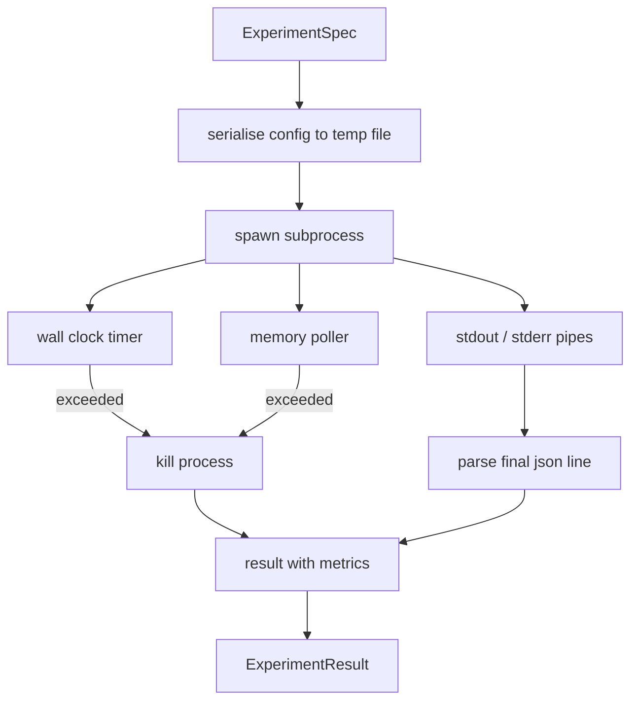

# 实验运行器

> 循环只有在测量诚实时才是诚实的。构建运行器，接受规范，在沙盒化的子进程中执行，并输出一个评估器可以信任的 JSON 指标块。

**Type:** Build
**Languages:** Python
**Prerequisites:** Phase 19 Track A lessons 20-29
**Time:** ~90 minutes

## Learning Objectives
- 将实验编码为运行器可以序列化到子进程的类型化规范。
- 启动带有硬墙钟超时和软内存上限的子进程，并将两者作为终止条件暴露。
- 将 stdout、stderr 和结构化指标块捕获到一个结果记录中。
- 构建一个消融表，在固定基础规范上每次扫描一个配置旋钮。
- 给定种子保持每个结果确定性，使评估器在不同运行之间看到相同的数字。

## 为什么用子进程

研究循环运行不受信任的代码。假设来自采样器，实验脚本来自同一条路径；将在进程内将其中任何一个视为安全是自找崩溃，导致编排器宕机。子进程是语言提供的最简单的隔离：单独的进程，独立的地址空间，父端的一个信号处理句柄。

这里的运行器没有实现完整的沙盒。没有 cgroup、没有 seccomp 过滤器、没有命名空间重映射。它所具有的是墙钟超时、内存增长的轮询循环，以及在任一限制上终止进程的杀死路径。这是每个更复杂的沙盒所扩展的运行时合约。本课将合约保持得足够小，可以在一次阅读中读完。

## ExperimentSpec 的形状

```text
ExperimentSpec
  spec_id        : str            (stable id, "exp_001")
  hypothesis_id  : int            (link back to the queue from lesson 50)
  script_path    : str            (path to the python script to run)
  config         : dict           (passed to the script as one json arg)
  seed           : int            (deterministic seed for the experiment)
  wall_timeout_s : float          (hard timeout, killed on exceed)
  memory_cap_mb  : int            (soft cap, polled; killed on exceed)
  metric_keys    : list[str]      (which fields the evaluator will read)
```

脚本存在磁盘上；运行器将配置写入一个临时文件路径，脚本读取该文件。脚本期望在 stdout 上打印一行 JSON，其键是 `metric_keys` 的超集。stdout 上的其他任何内容都被捕获但被指标解析器忽略。

## 架构



运行器是一个只有一个主方法的类。轮询器是一个小线程，每次按轮询间隔唤醒，并从 proc 文件系统读取子进程的 `psutil` 等效值（当可用时），在平台不暴露时回退到无操作。

## 为什么是软内存上限

硬内存上限需要 `resource.setrlimit` 并且仅在 POSIX 上可用。本课提供一种可移植的方法：从平台轮询常驻集大小，如果子进程超过上限则杀死它。上限是软的，因为轮询器具有非零间隔；一个进程可能在两次轮询之间超过上限然后回落到以下。运行器记录观察到的最大 RSS，以便评估器可以看到运行接近限制的程度。

在不支持进程检查的系统上，轮询器记录一次性警告并禁用自身。墙钟超时仍然适用。课程测试覆盖了两种路径。

## 捕获 stdout 和 stderr

运行器读取完成时排空的两个管道。stdout 按行扫描；解析为带有所有必需 `metric_keys` 的 JSON 的最后一行被取作指标块。之前的 JSON 行保存在结果中作为 `intermediate_metrics`；评估器可以将这些用于学习曲线。

Stderr 被逐字捕获到结果中。运行器从不为非零退出码引发异常；相反，它将代码记录在结果中。任何非零退出被标记为 `"crash"`，即使脚本打印了指标，因此评估器默认将部分运行视为失败。

## 消融表

```python
def ablate(base: ExperimentSpec, knob: str, values: list[Any]) -> list[ExperimentSpec]:
    ...
```

给定一个基础规范和旋钮名称，辅助函数为每个值返回一个覆盖了 `config[knob]` 的规范。每个规范获得一个派生 `spec_id` (`f"{base.spec_id}_{knob}_{value}"`)。运行器提供 `AblationRunner`，按顺序运行它们并返回按旋钮值索引的 `AblationTable`。

为什么每次一个旋钮。全因子扫描呈指数爆炸并产生评估器无法解释的结果。每次一个旋钮产生评估器可以绘图的干净轴线。本课仅支持通过重复的单旋钮消融来实现多旋钮扫描，由调用者组合。

## 确定性

每个规范携带一个种子。运行器通过配置字典将种子转发给脚本 (`config["__seed"] = spec.seed`)。`code/experiments/` 中的模拟实验脚本遵循种子并在不同运行之间产生相同的指标。第五十三课的评估器依赖这一点；没有确定性，"回退"可能只是一个不同的随机初始化。

## 模拟实验脚本

本课提供一个实验脚本：`code/experiments/sparsity_experiment.py`。它是一个真实的脚本，读取其配置文件，用 numpy 随机路径模拟一个小的训练运行，并打印一个 JSON 指标块。脚本遵循 `sleep_s` 旋钮用于测试超时，以及 `allocate_mb` 旋钮用于测试内存轮询器。

模拟不是在训练真实的东西。它是一个模拟训练循环形状的数值计算：损失曲线、最终困惑度、墙钟时间。本课的重点是运行器，而不是模拟。真实的实验脚本会导入一个模型。

## 结果形状

```text
ExperimentResult
  spec_id              : str
  hypothesis_id        : int
  exit_code            : int
  terminal             : "ok" | "timeout" | "oom" | "crash"
  wall_time_s          : float
  peak_rss_mb          : float | None
  metrics              : dict
  intermediate_metrics : list[dict]
  stdout_tail          : str
  stderr_tail          : str
```

评估器首先读取 `metrics` 和 `terminal`。如果 terminal 是 `"ok"` 之外的任何值，实验算作失败的运行，评估器的裁决是自动的。否则，指标将通过显著性检验。

## 如何阅读代码

`code/main.py` defines `ExperimentSpec`, `ExperimentResult`, `ExperimentRunner`, `AblationRunner`, and a deterministic demo. The subprocess management is one class. The memory poller is a small thread. The ablation helper is a single function.

`code/experiments/sparsity_experiment.py` is the mock experiment used in tests. It reads its config file path from argv and writes a single json metrics line on completion.

`code/tests/test_runner.py` covers the success path, the timeout path, the crash path, the ablation table, and the determinism check across two runs.

## 这一课在整体中的位置

第五十课生成假设。第五十一课过滤掉文献已经解决的内容。第五十二课对剩余的内容运行实验。第五十三课读取结果，运行显著性检验，并编写编排器针对假设 ID 存储的裁决。
