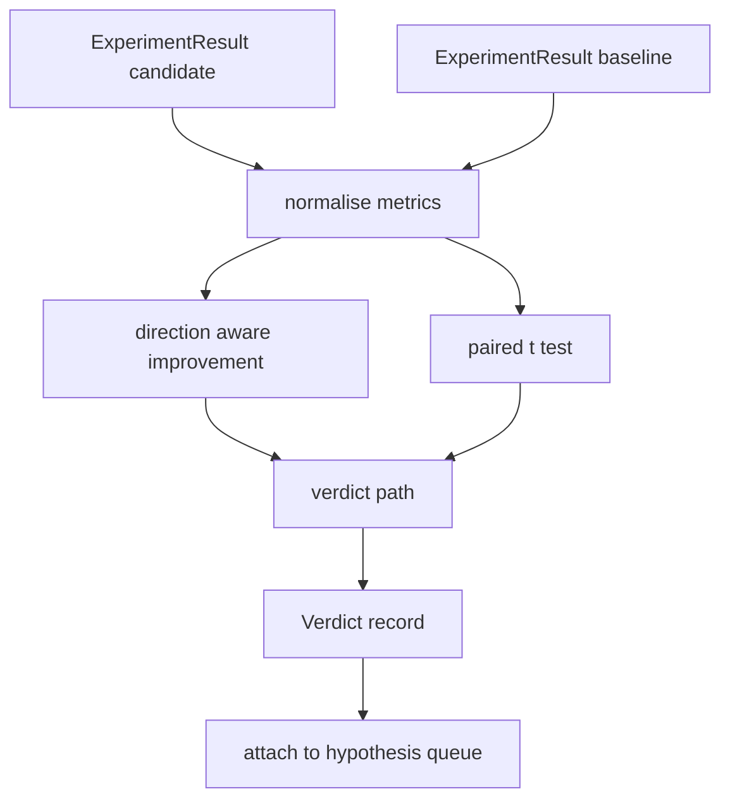

# 结果评估器

> 运行器产生了数字。评估器决定这些数字是改进、回退还是噪音。构建裁决路径，将指标转化为一行结论。

**Type:** Build
**Languages:** Python
**Prerequisites:** Phase 19 Track A lessons 20-29
**Time:** ~90 minutes

## Learning Objectives
- 使用方向感知改进和固定阈值将候选运行与基线进行比较。
- 在每种子指标上从零运行配对 t 检验并读取结果 p 值。
- 归一化对数尺度指标，使下游报告可以将其与线性指标混合。
- 输出编排器可以附加到第五十课队列的每假设裁决。
- 保持每一步纯函数，使相同的输入始终产生相同的裁决。

## 为什么用配对检验

运行器给出的单个数字并不能说明变化是否真实。相同配置使用不同种子给出不同的困惑度。变化可能只是噪音。正确的比较是配对：相同的种子和相同的数据，一次以候选运行，一次以基线运行。每个种子贡献一个差异。这些差异的均值是效应。这些差异的标准误差是噪音下限。

本课从零实现检验。没有 `scipy.stats`。数学小到可以在一个屏幕上读完。

```text
diffs    = [a_i - b_i for i in seeds]
mean     = sum(diffs) / n
variance = sum((d - mean) ** 2 for d in diffs) / (n - 1)
t_stat   = mean / sqrt(variance / n)
df       = n - 1
p_value  = two_sided_p(t_stat, df)
```

双尾 p 值使用正则化不完全 beta 函数。本课提供一个使用 Lentz 连分式的小型实现。整个东西是六十行标准库数学。

## 方向感知改进

一些指标上升时改进（准确率、吞吐量）。另一些下降时改进（损失、困惑度、墙钟时间）。评估器在每个指标上携带一个 `direction` 字段。

```text
if direction == "higher_is_better":
    improvement = (candidate - baseline) / abs(baseline)
elif direction == "lower_is_better":
    improvement = (baseline - candidate) / abs(baseline)
```

改进是有符号的。在 higher is better 指标上的负改进意味着候选更差。裁决路径同时读取符号和幅度。

一个固定阈值（`improvement_threshold=0.02`，百分之二）决定变化是否大到足以发挥作用。低于该值时，无论 p 值如何，裁决都是 "noise"；循环对用户无法测量的变化不感兴趣。

## 架构



评估器运行三个独立的计算并在裁决路径中将它们结合起来。每个计算是一个没有共享状态的纯函数。

## 对数归一化

困惑度相对于损失是指数级的。损失下降 0.1 在困惑度上是更大得多的下降。直接比较两种配置的困惑度是可以的，但在单一报告中将其与线性指标混合需要归一化。

本课对 `scale` 字段为 `"log"` 的任何指标在计算改进之前取自然对数。然后在对数空间中应用阈值。困惑度从 32 下降到 28，在 lower is better 指标上是 `log(28) - log(32) = -0.133`，远高于百分之二的阈值。

```text
if scale == "log":
    a = log(candidate)
    b = log(baseline)
else:
    a = candidate
    b = baseline
```

`scale="linear"`（默认）的指标跳过变换。同一代码路径处理两者。

## 每种子配对检验

第五十二课的运行器每次运行输出一个最终指标块。对于配对检验，评估器需要候选的每个种子一个块和基线的每个种子一个块。编排器在两个配置下通过一系列种子运行相同的实验，并将两个 `ExperimentResult` 记录列表交给评估器。

评估器按种子配对它们（种子存在于 `result.metrics["seed"]` 中）并遍历请求的指标。如果两个列表之间的种子不匹配，评估器引发 `PairingError`。编排器应重新运行。

## 裁决的形状

```text
Verdict
  hypothesis_id          : int
  metric                 : str
  direction              : "higher_is_better" | "lower_is_better"
  scale                  : "linear" | "log"
  candidate_mean         : float
  baseline_mean          : float
  improvement            : float       (signed, fraction; see direction rules)
  p_value                : float | None  (None if n < 2)
  significance_threshold : float
  improvement_threshold  : float
  verdict                : "improved" | "regressed" | "noise" | "failed"
  rationale              : str
```

裁决路径是一个小型决策表：

```text
1. If any candidate result has terminal != "ok": verdict = "failed"
2. else if |improvement| < improvement_threshold:  verdict = "noise"
3. else if p_value is None or p_value > significance: verdict = "noise"
4. else if improvement > 0:                          verdict = "improved"
5. else:                                             verdict = "regressed"
```

Rationale 是一行人类可读的句子，编排器可以针对假设 ID 记录。

## 如何阅读代码

`code/main.py` defines `MetricSpec`, `Verdict`, `Evaluator`, the t statistic and incomplete beta helpers, and a deterministic demo. The t test is implemented in pure stdlib math; numpy is used only to read the metrics list and compute means and variances.

`code/tests/test_evaluator.py` covers the improved path, the regressed path, the noise path (small improvement), the noise path (low n), the failed terminal path, the log normalised path, the t test against a known reference value, and the pairing error.

## 这一课在整体中的位置

第五十课产生了假设队列。第五十一课过滤掉文献已经解决的内容。第五十二课在候选和基线配置下跨种子运行实验。第五十三课读取这些运行并编写裁决。编排器将这四个串联起来：

```text
for hypothesis in queue:
    literature = retrieval.search(hypothesis.text)
    if literature_settles(hypothesis, literature):
        attach(hypothesis, verdict="settled")
        continue
    candidates = runner.run_all(specs_for(hypothesis))
    baselines  = runner.run_all(baseline_specs_for(hypothesis))
    metric_spec = MetricSpec("perplexity", direction=LOWER, scale=LOG)
    verdict = evaluator.evaluate(hypothesis.id, metric_spec, candidates, baselines)
    attach(hypothesis, verdict)
```

该编排器不在本课中；这四课通过每课定义的数据类组合成它，无需除数据类之外的任何粘合剂。
