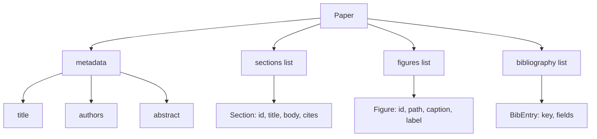
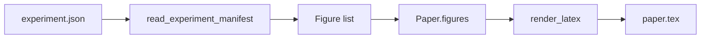
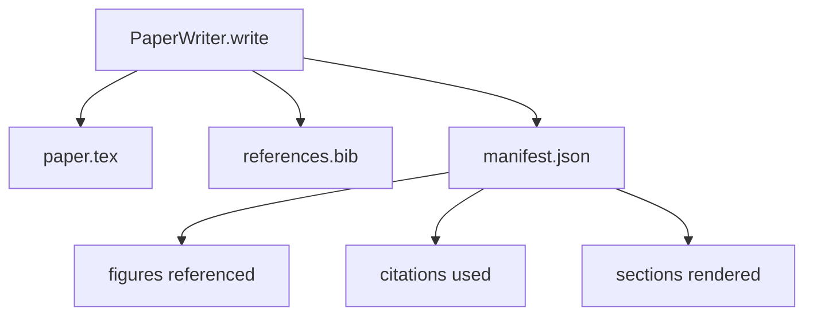

# 论文撰写器

> LaTeX 骨架是研究者与排版系统之间的合约。如果合约被打破，文档就无法编译，失败是响亮的。先构建骨架，再填充它。

**Type:** Build
**Languages:** Python
**Prerequisites:** Phase 19 lessons 50-53
**Time:** ~90 minutes

## Learning Objectives

- 将研究论文视为具有已知章节图的结构化产出物，而非自由格式文档。
- 生成一个 LaTeX 骨架，在任何散文被写出之前声明其摘要、章节、图位和参考文献键。
- 通过确定性槽位机制将实验输出的图（路径和标题）注入骨架。
- 连接一个模拟散文生成器，从结构化大纲填充每个章节，使得测试装置无需模型即可测试。
- 输出单个 `paper.tex` 加上 `references.bib` 和一个清单，列出每个引用的图和每个使用的引用。

## 为什么先做骨架

以散文开始的草稿会累积结构性债务。引言中长出了三段本应放在相关工作里的内容。一个图在被定义之前就被引用了。参考文献最终对同一篇论文有三个键。当作者注意到时，重写成本已经高于写作成本。

骨架反转了这一切。结构被预先声明为数据。章节是具有名称和顺序的槽位。图是具有 ID 和标题的槽位。参考文献键在顶部声明，附带它们指向的条目。散文被一次一个地生成到这些槽位中。测试装置可以在任何散文被写出之前验证：每个图都有一个槽位，每个引用都有一个条目，每个章节都出现在目录中。

这与早期课程应用于计划、工具调用和追踪的纪律是相同的。结构就是合约。

## 论文的形状

每个字段都是纯 Python 数据。渲染器是从 `Paper` 到 LaTeX 字符串的纯函数。测试装置可以在渲染之前内省论文：计算章节数、列出缺失的图文件、检查每个 `\cite{key}` 都有匹配的 `BibEntry`。

## 渲染合约

渲染器保证三个属性。首先，骨架中的每个图槽位发出一个带有 `fig:<id>` 形式稳定标签的 `\begin{figure}` 块。其次，每个章节发出一个带有 `sec:<id>` 形式稳定标签的 `\section{}`，以便交叉引用能工作。第三，参考文献发出一个 `\bibliography` 块，其 `references.bib` 恰好包含论文上声明的条目，不多不少。

违反这些中的任何一条都是渲染错误，而非警告。骨架就是合约；默默丢弃一个图的渲染是对合约的违反。

## 从实验中注入图

本赛道的前期课程将实验输出生成为 JSON 清单。每个清单携带一个具有路径和简短标题的产出物列表。论文撰写器读取该清单并产生 `Figure` 记录。

注入是确定性的。图 ID 从实验名称加上单调计数器派生。标题来自清单。路径相对于论文输出目录进行归一化，使得 LaTeX 即使在实验输出存放在磁盘其他位置时也能编译。

## 模拟散文生成器

本课不调用模型。一个 `MockProseGenerator` 读取大纲形状并确定性地发出散文。大纲形状是每节一条短字符串。生成器将该字符串展开为两个短段落，其中编织了章节标题。生成的散文在在大纲声明图或引用时恰好点名它们。

这足以测试撰写器的每个行为。真实的实现会将生成器替换为模型调用。围绕它的测试装置不会改变。这就是将散文生成器声明为可调用对象的价值：测试替换为确定性的，生产替换为模型的，管线的其余部分完全相同。

## 清单输出

撰写器在输出目录中发出三个文件。

清单是下游评估器或批评循环读取的内容。它不解析 LaTeX；它读取清单。下一课，即批评循环，将此清单作为输入并产生反馈列表。这就是为什么清单是合约的一部分而 LaTeX 不是。

## 验证门控

撰写器在写入任何文件之前运行四个门控。

1. 论文内每个图 ID 是唯一的。
2. 每个章节的 `cites` 字段引用在论文上声明的参考文献键。
3. 摘要非空。
4. 标题非空。

失败的门控引发 `PaperValidationError`，带有精确的原因。测试装置将原因呈现为故障模式。没有部分写入：要么三个文件都被发出，要么一个也不发出。

## 如何阅读代码

`code/main.py` defines `Paper`, `Section`, `Figure`, `BibEntry`, `PaperValidationError`, `MockProseGenerator`, `PaperWriter`, and a `render_latex` function. The `write` method takes an output directory and emits `paper.tex`, `references.bib`, and `manifest.json`. The `read_experiment_manifest` helper converts a list of experiment manifests into `Figure` records.

`code/tests/test_paper_writer.py` covers: skeleton render with no sections, full render with two sections and two figures, missing-citation gate, duplicate-figure-id gate, manifest content, and the LaTeX-string contract (every section emits a `\section{}`, every figure emits a `\begin{figure}`).

## 更进一步的扩展

一个真实实现会想要两个扩展。第一，多格式渲染：相同的 `Paper` 形状编译为博客文章的 Markdown 和预览的 HTML。渲染器成为 `Paper` 上的策略。第二，引用丰富：撰写器从一个引用键获取 BibTeX 条目，给定一个 DOI 的本地缓存。两者都增加价值，两者都可以在不触及骨架合约的情况下添加。

骨架是赌注。章节、图和引用被声明为数据，散文被生成到槽位中，清单与 LaTeX 一起发出。每个其他的改进都组合在其上。
