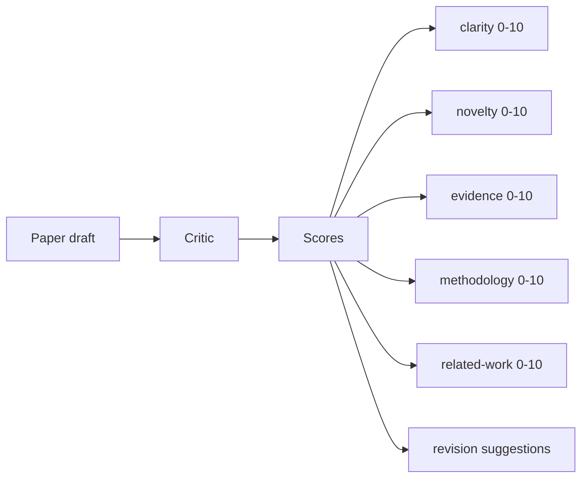
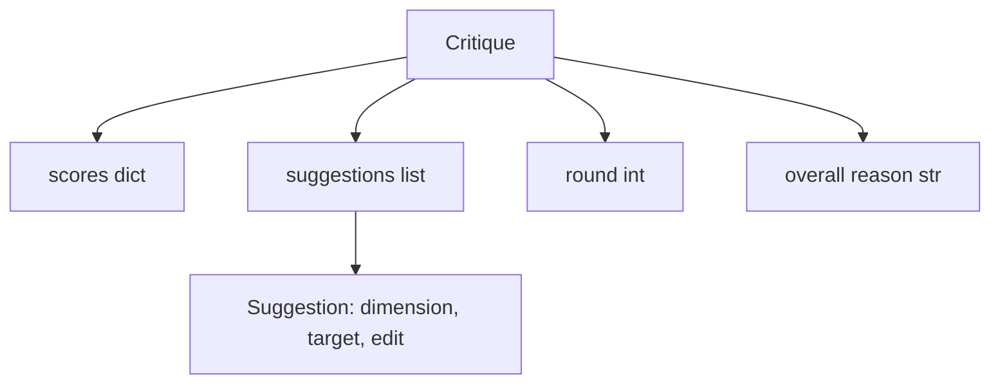
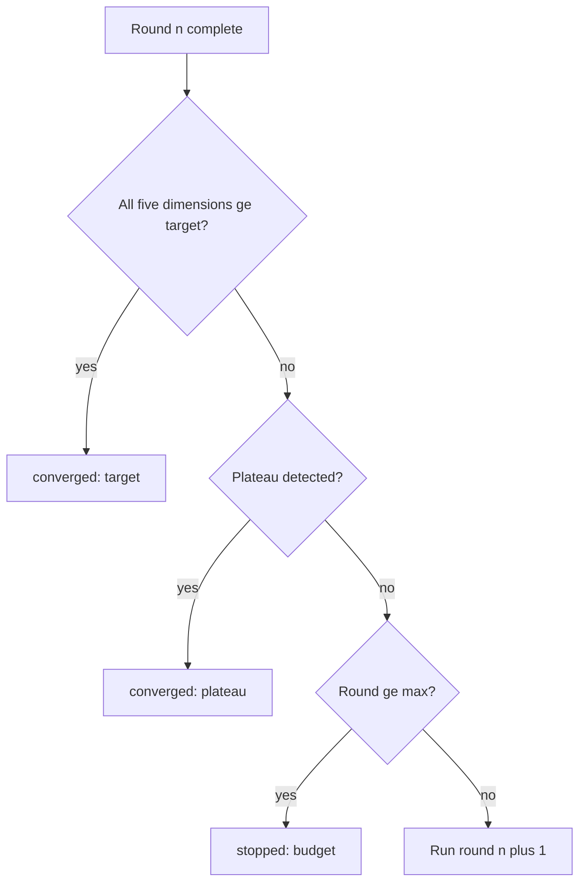
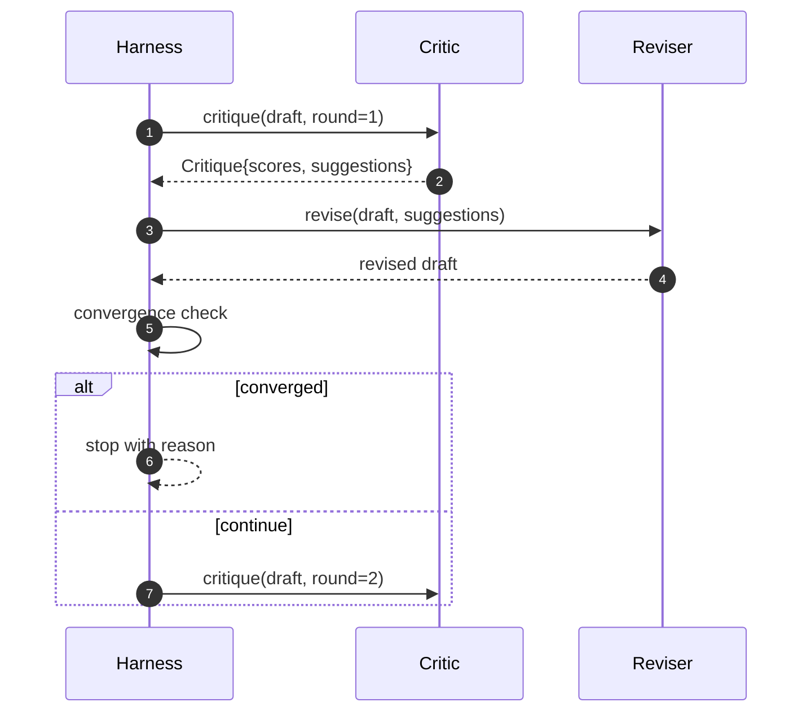

# 批评循环

> 第一次就返回"看起来不错"的批评者是坏的。总是返回"需要改进"的批评者是坏的。有趣的批评者是收敛的那一个，你必须设计收敛。

**Type:** Build
**Languages:** Python
**Prerequisites:** Phase 19 lessons 50-53
**Time:** ~90 minutes

## Learning Objectives

- 在五个固定维度上评分论文草稿：清晰度、新颖性、证据、方法论、相关工作。
- 将每轮批评应用为结构化修订差异，而非自由格式的重写。
- 通过跨轮比较分数来检测收敛；在停滞、达到目标或预算耗尽时停止。
- 用最大迭代预算限制轮数，使不收敛的批评者不会永远运行。
- 输出每轮追踪，使仪表盘或下一阶段可以渲染分数轨迹。

## 为什么是五个固定维度

自由格式的批评者是一个返回一段建议的模型。下一轮的修订将该段落视为环境上下文。重写是否解决了批评是不可验证的，因为批评从来没有结构。

五个维度为测试装置提供了合约。



分数是一个向量。测试装置跨轮次观察每个维度。提高清晰度但降低证据的修订是证据上的回退，而收敛检查看到了这一点。仅靠模型的批评者无法提供这种保证。

## 批评的形状



每个建议携带其改进的维度、它针对的章节，以及修订器可以应用的 `edit` 指令。修订器也是一个可调用对象。本课提供一个确定性修订器，将 edit 指令解释为追加到章节操作。模型驱动的修订器会将同一字段解释为提示。合约不会改变。

## 收敛规则，按顺序

批评循环在以下三个条件之一触发时终止。



目标是最高严格情况：五个维度中每一个（clarity、novelty、evidence、methodology、related_work）必须在循环返回成功之前达到 `>= target_score`（默认 `8.0`）。均值高但一个维度薄弱是不够的。停滞检测将当前轮的均值与上一轮的均值进行比较。如果改进在连续两轮中低于 `plateau_epsilon`（默认 `0.1`），循环以 `plateau` 退出。预算是对轮数的硬上限（默认 `5`），以 `budget` 退出。

顺序很重要。目标优先于停滞，优先于预算。如果第三轮在触发停滞的同一迭代上达到了目标，结果是 `target`，而非 `plateau`。

## 为什么停滞检测运行两轮

单轮停滞是噪音。即使对固定草稿，真实批评者每次迭代也会返回略有不同的分数，因为确定性评分仍然取决于哪些建议被应用以及以什么顺序。需要连续两轮停滞来过滤掉噪音。如果测试装置报告停滞，草稿已经真正停止改进。

## 本课中的确定性批评者

本课不调用模型。提供的批评者是一个基于三个信号对草稿评分的可调用对象：平均章节正文长度（清晰度）、图计数和引用计数（证据），以及论文元数据上的 `originality_tag` 字段（新颖性）。修订器知道如何推动每个分数上升。

```text
clarity      grows when the average section body length increases
novelty      grows when originality_tag is set to "high"
evidence     grows when a section's figure_refs is non-empty
methodology  grows when a section titled "Method" exists with body
related-work grows when a section titled "Related Work" exists with body
```

修订器将每个建议解释为有针对性的追加。第一轮之后，测试装置可以观察到分数上升。测试使用此属性来断言循环减小了差距。

## 完整循环合约



测试装置拥有轮计数器、追踪和收敛检查。批评者拥有分数。修订器拥有差异。三者都不触及其他方的状态。

## 追踪输出

每轮发出一个追踪事件，包含轮数、分数向量、建议计数和收敛裁决。完整追踪与最终草稿一起返回。下游仪表盘可以渲染每轮分数图表。下一课，即迭代调度器，读取追踪以确定分支是否值得保留。

## 防止坏批评者的预算

一个产生永远不会提高分数的建议的批评者，会将循环锁定在最大迭代上限。追踪使这一点可见：五轮，分数平坦，裁决 `budget`。用户将其理解为批评者 bug 而非草稿 bug。另一种方式——只呈现最终草稿——会隐藏诊断。追踪优先的设计将其呈现出来。

## 如何阅读代码

`code/main.py` defines `Critique`, `Suggestion`, `Critic` protocol, `Reviser` protocol, `CriticLoop`, and a `make_deterministic_critic_pair` factory that returns the deterministic critic and a matching reviser. A minimal `Paper` shape is included so the lesson stands alone.

`code/tests/test_critic_loop.py` covers: monotone improvement after round one, target convergence on a tuned draft, plateau detection after two flat rounds, budget exhaustion when no suggestion improves, suggestion application by the reviser, and trace shape.

## 更进一步的扩展

一个真实实现会想要两个扩展。第一，维度权重：一个工作坊的论文更看重新颖性而非方法论；期刊则加权相反。收敛检查变为加权均值。第二，配对批评者：一个批评者评分，第二个批评者在修订器看到之前裁决建议。两者都增加价值，两者都在相同的 `Critique` 形状上组合。

赌注是分数向量。一旦批评被结构化，每个其他的改进——收敛规则、仪表盘、配对批评者——都可以在不改变循环的情况下加入。
