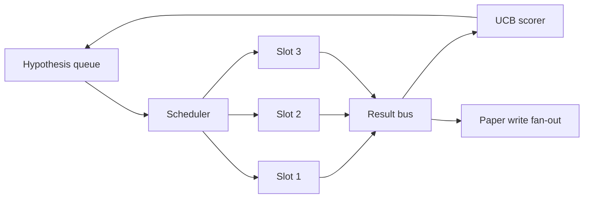
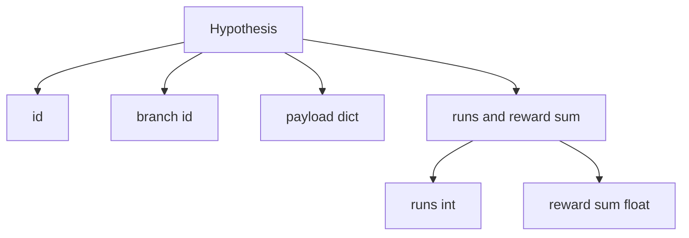
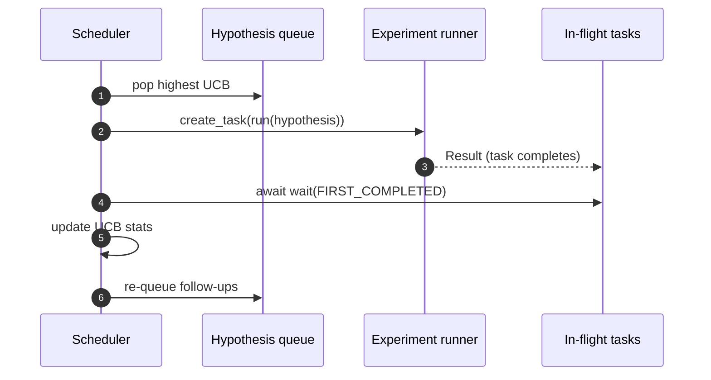

# 迭代调度器

> 没有调度器的研究循环是一个带有妄想的队列。调度器是循环决定停止探索什么的地方，而那个决定就是整个游戏。

**Type:** Build
**Languages:** Python
**Prerequisites:** Phase 19 lessons 50-53
**Time:** ~90 minutes

## Learning Objectives

- 将研究工作流建模为假设队列，供给平行的实验槽位，其结果扇回。
- 使用 asyncio 同时运行多个实验，使调度器能保持所有槽位忙碌。
- 使用 UCB 对每个假设分支评分，使调度器能在不放弃探索的情况下修剪低产出分支。
- 将完成的结果扇出到论文撰写阶段和重新入队阶段，使高产分支产生后续假设。
- 呈现一个每迭代追踪，包含分支分数、槽位占用和修剪决策。

## 为什么是调度器，而不是工作列表

平坦的工作列表按提交顺序运行作业。当每个作业独立时那没问题。研究不是独立的：实验三的发现改变了实验四和实验五的优先级。一个读取结果扇入并重新排序队列的调度器，每单位计算完成更多有用的工作。

有趣的设计选择是评分规则。贪婪评分者总是选择当前领先者，从不探索。均匀评分者从不利用。UCB（上置信界）是中间路径：利用领先者的同时为被尝试较少的分支保留容量。

## 系统形状



队列持有假设。当一个槽位空出时，调度器选择 UCB 最高的假设。每个槽位异步运行一个实验。完成的实验将结果扇到总线上。总线更新发起分支上的 UCB 统计量，并在分支的产出超过阈值时扇出到论文撰写阶段。

## 假设的形状



`branch` 是 UCB 统计量的键。多个假设可能共享一个分支（分支是研究方向；假设是其中的一个试验）。`runs` 是该分支完成的实验计数，`reward_sum` 是累积奖励。UCB 读取两者。

## UCB 评分

本课使用的 UCB 公式是经典的 UCB1。

```text
ucb(branch) = mean_reward(branch) + c * sqrt( ln(total_runs) / runs(branch) )
```

`total_runs` 是所有分支完成的实验总数。`c` 是探索权重；本课默认为 `sqrt(2)`。零次运行的分支得到 `+inf`，因此未尝试的分支始终先被调度。均值奖励高的分支保持高分，直到其他分支追赶上来；运行多次却没有多少奖励的分支会被运行较少的分支所超越。

修剪门控与选择器分开。修剪在分支的均值奖励在至少 `prune_after_runs` 次（默认 `3`）试验后低于绝对下限（默认 `0.2`）时，将其从未来调度中移除。这保持队列有界。

## 带 asyncio 的平行槽位

调度器用 `asyncio.create_task` 驱动实验。每个任务运行返回 `Result` 的实验运行器（一个 `async def` 可调用对象）。主循环用 `asyncio.wait(..., return_when=asyncio.FIRST_COMPLETED)` 等待在飞任务的集合，并在每个完成时触发评分更新。



三个槽位并发运行。主循环永远不会阻塞在单个实验上。调度器在槽位空出时立即启动新任务，直到队列为空且没有任务在飞。

## 扇出：论文触发器

当分支的均值奖励超过 `paper_threshold`（默认 `0.7`）且该分支尚未产生论文时，调度器将一个 `paper.trigger` 事件扇出到输出列表中。下游，第五十四课的论文撰写器会拾取此事件。在本课中，触发器被捕获为列表以便测试可以断言它。

## 扇出：后续假设

当高产结果到达时，调度器可以调用用户提供的 `expander` 产生同一分支上的一个或多个后续假设。扩展器是从 `Result` 到 `list[Hypothesis]` 的纯函数。本课提供一个确定性扩展器，为奖励超过论文阈值的任何结果产生两个后续假设。

## 预算

两个预算保护调度器免受失控循环。

```text
max_experiments    : total count of experiments run across all branches
max_seconds        : wall-clock cap (asyncio time)
```

当任一触发时，调度器停止调度新任务，等待在飞的任务，并返回最终追踪。追踪包含 `stop_reason`。

## 追踪和最终报告

每个调度决策（选择、分派、结果、修剪、扇出）输出一个事件。最终报告汇总每个分支的统计量、总运行次数、总墙钟时间和触发的论文触发器。下一课，即端到端演示，读取此报告以驱动论文撰写器。

## 如何阅读代码

`code/main.py` defines `Hypothesis`, `Result`, `BranchStats`, `IterationScheduler`, and a `make_deterministic_runner` factory that returns an asyncio experiment runner with predictable rewards. The runner sleeps for a fixed `delay_ms` (default `5ms`) so concurrency is observable.

`code/tests/test_scheduler.py` covers: UCB picks untried branches first, parallel slot occupancy, paper triggers when threshold is crossed, branch pruning after low-yield trials, fan-out follow-up hypotheses, and budget exit (both experiment count and wall clock).

## 更进一步的扩展

一个真实实现会想要三个扩展。第一，跨会话持久化 UCB 统计量：当前统计量存在于内存中；真实调度器会对它们做检查点，使得重启能保留已花费的探索预算。第二，多目标评分：而非标量奖励，每个结果发出向量，UCB 变为帕累托风格的选择器。第三，上下文 bandit：选择器以假设特征（长度、复杂度）为条件，使得相似的假设共享探索。

调度器是研究超越工作列表的地方。一旦 UCB 被接入且槽位并行运行，每个其他改进都组合在其上。
