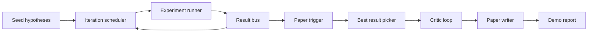
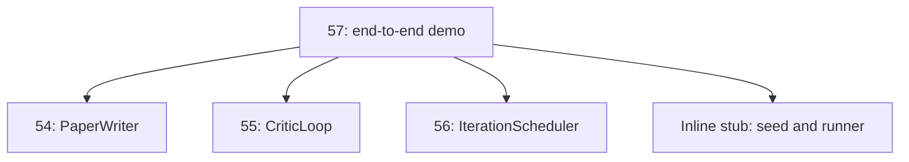
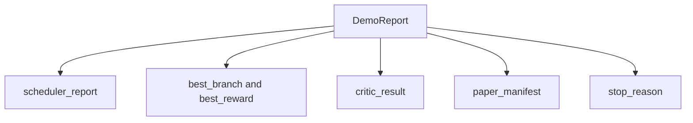

# 端到端研究演示

> 演示是你之前编写的每个合约必须组合的地方。如果其中任何一个泄漏，演示就是捕获它的那一课。

**Type:** Build
**Languages:** Python
**Prerequisites:** Phase 19 lessons 50-53
**Time:** ~90 minutes

## Learning Objectives

- 端到端连接自动研究循环：假设种子、实验运行器、调度器、批评循环、论文撰写器。
- 通过纯 Python 导入（而非框架）组合前述四课 Track D 的原语。
- 运行循环到自终止结束并发出一个演示报告，列出每个阶段的输出。
- 保持演示确定性，使测试套件可以断言最终形状。
- 在任何阶段的合约被打破时呈现清晰的故障模式，使下一个阶段不会以损坏的输入运行。

## 这里组合了什么



五个阶段。种子是三个假设的列表。调度器在三个并行槽位上跨它们运行六个实验。总线报告一个或多个论文触发器。选择器选出唯一最佳结果。批评循环在从该结果构建的草稿上迭代。论文撰写器发出最终 LaTeX、BibTeX 和清单。

## 为什么是导入，而不是复制

每节前课提供带有公共数据类和函数的 `main.py`。演示通过将 `sys.path` 调整为每课的父目录来导入它们。这不是框架接线；它是之前课程测试文件已经使用的相同导入方式。



内联存根代替第五十课到第五十三课：一个种子假设的小型生成器和一个同步奖励函数。用户可以通过调整两个导入将内联存根替换为这些课程的真实原语。

## 确定性保证

演示是按构造确定性的。实验运行器是带种子的 numpy。批评循环的修订器按固定顺序遍历固定维度。论文撰写器的散文生成器是第五十四课的模拟版本。调度器的 UCB 选择器按迭代顺序打破平局，而非随机选择。

给定相同的种子，演示发出相同的报告。测试通过运行演示两次并比较清单来断言此属性。

## 演示报告形状



每个字段逐字来自上游阶段。演示不转换任何输出；它组合它们。这就是演示所要测试的内容。

## 故障模式处理

每个阶段要么成功，要么引发类型化错误。

```text
Scheduler ........ returns SchedulerReport with stop_reason
                   in {queue_empty, max_experiments, deadline}
Best-result pick . raises NoTriggerError if no paper trigger fired
Critic loop ...... returns LoopResult with status converged or stopped
Paper writer ..... raises PaperValidationError on contract break
```

任何阶段的故障都会以类型化异常短路演示。测试固定此合约：`test_no_triggers_raises_typed_error` 和 `test_best_picker_raises_when_no_triggers` 断言当没有分支触发时，选择器引发 `NoTriggerError` / `BestResultError`，并且撰写器永远不会被调用。

## 最佳结果选择器

调度器按分支发出论文触发器。选择器在所有触发中选择均值奖励最高的分支。平局按分支 ID 字母顺序打破，使演示保持确定性。选择器是一个小的纯函数；测试将其固定在一个固定的调度器报告上。

## 连接批评循环

第五十五课的批评循环在 `MiniPaper` 上操作。演示通过使用分支 ID 填充摘要、播种两个章节（Introduction 和 Results）并设置 `originality_tag`（来自分支的均值奖励：`>= 0.8` 为 high，`>= 0.6` 为 medium，否则为 low），从选中的分支构建一个 `MiniPaper`。

然后修订器将草稿迭代到收敛。输出进入论文撰写器。

## 连接论文撰写器

第五十四课的论文撰写器在带有图和参考文献的完整 `Paper` 形状上操作。演示通过 `mini_to_full_paper` 升级收敛的 `MiniPaper`，该函数为选中的分支附加一张图，以及从批评者建议的引用键并集构建的一个小型合成参考文献列表。演示添加的每个引用也被添加到参考文献列表中，因此验证通过。

## 如何阅读代码

`code/main.py` defines `BestResultError`, `NoTriggerError`, `DemoReport`, `pick_best_branch`, `build_mini_paper`, `mini_to_full_paper`, and `run_demo`. The imports at the top adjust `sys.path` once and pull `PaperWriter`, `CriticLoop`, and `IterationScheduler` from their lessons.

`code/tests/test_e2e.py` covers: demo runs end to end and emits a report with all five fields populated, determinism across two runs, NoTriggerError when no branch crosses the threshold, PaperValidationError when the writer's contract breaks, paper manifest contains the picked branch's figure, and the scheduler stop reason is one of the expected values.

## 更进一步的扩展

一旦演示绿灯，三个扩展值得接入。第一，持久状态：每个阶段的结果写入一个小型 JSON 存储，使得重启可以在不重新运行廉价阶段的情况下继续。第二，仪表盘：来自调度器和批评循环的追踪事件渲染为单一时间线。第三，真实模型调用：将模拟散文生成器和确定性批评者替换为模型驱动的；接线不会改变。

演示的任务是证明组合就是架构。五节课，四个导入，一个报告。下次你添加一个阶段时，接线恰好增长一行。
