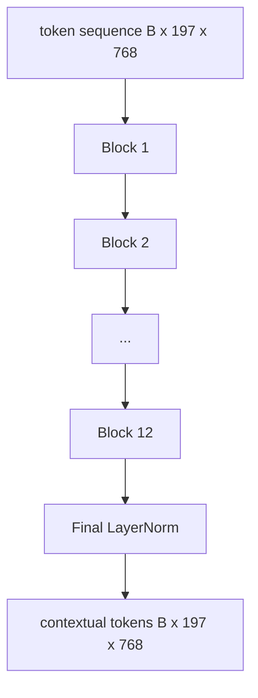

# 视觉 Transformer 编码器

> 仅有 patch 是看不见的。一个 12 层的 pre-LN transformer 和 12 个注意力头将 patch token 序列转化为上下文 token 序列，CLS token 在其最终隐藏状态中汇集整图特征。本课是每个现代视觉-语言模型的引擎室。

**Type:** Build
**Languages:** Python
**Prerequisites:** Phase 19 lessons 30-37 (Track B foundations)
**Time:** ~90 minutes

## Learning Objectives

- 实现一个带有多头自注意力和前馈子层的 pre-LN transformer 块。
- 堆叠 12 个块和 12 个头以形成 ViT-Base 编码器。
- 将第 58 课的 patch 前端接入编码器并运行一次前向传播。
- 验证 CLS token 从每个 patch 聚合信息。

## The Problem

patch embedding 产生 197 个 token 的序列，每个 token 是一个向量，不知道任何其他 patch。一张猫的图片需要每个 patch 知道哪些 patch 包含胡须、哪些包含背景、哪些包含眼睛。transformer 是一种构建这种认知的机制，每次一个注意力层。没有它，patch 前端只是一个聪明但没有理解力的分词器。

标准配方是十二层深、十二头宽，使用 pre-LayerNorm 放置、GELU 激活和 4 倍前馈扩展。该配方是 CLIP ViT-L、SigLIP、DINOv2、Qwen-VL 系列、InternVL 以及 2025-2026 年所有其他开放权重视觉编码器的骨干。该配方足够稳定，除非它们明确说明其他情况，否则你可以阅读上述任何论文并假设这个块形状。

## The Concept




### Pre-LN vs post-LN

原始 Transformer 将 LayerNorm 放在残差之后。Pre-LN（每个子层之前的 LayerNorm）是每个现代视觉-语言模型使用的版本，因为它在没有学习率预热技巧的情况下稳定训练。差异在前向传播中是一行代码，而在 12+ 层深度上的梯度流是天壤之别。

### 多头自注意力

每个头将 token 向量投影到自己的 `(query, key, value)` 三元组，维度为 `head_dim = hidden / num_heads`。`hidden = 768` 且 `heads = 12` 时，每个头的 `dim = 64`。12 个头并行注意，然后它们的输出拼接回维度 768 并经过一个输出投影。多头的意义在于一个头可以学习"关注猫的眼睛"，而另一个学习"关注背景渐变"，互不干扰。

### 为什么是 4x 前馈扩展

FFN 以 GELU 在中间进行 `hidden -> 4 * hidden -> hidden`。因子 4 是经验性的，自 2017 年以来跨语言和视觉 transformer 一直使用。更小（2x）欠拟合；更大（8x）在固定数据预算下过拟合。MLP 是模型存储其大部分学得事实的地方，更宽的中间层是它们的存放之处。

| Component | Parameters at ViT-Base scale |
|-----------|------------------------------|
| qkv projection per block | `3 * 768 * 768 = 1.77M` |
| output projection per block | `768 * 768 = 590K` |
| FFN per block (4x expansion) | `2 * 768 * 4 * 768 = 4.72M` |
| LayerNorm per block | `4 * 768 = 3K` |
| Total per block | about 7.1M |
| 12 blocks | about 85M |
| Plus front end | about 86M total |

ViT-Base 是一个 86M 参数的编码器。以 2026 年的标准来看很小（SigLIP-So400M 是 400M，Qwen-VL ViT 是 675M），但架构在宽度和深度上完全相同。

### 因果掩码还是不？

视觉 Transformer 是仅编码器的且双向的：token `i` 可以关注 token `j` 对任意对。无掩码。第 61 课的解码器端交叉注意力将使用因果掩码，但在视觉编码器内部，注意力是完全连接的。

### CLS token 学到了什么

CLS token 以可学习参数开始，自身没有 patch 内容，并通过在每个块中的注意力累积信息。到最后一层，CLS 行是整个图像的向量摘要；下游头将此单一向量投影为类别 logits、对比嵌入或文本解码器的交叉注意力键。

## Build It

`code/main.py` implements:

- `MultiHeadSelfAttention`, with `qkv` and output projections, the scaled-dot-product attention math, and shape assertions.
- `FeedForward`, the 4x-expansion GELU MLP.
- `Block`, a pre-LN block composing attention and feed-forward sub-layers with residuals.
- `ViT`, a stack of 12 blocks with a final LayerNorm.
- `VisionEncoder`, which wires `VisionFrontEnd` from lesson 58 to the `ViT` stack and exposes a `forward()` returning the contextual sequence and the pooled CLS vector.
- A demo that runs a synthesized 224x224 fixture image through the full encoder and prints input shape, output shape, parameter count, and the CLS norm at every other layer.

Run it:

```bash
python3 code/main.py
```

Output: the fixture is encoded to a `(1, 197, 768)` tensor. The CLS norm drifts upward as the layers compose, then stabilizes at the final LayerNorm. Total parameters report at about 86M.

## Use It

The encoder defined here is, up to width and depth, the same block stack that ships inside every open-weight VLM in 2025-2026. Differences live in:

- **Width and depth.** ViT-Large is `hidden=1024, depth=24, heads=16`; SigLIP So400M is `hidden=1152, depth=27, heads=16`. Same block.
- **Pooling head.** CLS pooling (this lesson) vs average pooling (SigLIP) vs attention pooling (later VLMs).
- **Position handling.** Fixed sinusoidal (lesson 58) vs learned 1D vs ALiBi vs 2D RoPE. The block math is unchanged.
- **Register tokens.** DINOv2 prepends 4 extra learned tokens. One line of code.

This block stack is the substrate. The next lessons (60-63) stand on top of it.

## Tests

`code/test_main.py` covers:

- a single block preserves shape and is invariant to input batch size
- attention scores sum to one along the key axis (softmax sanity)
- residual paths are wired (zero input still produces non-zero output via the CLS token)
- a 4-layer stacked forward pass produces the right shape
- gradients flow to the patch projection from the CLS output

Run them:

```bash
python3 -m unittest code/test_main.py
```

## Exercises

1. Add register tokens (4 learned vectors prepended after CLS) and rerun. Compare attention map smoothness via the entropy of the softmax distribution on the last layer.

2. Swap pre-LN for post-LN and train for one epoch on a synthetic shape classifier. Observe which one trains stably without LR warm-up.

3. Implement causal masking as an `attn_mask` argument so the same block can be reused as a decoder block. The mask shape is `(seq, seq)`, lower-triangular.

4. Profile a forward pass at batch sizes 1, 8, 64 with `torch.profiler`. The MLP layer dominates wall time, not attention.

5. Replace one attention head's q-k-v projections with a low-rank LoRA adapter, freeze the rest, and verify the gradient only flows where you expect.

## Key Terms

| Term | What it means |
|------|---------------|
| Pre-LN | LayerNorm applied before each sub-layer instead of after |
| Self-attention | Each token attends to every other token in the same sequence |
| Multi-head | The hidden dim is split across `H` independent attention heads |
| FFN expansion | The feed-forward layer widens to `4 * hidden` before contracting |
| CLS pooling | Use the first token's final hidden state as the image summary |

## Further Reading

- An Image is Worth 16x16 Words (ViT, 2021) for the encoder recipe.
- DINOv2 (2023) for register tokens and the self-supervised pretraining objective.
- SigLIP (2023) for the average-pooling variant and the sigmoid contrastive loss used in lesson 62.
