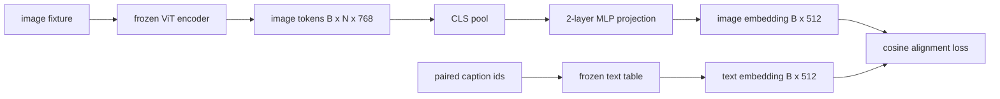

# 模态对齐的投影层

> 视觉编码器产生图像 token。文本解码器消费文本 token。两者驻留在不同的向量空间中。一个小型两层 MLP 将图像 token 投影到文本嵌入空间，一个针对配对标题的余弦对齐损失将两个空间拉向一致。该投影是视觉-语言模型中最小的部分，也是迁移最重要的一部分。

**Type:** Build
**Languages:** Python
**Prerequisites:** Phase 19 lessons 30-37 (Track B foundations)
**Time:** ~90 minutes

## Learning Objectives

- 构建一个两层 MLP 投影，将图像特征映射到文本嵌入空间中。
- 构建一个模拟文本嵌入表（无需预训练分词器，无需真实语料库）。
- 计算投影后的图像 token 与配对标题嵌入之间的余弦对齐损失。
- 在冻结的视觉编码器和冻结的文本表上单独训练投影。

## The Problem

你有一个视觉编码器（第 58-59 课），产生维度为 `vision_hidden = 768` 的 token。你有一个想要在其上附加的文本解码器，嵌入维度为 `text_hidden = 512`（其他任何数字都同样合理）。解码器期望文本形状的 token。图像 token 不是文本形状的：它们驻留在编码器在纯视觉预训练期间学到的基中，与解码器的词向量没有关系。

两层 MLP 投影（linear、GELU、linear）桥接了这一差距。它足够小（约 `768 * 1024 + 1024 * 512 = 1.3M` 个参数），能在单个 GPU 上几分钟内训练，并且它是对齐阶段唯一需要学习的部分。视觉编码器保持冻结。文本嵌入表保持冻结。只有投影在学习。这是 LLaVA 在 2023 年发布的配方，是 BLIP-2 重构为 Q-Former 的方案，也是自此以后每个开放权重 VLM 以某种形式采用的方法。

## The Concept



### 投影前的池化

视觉编码器发出 197 个 token。文本端有一个标题级别的嵌入。要对齐它们，你需要每个样本一个图像级向量。CLS 池化是最简单的：从编码器取第一个 token 并投影它。在所有 197 个 token 上的均值池化是另一种选择，也是 SigLIP 使用的方式。无论是哪种，都将 197 个向量池化成一个。

### 为什么是两层，而不是一层

单个线性投影可以旋转和重新缩放，但如果两个空间有曲率不匹配，则无法修正基。两个线性层之间的 GELU 给予投影一次非线性弯曲，这经验上足以将 CLIP 风格的特征对齐到语言模型嵌入。更深的投影（LLaVA-NeXT 使用 GLU；Qwen-VL 使用注意力层的堆叠）是扩展；两层 MLP 是规范基线，也是 BLIP-2 的 Q-Former 投影头在其内部提供的方案。

| Layer | Shape | Parameters |
|-------|-------|------------|
| fc1 | `(vision_hidden, projection_hidden)` | `768 * 1024 + 1024` |
| activation | GELU | 0 |
| fc2 | `(projection_hidden, text_hidden)` | `1024 * 512 + 512` |

对于 `768 -> 1024 -> 512` 的头部，约 1.3M 参数。

### 余弦对齐损失

对齐并不意味着 `image_emb == text_emb`。对齐意味着 `image_emb` 在联合空间中指向与 `text_emb` 相同的方向。余弦损失是 `1 - cos_sim(image, text)`，范围从 0（完美对齐）到 2（相反）。训练驱动此值每对趋近于零。第 62 课推广到对比批次（InfoNCE），其中每张图像必须比批次中任何其他标题更接近自己的标题；本课使用每对版本，以便动态可见。

### 冻结编码器是技巧所在

视觉编码器有 86M 个参数。文本表还有另一个几百万。从模拟语料库训练所有它们是不可能的。冻结两者意味着投影的 1.3M 个参数是唯一变化的东西，在合成对上训练几百步就足以将损失降下来。这正是每个基于适配器的 VLM 的操作形态：重的部分保持冻结，轻的桥梁进行训练。

## Build It

`code/main.py` implements:

- `MLPProjector(in_dim, hidden_dim, out_dim)`, two-layer linear MLP with GELU activation.
- `MockTextEmbedding(vocab_size, dim)`, a frozen embedding table with deterministic init from a seed.
- `make_pair(seed, vocab_size)`, which synthesizes one paired (image, caption) sample. Captions are short id sequences; the caption embedding is mean-pooled over token embeddings.
- `cosine_alignment_loss(image_emb, text_emb)`, the per-pair `1 - cos_sim` objective.
- A training loop that runs the projection for 200 steps over 32 synthetic pairs (cycled), with the vision encoder and text table frozen, and prints the loss every 25 steps.

Run it:

```bash
python3 code/main.py
```

Output: training reports drop from initial loss around 1.07 down to about 0.80 within 200 steps, demonstrating that the projection alone can pull image tokens toward the text space. The final cosine similarity per pair is also printed.

## Use It

相同的模式出现在每个开放权重 VLM 中：

- **LLaVA 1.5.** 从 CLIP-ViT-L 隐藏状态到 LLaMA 嵌入维度的两层 GELU MLP 投影。冻结视觉编码器，冻结 LLM，仅训练投影（然后在第二阶段解冻 LLM）。
- **BLIP-2.** Q-Former 取 32 个学习到的查询 token，通过交叉注意力与图像 token 交互，然后投影到 LLM 嵌入维度。Q-Former 最末端的投影头部是本课 MLP 的类比。
- **MiniGPT-4.** 从 BLIP-2 Q-Former 输出到 Vicuna 嵌入维度的单个线性投影。
- **Qwen-VL.** 多层的交叉注意力适配器，但最终部分仍是到 LM 嵌入维度的投影。

形状各不相同，但角色是相同的：池化图像 token，投影到文本嵌入维度，单独训练。

## Tests

`code/test_main.py` covers:

- projector output shape matches the configured `out_dim`
- frozen text embedding table has zero `requires_grad` parameters
- cosine loss is zero on identical vectors and is 2 on anti-parallel vectors
- projector gradient flows after one backward pass
- the training loop reduces loss between step 0 and step 200

Run them:

```bash
python3 -m unittest code/test_main.py
```

## Exercises

1. Replace CLS pooling with mean pooling over the 196 patch tokens and compare final loss after 200 steps. Mean pooling usually trains faster on synthetic data; CLS is more sample-efficient on natural images.

2. Add a learned scalar temperature to the cosine loss (`cos / tau`) and observe what happens when `tau` is too small (gradient noise) or too large (loss plateaus high).

3. Swap the two-layer MLP for a single linear layer and quantify the loss gap. The non-linearity matters more on natural image features and less on synthetic ones.

4. Add a small L2 penalty on the projector weights and watch how it interacts with cosine alignment (cosine is scale-invariant, so the penalty mostly shrinks unused directions).

5. Persist projector weights, then reload and run inference without the vision encoder backward pass to verify that only the projector is needed at deploy time.

## Key Terms

| Term | What it means |
|------|---------------|
| Modality alignment | The act of making image and text embeddings comparable in one shared space |
| Projection head | 将一个空间映射到另一个空间的小型模块，通常是一个 2 层 MLP |
| Cosine similarity | 点积除以 L2 范数的乘积 |
| Frozen encoder | 视觉（或文本）模型的所有参数设置为 `requires_grad=False` |
| Mock corpus | 使用的合成对，以便训练没有数据集下载依赖 |

## Further Reading

- LLaVA paper for the two-stage train (project, then unfreeze LM).
- BLIP-2 paper for Q-Former as a learnable projection alternative.
- Qwen-VL technical report for cross-attention adapters as deeper projection heads.
