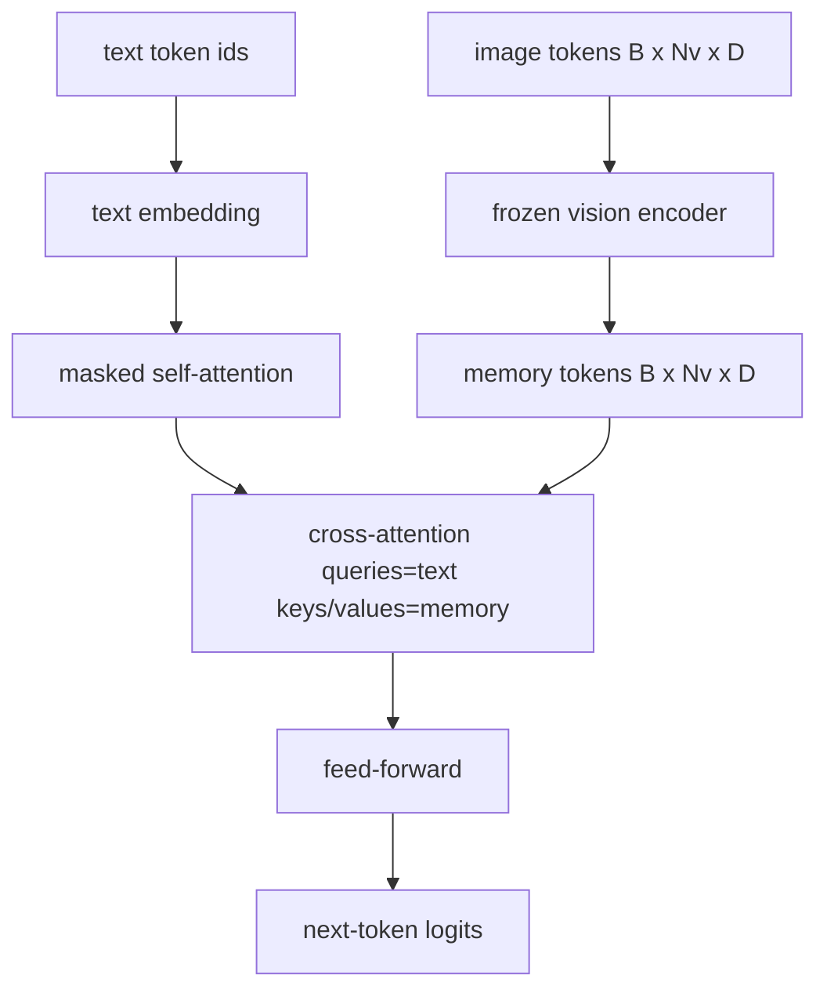
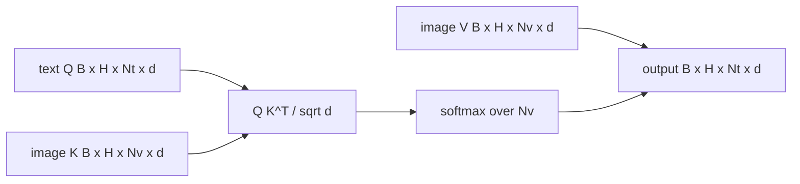

# 交叉注意力融合

> 投影层将一张图像向量与一个标题向量对齐。一个真正的视觉-语言解码器需要每个文本 token 关注每个 patch token，使模型能将每个词定位到某个区域。交叉注意力就是这种定位发生的方式。文本作为查询；视觉作为键和值来应答。本课构建交叉注意力块、因果文本自注意力以及保持两者合法的掩码形状。

**Type:** Build
**Languages:** Python
**Prerequisites:** Phase 19 lessons 30-37 (Track B foundations)
**Time:** ~90 minutes

## Learning Objectives

- 实现查询流为文本、键/值流为视觉的多头交叉注意力。
- 组合一个解码器块：因果自注意力 + 交叉注意力 + 前馈。
- 理解掩码形状：自注意力的因果掩码，交叉注意力的无掩码。
- 使用批量文本 token 和固定图像 token 池运行一次前向传播。

## The Problem

将图像 token 和文本 token 拼接为一个序列是一种融合选项（早期融合，Chameleon 和 Emu3 采取的路径）。交叉注意力是另一种（晚期融合，Flamingo 引入并自此被每个 Flamingo 形状的解码器所复制的路径）。在晚期融合中，文本解码器仅在文本 token 上运行，并通过每层交叉注意力接触图像流。

晚期融合有两个优势。第一，文本流保持纯净，模型保留纯文本能力。第二，图像流每张图像计算一次并为每个解码步骤重用，因此即使是长标题的生成也很廉价。代价是每个块多一个注意力子层。

## The Concept





### 掩码形状

解码器块内的两种注意力需要不同的掩码：

| Attention | Query length | Key length | Mask | Why |
|-----------|--------------|------------|------|-----|
| Self-attention | `Nt` (text) | `Nt` (text) | Causal: lower-triangular `(Nt, Nt)` | 文本 token 在自回归期间不能向前看 |
| Cross-attention | `Nt` (text) | `Nv` (vision) | No mask | 整个图像对每个文本位置可见 |

本课包含一个形状验证函数，因此混合它们的错误表现为 `ValueError` 而非默默损坏的损失曲线。

### 为什么交叉注意力没有掩码

图像在任何文本生成之前被完整观察。标题的 token `t` 可以关注图像的任意 patch；图像 patch 没有时间顺序。一些 Flamingo 变体在交错多图像和文本片段时添加了每样本掩码模式，但对于单张图像加一个标题，交叉注意力看到一切。

### 键/值缓存

图像键和值在解码开始计算一次并保存在缓存中。每个新的文本 token 使用缓存而不重新计算。这就是使检测在推理时快速的原因：重的 ViT 运行一次；交叉注意力在每个步骤重用其键和值。本课暴露缓存并测试缓存命中路径。

### 块组合

一个解码器块运行：pre-LN -> self-attention -> residual -> pre-LN -> cross-attention -> residual -> pre-LN -> feed-forward -> residual。三个子层，每个都有自己的 LayerNorm。Flamingo 论文在交叉注意力上添加了一个可学习的门控，使模型可以以训练时稳定性代价选择退出图像路径；规范基线（此处使用）没有门控。

```python
class DecoderBlock:
  def forward(self, text_tokens, image_tokens, text_mask, cross_mask):
      text_tokens = text_tokens + self.self_attn(self.ln1(text_tokens),
                                                 mask=text_mask)
      text_tokens = text_tokens + self.cross_attn(self.ln2(text_tokens),
                                                  image_tokens,
                                                  mask=cross_mask)
      text_tokens = text_tokens + self.ffn(self.ln3(text_tokens))
      return text_tokens
```

## Build It

`code/main.py` implements:

- `CrossAttention(hidden, heads)`, multi-head cross-attention with separate `q` and `kv` projections.
- `CausalSelfAttention(hidden, heads)`, the masked self-attention from a standard decoder.
- `DecoderBlock`, composing the three sub-layers with pre-LN residuals.
- `VisionLanguageDecoder`, four-layer decoder fed by a mock vision encoder output and a small text embedding table.
- `causal_mask(length)` returning a `(length, length)` lower-triangular boolean tensor.
- A demo that feeds a batch of two text sequences of length 10 with image memory of length 197 and prints output shape, the self-attention mask shape, and the cross-attention output norm per position.

Run it:

```bash
python3 code/main.py
```

Output: decoder produces a `(2, 10, text_vocab)` logits tensor. Mask shape is `(10, 10)`. The KV-cache reuse check confirms identical logits between the cached and uncached paths.

## Use It

交叉注意力出现在两个生产系列中：

- **Flamingo and IDEFICS.** 每 K 个语言模型块插入一个交叉注意力子层，使用冻结的 LM。视觉-语言适配器就是交叉注意力块加其门控。
- **BLIP-2.** Q-Former 使用来自固定 32 个查询 token 到图像特征的交叉注意力，然后将查询投影到 LM 嵌入空间。

本课中块的形状直接映射到两者上。掩码纪律（自注意力上的因果，交叉注意力上的无）是相同的。

## Tests

`code/test_main.py` covers:

- causal mask is lower-triangular and matches expected boolean shape
- cross-attention output shape is `(B, Nt, hidden)` regardless of key length
- KV-cache path matches uncached path to float tolerance
- shape mismatch between text and image streams raises a clear `ValueError`
- a full decoder forward pass produces the right batch and sequence shape

Run them:

```bash
python3 -m unittest code/test_main.py
```

## Exercises

1. Add a learned tanh gate to the cross-attention residual (the Flamingo trick) and verify training converges from a near-zero initial gate. The gate starts at 0; the model recovers text-only behavior before mixing the image stream in.

2. Implement interleaved attention where the same decoder consumes multiple images plus multiple text segments. Build the per-sample cross-attention mask that prevents text segment 2 from attending to image 1.

3. Profile the cross-attention vs the self-attention layer at `Nt=64, Nv=576` (a 24x24 grid at higher resolution). The cross-attention cost is `Nt * Nv` and dominates at high image resolution.

4. Add a query-side dropout on the cross-attention map and measure caption diversity on the demo (caption sample variance increases with dropout in the cross map).

5. Swap the cross-attention layer for a Q-Former-style attention block where a fixed 32-token query pool attends to image features once per layer.

## Key Terms

| Term | What it means |
|------|---------------|
| Late fusion | Text and vision stay in separate streams; cross-attention bridges them at every block |
| Cross-attention | Q comes from one stream, K and V from another |
| Causal mask | Lower-triangular boolean mask that prevents looking ahead during autoregression |
| KV cache | Image keys and values stored once and reused for every decode step |
| Memory tokens | The frozen image tokens that the decoder reaches into |

## Further Reading

- Flamingo (2022) for the canonical late-fusion design with gated cross-attention.
- BLIP-2 (2023) for the Q-Former, which is a cross-attention block dressed as a learned query pool.
- IDEFICS (2023) for an open-weight reproduction of the Flamingo recipe.
