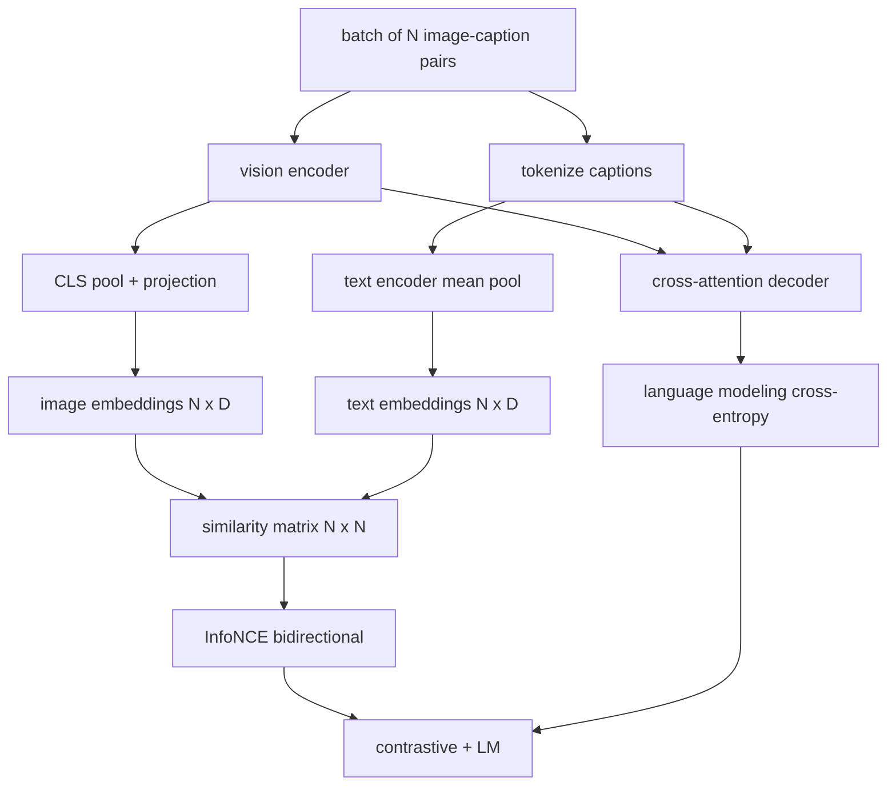

# 视觉-语言预训练

> 编码器、投影和解码器已连接好。现在一起训练它们。两个目标驱动学习：一个对比图像-文本损失（InfoNCE），将匹配对在联合嵌入空间中拉近；以及一个语言建模损失，要求解码器为每张图像生成标题。结合起来，它们教会网络既能为标题找到正确的图像，也能为图像写出标题。

**Type:** Build
**Languages:** Python
**Prerequisites:** Phase 19 lessons 30-37 (Track B foundations)
**Time:** ~90 minutes

## Learning Objectives

- 在一个批次的图像-标题对上实现 InfoNCE 对比损失。
- 将对比损失与自回归语言建模损失组合。
- 合成一个 200 对的模拟图像-标题语料库，无真实数据集下载。
- 运行 50 步演示训练循环，并观察两个损失都在下降。

## The Problem

一个视觉-语言模型需要两种技能。它必须能够排序：给定一个标题，在众多图像中找到正确的那张。它必须能够生成：给定一张图像，写出标题。仅在一种技能上预训练模型只能得到半套系统。CLIP 解决了排序但不能生成标题。GPT-4V 可以生成标题但使用单独的检索头部进行排序。多目标预训练在一次遍历中获得两者。

InfoNCE 处理排序的一半。对于 N 对的批次，模型将 N 个匹配对视为正例，将 `N^2 - N` 个不匹配对视为负例，然后在生成的 `(N, N)` 相似度矩阵上运行交叉熵损失。LM 损失处理生成的一半：在图像条件下进行标准的下一个 token 预测。两种损失都是可微的，且可以共享编码器、投影器和解码器权重。

## The Concept



### InfoNCE 在一段话中

将 N 个图像嵌入作为行，N 个文本嵌入作为行堆叠。对二者进行 L2 归一化。计算 `N x N` 矩阵 `S = I T^T / tau`，其中 `tau` 是可学习的温度。对角线元素是匹配对；非对角线元素是负例。应用交叉熵，目标 `argmax` 沿对角线运行：行 `i` 应在其列 `i` 中有最高条目。沿列做对称的相同操作。总计是两者的平均。这就是 CLIP 损失的八行代码。

### 温度很重要

温度 `tau` 控制 softmax 的尖锐程度。太小（例如 `tau = 0.01`）则梯度仅来自最困难的负例，训练嘈杂。太大则 softmax 变平，梯度消失。CLIP 将 `tau` 作为参数学习；此处的演示也一样。

### 语言建模损失

解码器通过交叉注意力消费图像内存 token，并在每个位置预测下一个文本 token。损失是与下一位置目标的标准交叉熵。填充位置被从损失中屏蔽。

### 组合损失

`total = contrastive + lm_weight * lm`，其中 `lm_weight` 是一个标量（通常为 1.0）。两种损失共享进入编码器和投影的梯度；只有解码器接收 LM 损失的梯度。这是 CoCa、BLIP 和 SigLIP 风格模型都使用的多任务配方，具有各种权重。

| Component | Loss surface | Affects |
|-----------|--------------|---------|
| InfoNCE | Pair ranking in the joint space | Encoder + projection + text head |
| LM | Token prediction conditioned on image | Encoder + projection + decoder |
| Combined | Multi-task | Whole stack |

### 为什么 50 步足以用于演示

模拟语料库是一个合成的 200 对集合，具有随机图像和随机标题 ID。经过 50 步使用批量大小 16 的 SGD 步骤，即使绝对值保持在真实数据模型所能达到的水平之上，两种损失仍然可见地下降。演示的意义是确认梯度管道端到端工作，以及添加 LM 损失不会破坏对比目标的稳定性。

## Build It

`code/main.py` implements:

- `MultimodalModel`, combining a small ViT encoder, the MLP projector, a tiny text-side encoder (mean-pool over embedded ids), and the cross-attention decoder from lesson 61.
- `info_nce_loss(image_emb, text_emb, temperature)`, the bidirectional CLIP-style contrastive loss.
- `lm_loss(logits, target_ids, padding_id)`, masked next-token cross-entropy.
- `make_mock_corpus(seed, n_pairs)`, returning 200 deterministic (image, caption_ids) pairs.
- A training loop running 50 steps with batch size 16, Adam optimizer, and a learned log-temperature parameter. Both losses are printed every 5 steps.

Run it:

```bash
python3 code/main.py
```

Output: contrastive loss drops from about `ln(16) = 2.77` toward 2.4; LM loss drops from a random-uniform baseline of `ln(512) ≈ 6.24` toward about 4.7. Both decreases prove the gradient is wired correctly. Real models train for millions of steps; the dynamics are the same.

## Use It

这是以下模型发布时使用的相同损失配方：

- **CLIP (2021).** 仅图像-文本对比，带有单独的冻结编码器标题探针。
- **CoCa (2022).** 图像-文本对比加图像-标题 LM 损失在一个模型中。本课构建的确切模式。
- **BLIP (2022) and BLIP-2.** 对比加 LM 加图像-文本匹配头。三个损失结合。
- **SigLIP (2023).** 将 InfoNCE 切换为 sigmoid 对损失；相同的对比角色，不同的函数形式。
- **LLaVA family.** 两阶段训练，阶段一为对齐（在冻结的 LM 上进行余弦），阶段二在解冻的 LM 上添加 LM 损失。第 60 课对应阶段一；本课对应阶段二。

## Tests

`code/test_main.py` covers:

- InfoNCE loss is symmetric across image/text rows
- InfoNCE loss returns 0 when the similarity matrix is a perfect diagonal of large positive numbers
- LM loss correctly masks padding positions
- model forward pass produces both losses without errors
- 5-step training loop reduces the combined loss

Run them:

```bash
python3 -m unittest code/test_main.py
```

## Exercises

1. Replace InfoNCE with SigLIP-style sigmoid pair loss and compare convergence on the mock corpus.

2. Add a hard-negative mining step: every other batch, select the hardest off-diagonal pair from the previous batch and append it. Train and inspect whether contrastive loss drops faster.

3. Add an image-text matching binary head on top of the joint embedding (true/false: do these match?) for a third loss, replicating BLIP's three-head setup.

4. Replace the mock corpus with caption-id sequences drawn from a Markov chain whose transition matrix is conditioned on image hash. The captioning loss should drop further because there is actual learnable signal.

5. Train the same model with `lm_weight = 0` and again with `lm_weight = 1`. Compare contrastive loss; the LM loss should not regress the ranking objective.

## Key Terms

| Term | What it means |
|------|---------------|
| InfoNCE | Noise contrastive estimation: cross-entropy on a similarity matrix |
| Temperature | Scalar that controls how peaked the contrastive softmax is |
| Hard negative | An off-diagonal pair the model finds confusing, useful for sampling |
| LM loss | Standard next-token cross-entropy on the captioning side |
| Joint embedding space | The shared space where image and text vectors live after projection |

## Further Reading

- CLIP paper for the original contrastive recipe.
- CoCa paper for contrastive plus captioning in one model.
- SigLIP paper for the sigmoid pair-loss variant and why it scales better.
