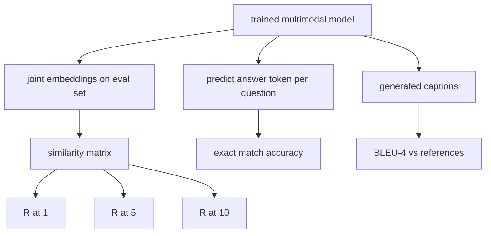

# 多模态评估

> 训练是循环的一半。另一半是测量。本课从原语构建三个评估表面：图像-标题检索，报告为 R@1、R@5、R@10；视觉问答，报告为精确匹配准确率；图像标题生成，报告为 BLEU-4。每个指标是模型输出上的一个函数，配有一个可在秒级内运行的合成评估套件。

**Type:** Build
**Languages:** Python
**Prerequisites:** Phase 19 lessons 58-62 (Track E foundations: encoder, transformer, projection, cross-attention fusion, pretraining)
**Time:** ~90 minutes

## Learning Objectives

- 从图像和标题嵌入之间的相似度矩阵计算 Recall@K。
- 从将（图像，问题）对映射到固定答案词汇表的模型计算精确匹配 VQA 准确率。
- 从生成的和参考的 token 序列计算 BLEU-4，无需任何外部库。
- 在构建于第 62 课训练模型之上的合成套件上运行所有三个评估。

## The Problem

诱惑是在训练损失停滞时声明多模态模型完成。训练损失衡量训练分布上的拟合；它不衡量模型是否能在留出批次中排名对、回答问题或写出人类可以接受的标题。三个评估表面是标准的：

- **Retrieval (R@1, R@5, R@10).** 为查询标题构建联合嵌入；按余弦对评估池中的每张图像排名；报告匹配图像是否落在前 1、前 5、前 10。对称（图像到文本）形式以相同方式运行。
- **Visual question answering (exact match).** 给定（图像，问题），模型输出一个答案 token。精确匹配是每样本一位数据：预测答案是否等于参考答案？在评估集上求平均。
- **Captioning (BLEU-4).** 生成一个标题。计算 1-gram 到 4-gram 精确度相对于参考标题的几何平均值，加上简洁惩罚。多参考是标准形式（一张图像，多个参考标题）。

每个指标是一个薄函数。本课在代码中构建它们全部，使数学具体，评估表面在你的掌控之下。真实基准套件（MS-COCO、VQA v2、GQA、OK-VQA）插入到相同的函数形状中。

## The Concept



### 从相似度矩阵计算 Recall@K

在图像和标题嵌入之间构建 `(N, N)` 余弦相似度矩阵。对于每一行，按降序对列排序。Recall@K 是对角线列索引落在前 K 位内的行的比例。对称 Recall@K（标题到图像）在转置矩阵上计算。两个数字都被报告。对于 N=100 的评估，R@1 = 0.6 意味着 100 个标题中 60 个检索到其正确图像作为顶部匹配。

### VQA 精确匹配

对于每对（图像，问题，答案），编码图像，嵌入问题，通过解码器融合，并读出下一个 token。预测的 token ID 与参考 ID 比较；如果相等则正确。在评估集上求平均。真实 VQA 数据集为每个问题提供多个带有人工标注的答案，并使用软准确率公式（如果 10 个标注者中有至少 3 个一致则为 1.0，低于此则缩放）；本课为清晰起见使用单答案精确匹配。

### BLEU-4

```text
BLEU-4 = BP * exp(mean(log p1, log p2, log p3, log p4))
```

其中 `p_n` 是修改后的 n-gram 精确度（出现在任何参考中的生成 n-gram 的截断计数，除以总生成 n-gram），`BP` 是简洁惩罚：

```text
BP = 1                if generated length > reference length
   = exp(1 - r/g)     otherwise, where r is reference length and g is generated
```

平滑对于某些 `p_n` 为零的小型样本是必要的。实现使用 Chen 和 Cherry 的"方法 1"（对于任何零计数，向分子和分母加 1），这是低计数场景下最安全的默认值。

### 合成评估套件

一个 50 样本的评估套件在内存中从第 62 课使用的相同模拟语料库模式构建，使用留出种子。套件包含三个列表：

- `pairs`: 50 个（图像，标题 ID）对，用于检索。
- `vqa`: 50 个（图像，问题 ID，答案 ID）三元组。
- `caps`: 50 个（图像，[参考标题 ID, ...]）条目，每张图像最多 3 个参考。

套件从种子起就是确定性的，并且从训练语料库中留出，因此指标是在模型从未见过的数据上计算的。将套件持久化为 JSON 留作练习（见下文）。

| Metric | Range | Random baseline (N=50) |
|--------|-------|------------------------|
| R@1 | 0 to 1 | 0.02 (1 / N) |
| R@5 | 0 to 1 | 0.10 |
| R@10 | 0 to 1 | 0.20 |
| VQA EM | 0 to 1 | 1 / vocab |
| BLEU-4 | 0 to 1 | small but nonzero |

对于合成数据上 50 步的训练运行，指标预期不会很高；它们预期高于随机基线，这正是演示检查的内容。

## Build It

`code/main.py` implements:

- `recall_at_k(sim_matrix, k)`, returning a float in `[0, 1]` for both directions.
- `vqa_exact_match(predictions, references)`, returning the mean over `int` equality.
- `bleu4(generated, references, smoothing=True)`, with multi-reference support.
- `build_eval_suite(seed, n_samples, vocab_size, max_len)`, returning three deterministic eval lists.
- `evaluate(model, suite)`, which runs all three metrics and returns a `dict` of numbers.
- A demo that loads a freshly-initialized multimodal model from lesson 62, evaluates it, then trains it for 50 steps and evaluates again, printing the before/after metrics.

Run it:

```bash
python3 code/main.py
```

Output: the before/after metric table shows retrieval improving from near-random toward the model's learned signal, VQA improving above random, and BLEU-4 improving (the synthetic structure is enough for a 4-gram precision lift).

## Use It

每个指标直接映射到一个生产基准：

- **Retrieval.** MS-COCO 5K val、Flickr30K、ImageNet zero-shot 都是同一相似度矩阵上的 R@K 问题。将合成评估替换为真实文件，函数签名不变。
- **VQA.** VQA v2、GQA、OK-VQA 使用相同的精确匹配形状（VQA v2 用软准确率代替单答案 EM）。
- **BLEU-4.** MS-COCO captioning、NoCaps、Flickr30K captioning 都使用 BLEU-4 加 CIDEr 和 METEOR。添加 CIDEr 只是多加一个函数。

对于真实基准，将 `build_eval_suite` 替换为真实加载器并保持函数体不变。数学是基准无关的。

## Tests

`code/test_main.py` covers:

- recall@k returns 1.0 on a perfect identity similarity matrix and 0.0 on a flipped one for k < N
- recall@k respects `k <= N` upper bound
- bleu4 returns 1.0 when generated equals one of the references exactly
- bleu4 returns 0.0 on disjoint vocabulary
- vqa exact match equals the fraction of equal pairs
- build_eval_suite returns the expected number of pairs, vqa items, and caption entries

Run them:

```bash
python3 -m unittest code/test_main.py
```

## Exercises

1. Add CIDEr to the captioning metrics. CIDEr uses TF-IDF weighting on n-grams, which rewards informative tokens.

2. Implement soft-accuracy VQA: multiple human answers per question, accuracy is `min(human_count / 3, 1)` if any matches. Replicates VQA v2.

3. Add a NaN-safe variant of `bleu4` that handles empty generated sequences without crashing.

4. Compute mean reciprocal rank (MRR) alongside R@K. MRR is sensitive to where the correct item lands beyond the top K; R@K is sensitive to whether it lands in the top K.

5. Run the eval on the model at five checkpoints during training (step 0, 10, 20, 30, 40, 50) and plot the learning curve. Confirm the metric trajectories track the loss trajectory.

## Key Terms

| Term | What it means |
|------|---------------|
| R@K | Fraction of queries where the correct match lands in the top K results |
| Exact match | The simplest VQA scoring: predicted answer equals reference |
| BLEU-4 | Geometric mean of 1- to 4-gram precisions, with brevity penalty |
| Multi-reference | A captioning metric accepts several reference captions per image |
| Held-out | The eval set is sampled from a seed disjoint from the training corpus |

## Further Reading

- VQA v2 paper for the soft-accuracy formula and dataset statistics.
- CIDEr paper for TF-IDF-weighted n-gram captioning.
- BLEU original (Papineni et al., 2002) for the smoothing variants.
- MS-COCO captioning eval scripts for the canonical reference implementation.
