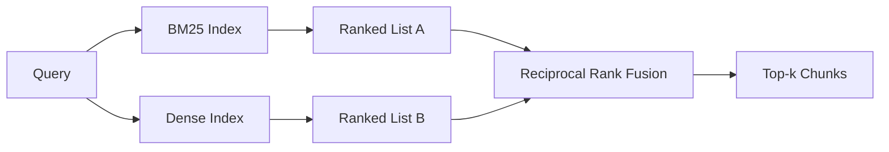

# BM25 与稠密嵌入的混合检索

> 词汇搜索和语义搜索在相反的查询分布上分别失败。基于倒数排名融合的混合检索不进行插值，而是进行投票——而投票在每个查询类别上都胜出。

**Type:** Build
**Languages:** Python
**Prerequisites:** Phase 11 lessons 04 (embeddings), 06 (RAG); Phase 19 Track B foundations (lessons 20-29); Phase 19 lesson 64 (chunking strategies)
**Time:** ~90 minutes

## Learning Objectives
- 从 Robertson 和 Sparck Jones 的公式从零实现 BM25，包含字段权重、文档长度归一化以及可调的 k1 和 b。
- 在确定性模拟嵌入之上构建稠密检索器，使循环能离线运行。
- 严格实现 Cormack、Clarke 和 Buettcher 在 2009 年发布的倒数排名融合，并解释为什么它优于分数加权插值。
- 调整 RRF k 常数和每种模态的权重，并在小型 fixture 语料库上读取权衡。

## The Problem

词汇搜索在查询携带语料库逐字包含的字面标识符时胜出。查询 `AbortMultipartOnFail` 通过 BM25 在微秒内返回正确的 Go 函数。相同的查询，嵌入化后，位于三个相似度聚类的边界，稠密检索器将错误的文件排在首位。

稠密搜索在查询从语料库的字面 token 被改写时胜出。用户询问 "how do we handle cancelled uploads" 从未键入过 abort 或 multipart 这两个词。BM25 返回关于 "uploading large files" 的文档块，因为该页面包含 uploads 这个词。稠密检索找到了摘要中提到 cancellation 的 abort 函数。

两者之间的选择不是静态的。查询分布是变量。一个生产 RAG 系统从同一端点处理两种类别，因此检索必须同时处理两者。这就是混合检索。合并步骤是必须正确的部分。

## The Concept



### BM25 用一段话描述

BM25 通过将查询词上的逆文档频率因子乘以包含长度归一化校正的饱和词频因子来对查询-文档对评分。两个旋钮。`k1` 控制词频饱和；默认值 1.5 是已发布的建议，你不应该在没有基准测试的情况下改变它。`b` 控制文档长度的重要性；默认值 0.75 表示较长的文档会受到惩罚，但不是线性的。

IDF 公式使用平滑的 Robertson 和 Sparck Jones 定义，即 `log((N - df + 0.5) / (df + 0.5) + 1)`。对数内的加一在词出现在超过一半语料库时保持 IDF 为正。这在小型语料库（停用词在技术上很稀有）中很重要。

字段权重让你告诉 BM25，符号名称上的匹配比正文中的匹配更重要。实现是在索引期间的词频计数上的乘数，而非在评分时。这保持了数学不变，并避免了每个字段的单独分数。

### 稠密检索用一段话描述

用嵌入模型将每个分块嵌入到固定维度的向量中。在查询时，嵌入查询，按相似度对每个分块进行余弦排名，并返回前 k 个。模型是决定质量的变量。检索算法本身是两行：点积和排序。

本课使用确定性基于哈希的嵌入，因此你可以在没有网络调用的情况下阅读融合数学。哈希将 token 键控偏移量求和为 96 维向量并归一化。余弦排名在不同运行之间是确定性的，这正是测试套件所需的。

### 倒数排名融合，已发布的公式

两个排名列表。对于出现在任一列表中的每个候选项，求其倒数排名贡献之和。2009 年的论文使用了 `1 / (k + rank)`，k 等于 60 作为默认值。按总分排序。这就是整个算法。

已发布的常数 k = 60 不是任意的。当 k = 60 时，排名 1 的贡献是 1/61，排名 10 的贡献是 1/70。贡献衰减缓慢，因此深度候选项仍然有投票。较小的 k 使顶部结果主导。较大的 k 使贡献曲线变平。

我们实现中有两个可调旋钮。`k` 常数。一对每种模态的权重，以便当你有先前证据表明某种模态在你的语料库上更好时，可以提升 BM25 或稠密。将排名贡献乘以权重是最简单的原则实现；它保留了排名衰减形状并保持无尺度。

### 为什么融合优于分数加权插值

BM25 分数是无界的且取决于语料库。余弦相似度有界于 -1 到 1。线性组合 `alpha * bm25 + (1 - alpha) * cosine` 需要每个语料库的 alpha 调整，并且每次重新索引时都会崩溃。基于排名的融合则不会。两个排名在不同模态之间是可比较的。已发布的 RRF 基线自 2010 年以来在每个公共 TREC track 中都击败了分数插值。

这与你在 Vespa 和 Weaviate 文档中听到的关于 RankFusion vs RRF 的论点相同。它们得出了同样的结论：除非你有非常强的证据进行分数插值，否则坚持基于排名的方法。

## Build It

`code/main.py` implements:

- `tokenize(text)` - a fast regex tokenizer.
- `BM25Index` - field-weighted, with `add` and `search` and tunable k1, b.
- `mock_embed`, `DenseIndex` - the same deterministic embedding as lesson 64 so chunks are comparable.
- `rrf(rankings, k, weights)` - the published fusion with multi-modality weights.
- `HybridRetriever` - combines BM25 and dense.
- A demo `main()` that loads a small fixture corpus, runs three queries that target each retriever's strength and weakness, and prints the rankings each modality produced plus the fused list.

Run it:

```bash
python3 code/main.py
```

并排阅读演示输出。字面标识符查询落在 BM25 排名 1、稠密排名 4、RRF 排名 1。改写后的查询落在 BM25 排名 6、稠密排名 1、RRF 排名 1。歧义词查询落在 BM25 排名 3、稠密排名 3、RRF 排名 1。融合不是平局决胜者；它是在每个查询类别上都胜出的系统。

## 调整旋钮

| Knob | Default | Move it up when | Move it down when |
|------|---------|----------------|------------------|
| BM25 k1 | 1.5 | Terms repeat in documents and you want frequency to matter more | Documents are short and term repetition is noise |
| BM25 b | 0.75 | Long documents really do say less per word | Document length is uncorrelated with topic |
| RRF k | 60 | Deep candidates should keep voting | The top-1 should dominate |
| BM25 weight | 1.0 | Your corpus contains literal identifiers and queries match them | Your queries are user-paraphrased |
| Dense weight | 1.0 | Queries are paraphrased | Queries are literal |

通过在你的留出查询集上重新运行第 68 课的评估工具来调整，而不是靠直觉。

## 演示会隐藏的故障模式

**词汇外 token。** BM25 的 IDF 从语料库中计算，因此仅在查询中出现的词贡献为零。稠密嵌入为相同的词幻觉一个向量。在语料库外标识符上，稠密模态返回看起来合理但错误的邻居。融合吸收了这一点，因为 BM25 不返回任何东西且排名贡献消失，但仅当你按文档而非按分块去重时。

**停用 token 主导。** BM25 对 "the" 产生在语料库上的均匀排名。在索引器中过滤停用 token 或接受高 IDF 的词自然主导。

**不同模态上的相同内容。** 如果你的语料库小到 BM25 的 top-1 也是稠密的 top-1，RRF 会给你相同的 top-1 和相同的邻居。这是正确的行为，不是故障，但它使融合看起来不可见。在你的评估中添加一对对抗性查询来验证融合确实在起作用。

## Use It

生产模式：

- 在进程中索引 BM25；瓶颈是词频字典，而非向量。
- 将稠密向量索引在单独的存储中（本课使用扁平列表；生产中你会使用 HNSW）。
- 并行运行两个查询；融合是对并集的常数时间合并。
- 持久化每个检索命中的模态，使下游重排器可以看到哪个模态为其投票。

## Ship It

第 66 课从本课获取融合后的前 k 个并用交叉编码器重排。第 68 课用精确度、召回率、MRR 和 nDCG 评估整个管线。本课中的混合检索器是第 69 课端到端系统的第一阶段。

## Exercises

1. Replace `mock_embed` with a real model from your provider. Re-run the demo and report how the dense-only ranking changes on the paraphrased query.
2. Add a third modality: chunk summaries indexed separately and fused as a third ranked list. Measure the gain.
3. Sweep RRF k across 10, 30, 60, 100, 200. Plot the recall@k curve from lesson 68. Report the value of k where the curve peaks on your corpus.
4. Implement BM25F properly (per-field length normalization rather than the multiplier trick) and compare on a corpus where symbol matches matter most.

## Key Terms

| Term | What people say | What it actually means |
|------|-----------------|------------------------|
| BM25 | "Lexical search" | 基于 idf x 饱和 tf x 长度归一化的概率排名 |
| RRF | "Rank fusion" | 在排名列表上求和 1 / (k + rank)；k = 60 默认 |
| k1 | "TF saturation" | 控制重复词停止添加更多分数的速度 |
| b | "Length penalty" | 0 表示忽略文档长度，1 表示完全归一化 |
| Field weighting | "Symbol boost" | 在索引期间重复 token 以提升该字段中的匹配 |
| Rank-based vs score-based fusion | "Why RRF beats linear" | 排名在不同模态间可比较；分数不可比较 |

## Further Reading

- Cormack, Clarke, Buettcher, "Reciprocal Rank Fusion outperforms Condorcet and individual rank learning methods", SIGIR 2009
- Robertson, Walker, Beaulieu, Gatford, Payne, "Okapi at TREC-3" (the original BM25 paper)
- [Vespa: Hybrid Retrieval with BM25 and Embeddings](https://docs.vespa.ai/en/tutorials/hybrid-search.html)
- [Weaviate: Hybrid Search](https://weaviate.io/developers/weaviate/search/hybrid)
- Phase 11 lesson 06 - RAG fundamentals
- Phase 19 lesson 64 - chunkers whose output is indexed here
- Phase 19 lesson 66 - cross-encoder reranker that consumes the fused top-k
