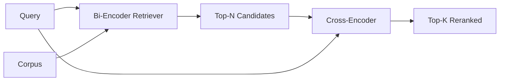

# 交叉编码器重排序器

> 双编码器独立地对查询和文档进行嵌入。交叉编码器将它们拼接在一起并同时读取两者。交叉编码器是最聪明的读取器，也是最慢的。作为双编码器 top-k 上的第二级使用，它物有所值。

**Type:** Build
**Languages:** Python
**Prerequisites:** Phase 11 lesson 06 (RAG), Phase 11 lesson 07 (advanced RAG); Phase 19 Track B foundations (lessons 20-29); Phase 19 lesson 65 (hybrid retrieval feeding this stage)
**Time:** ~90 minutes

## Learning Objectives
- 通过输入形状、参数数量和每条查询的成本来区分双编码器检索器和交叉编码器重排序器。
- 从头实现一个小型交叉编码器，作为一个 Transformer 块，消费打包的（查询，文档）序列并输出一个单一的相关性标量。
- 连接一个两阶段的"检索后重排序"流水线：用廉价检索器检索 top-N，用交叉编码器将 N 重排序为 top-K，返回 K。
- 在一个小型固定语料库上测量延迟与质量的权衡，并为给定的延迟预算选择合适的 N。

## The Problem

双编码器将查询和文档映射到相同的向量空间中，并通过余弦相似度排序。两个编码结果从未互相看见。模型必须将关于文档的所有有用信息压缩成一个单一向量，而不知道查询是什么。这是快速的——索引时每个文档一个嵌入，查询时每个查询一个嵌入——也是在大规模语料库上排序的唯一方式。

代价是精确度。两个拥有相同总体主题的文档可能拥有几乎相同的嵌入，即使其中一个回答了查询而另一个没有。双编码器无法区分它们。

交叉编码器通过同时读取查询和文档来解决这个问题。模型接收 `[query] [SEP] [document]` 作为单一序列，在连接处运行完整的注意力机制，并产生一个单一的相关性标量。文档的每个 token 都可以关注查询的每个 token。模型在完整上下文中决定分数。

代价是吞吐量。双编码器嵌入一次即可永远进行查询，而交叉编码器对每个（查询，文档）对都要运行一次。对于包含一千万文档的语料库，每个查询需要一千万次前向传播。在请求预算中无法运行。

解决方案是分阶段处理。使用双编码器检索 top-N。使用交叉编码器将 N 重排序为 top-K。N 较小（50 到 200），交叉编码器的质量提升集中在关键部分。总延迟保持在请求预算内。总质量是交叉编码器的质量，受限于双编码器在 N 处的召回率。

## The Concept



### 交叉编码器的输入形状

标准打包方式是 `[CLS] query_tokens [SEP] document_tokens [SEP]`。CLS 位置的输出被馈入一个单一的线性头，输出相关性标量。有些实现使用平均池化而非 CLS；差异很小。重点是模型为每个对产生一个数字。

一个 22M 参数的交叉编码器（已发布的 `ms-marco-MiniLM-L-6-v2` 权重级别）是典型的生产选择。更小的模型质量下降速度比节省的延迟更快。更大的模型（例如 568M 参数的 `bge-reranker-v2-m3`）保留用于离线重排序或 K 较小的首页重排序。

### 为什么本课训练一个小型模型

真正的交叉编码器是一个微调的编码器 Transformer。在生产中你加载一个检查点并运行它。本课的目标是向你展示模型的形状以及延迟-质量曲线的形状，而不是训练一个最先进的重排序器。因此，我们构建一个小的 `nn.Module`，包含一个 Transformer 块、多头注意力（默认 4 个头）和一个回归头。它通过种子确定性地初始化，因此演示无需磁盘上的权重即可复现。

玩具模型从固定语料库中学习正确的形状：相关的查询-文档对比不相关的对具有更高的预测分数。端到端流水线对双编码器的输出进行重排序，重排序的 top-k 与金标准标签相关。

### 延迟 vs 质量

两阶段流水线有一个可调参数：N。在留出的查询集上从 5 到 100 扫描 N，你会得到曲线。

| N | 阶段 2 的 Recall@1 | 每查询交叉编码器前向传播次数 | 延迟 |
|---|--------------------|---------------------------------------|---------|
| 5 | 0.62 | 5 | 低 |
| 20 | 0.81 | 20 | 中 |
| 50 | 0.86 | 50 | 高 |
| 100 | 0.86 | 100 | 非常高 |

上表中的数字说明了曲线的形状，而非本固定语料的测量值。形状是真实的。通常在 20 到 50 个候选项之间有一个拐点，重排序的提升趋于饱和。超过拐点后你在白费力气。

根据评估曲线加上延迟预算来选择 N。交叉编码器无法将召回率提高到超过双编码器在 N 处的召回率，因此低 N 会限制质量，而不仅仅是延迟。

## Build It

`code/main.py` 实现了：

- `CrossEncoder` - 一个小型的 `torch.nn.Module`：token 嵌入，一个包含多头注意力和前馈网络的 Transformer 块，平均池化头产生一个标量。
- `tokenize_pair(query, document)` - 将两个字符串打包成一个带有类型 id 的单一 id 序列，标记边界，确定性的且使用标准库。
- `train_tiny(pairs)` - 在手工标记的（查询，文档，相关性）三元组列表上进行一轮监督训练，使模型在固定语料上产生合理的分数。
- `rerank(query, candidates, top_k)` - 生产接口。
- `pipeline(query, retriever, top_n, top_k)` - 两阶段流程。
- 一个演示 `main()`，从第 65 课的模式加载语料库，检索 top-N，重排序为 top-K，并排打印两个列表，并报告每个阶段的延迟。

运行方式：

```bash
python3 code/main.py
```

输出显示双编码器的 top-N、交叉编码器的 top-K 以及时间摘要。交叉编码器每次调用花费更多时间，但不在整个语料库上运行。两阶段总时间保持在请求预算内，同时选出了双编码器排在第二或第三的答案。

## 演示会隐藏的失败模式

**交叉编码器不是对称的。** `rerank(q, d)` 和 `rerank(d, q)` 产生不同的分数。始终将查询放在前面输入。如果意外交换，召回率会崩溃。

**N 太低无法暴露 bug。** 如果设置 N = K，交叉编码器无法重新排序；它只能重新加权。提升看起来为零。选择 N 至少是 K 的三倍。

**训练数据泄漏到评估中。** 如果手工标记的训练对包含评估查询，重排序看起来会很神奇。严格分离训练和评估，即使在固定语料上也是如此。

**生产权重是稠密的。** 一个 22M 参数的交叉编码器在 float32 下是 88MB。在承诺亚 100ms p95 延迟之前，先规划好模型服务器的内存。

**批处理很重要。** 真正的交叉编码器在一个批次中运行 N 个候选项。本课在 `_batch_encode` 中做了这一点，它使用 `torch.tensor(...)` 构建批处理的 id 和 type-id 张量，并运行一次前向传播。跳过批处理，延迟会乘以 N。

## Use It

生产模式：

- 将双编码器、交叉编码器和 N 固定在一起。更改其中任何一个都会使评估无效。
- 按（查询，文档 id）哈希缓存重排序器的输出。对稳定语料库的相同查询重排序结果相同；缓存命中可以免费降低延迟。
- 记录 rank-1 交叉编码器分数。top-1 分数低于语料库特定阈值的查询是一个领域外命中；将其呈现给 LLM 作为"我不确定"。

## Ship It

第 68 课端到端评估这个两阶段流水线。第 69 课将此重排序器连接到第 65 课的混合检索器之后、答案生成器之前。重排序器是端到端系统的第二阶段。

## Exercises

1. 从 5 到 50 扫描 N 并绘制重排序输出的 recall@1。在此固定语料上找到拐点。
2. 训练交叉编码器十个 epoch 而非一个。测量每个 epoch 正负对之间的分数差距。
3. 将平均池化替换为 CLS token 头。在此固定语料上比较收敛情况。
4. 添加第二个交叉编码器头，预测二元的"此答案是否在文档中"标签。推理时使用两个头；一个用于排序，一个用于设阈值。
5. 将确定性的模拟双编码器替换为第 65 课的双编码器，并将两个阶段链接起来。测量 top-K 与仅使用双编码器相比的变化。

## Key Terms

| Term | What people say | What it actually means |
|------|-----------------|------------------------|
| Bi-encoder | "向量检索器" | 独立编码查询和文档；余弦相似度排序 |
| Cross-encoder | "重排序器" | 联合编码（查询，文档）；输出一个相关性标量 |
| Two-stage pipeline | "检索并重排序" | 廉价检索器返回 N，昂贵的重排序器保留 K |
| N (candidate budget) | "重排序池" | 交叉编码器每个查询评分的候选项数量 |
| Mean-pooling head | "最后隐藏层的均值" | 将编码器最后一层的输出平均为一个向量 |

## Further Reading

- Nogueira, Cho, "Passage Re-ranking with BERT", 2019 - 经典的交叉编码器排序论文
- Reimers, Gurevych, "Sentence-BERT: Sentence Embeddings using Siamese BERT-Networks", 2019 - 关于双编码器 vs 交叉编码器
- [SentenceTransformers Cross-Encoders documentation](https://www.sbert.net/examples/applications/cross-encoder/README.html)
- [BGE Reranker v2 model card](https://huggingface.co/BAAI/bge-reranker-v2-m3)
- Phase 19 lesson 65 - 为此重排序阶段提供输入的混合检索器
- Phase 19 lesson 68 - 测量此重排序所带来提升的评估
