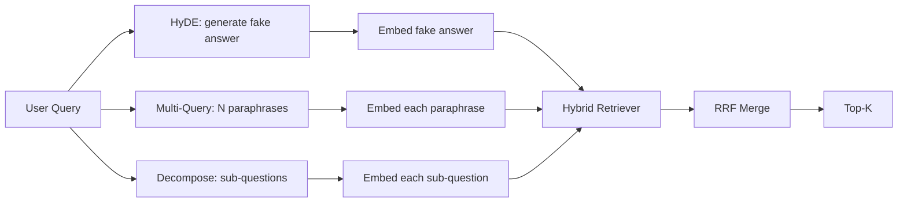

# 查询改写：HyDE、多查询扩展和分解

> 用户输入的查询不是你的检索器想要的查询。改写弥合了检索前的差距，使索引看到更接近答案形式的内容。

**Type:** Build
**Languages:** Python
**Prerequisites:** Phase 11 lessons 04 (embeddings), 06 (RAG); Phase 19 Track B foundations (lessons 20-29); Phase 19 lessons 64 and 65
**Time:** ~90 minutes

## Learning Objectives
- 实现假设文档嵌入（HyDE）：生成一个假答案，将其嵌入，用该向量而不是查询向量进行检索。
- 实现多查询扩展：将一个查询改写为 N 个释义，每个都进行检索，通过倒数排序融合合并并集。
- 实现查询分解：将复杂问题拆分为子问题，每个子问题单独检索，合并结果。
- 在固定语料上直接对比三种改写器，并解释每种策略何时胜出。
- 连接一个模拟 LLM，产生确定性的、在固定语料上的输出，使改写器循环可以离线运行。

## The Problem

用户输入"当上传失败且预算耗尽时，我们的团队会做什么？"。语料库中有一篇文档说"AbortMultipartOnFail 在中止正在进行的 S3 多部分上传时，会在上传失败时递减每桶重试预算"。查询和文档不共享任何名词短语。BM25 会错过。双编码器将文档排在第三或第四，因为查询向量落在嵌入空间中偏向关于取消作业的文档的区域，而非关于中止上传的文档的区域。第 66 课的两阶段重排序可以挽救答案，如果它位于 top-N 中，但如果它甚至没有到达 top-N，重排序器就永远不会看到它。

解决方法是在查询接触检索器之前改写它。2023 年的论文"Precise Zero-Shot Dense Retrieval without Relevance Labels"（Gao 等人）引入了 HyDE：让 LLM 写出会回答查询的文档，嵌入那个假设文档，并将其嵌入用作检索向量。假设文档位于嵌入空间的正确区域，因为它是以语料库的语言风格书写的。查询向量则不在那个位置。

两个姊妹技术与 HyDE 搭配使用。多查询扩展（微软 GraphRAG 使用的术语）生成 N 个查询的释义，每个都进行检索，然后合并。分解（在 2024 年斯坦福 DSPy 工作中以"子查询分解"流行）将"当上传失败且预算耗尽时我们的团队会做什么"拆分为两个问题："上传失败时会发生什么"和"重试预算耗尽时会发生什么"。两次检索，一个合并结果，答案的两个部分都可以被检索到。

本课实现全部三种方法，并在相同的固定语料库上运行它们。

## The Concept



### HyDE 详解

HyDE 用 LLM 编写的假设文档向量替换用户的查询向量。提示词很短：

```
You are a domain expert. Write a one-paragraph passage that answers the question
below. Use the same vocabulary and phrasing the documentation in this domain would
use. Do not refuse. Do not say you do not know.

Question: {user_query}

Passage:
```

LLM 的答案作为事实性答案是错误的，因为 LLM 不知道你的语料库。这没关系。检索器不关心事实正确性，只关心 token 分布。假设段落包含"abort"、"multipart"、"bucket"、"budget"这些词，因为这是关于此主题的文档段落会使用的词汇。嵌入该段落。该向量会落在真实段落附近。

在生产中，将假设文档的长度限制在 2 到 3 句话。更长的假设段落会收集更多噪音。更短的则会丢失 HyDE 所需的词汇信号。

### 多查询扩展详解

生成 N 个用户查询的释义。最简单的提示词：

```
Rewrite the following question in {N} different ways. Each rewrite must preserve
the original intent. Number them 1 to {N}. Do not add explanations.
```

为每个释义检索 top-k。用 RRF（与第 65 课相同的算法）合并 N 个排序列表。廉价、并行、确定性。

当用户的措辞是问问题的多种同样有效的方式之一，而任何一个改写都能更好地表达时，多查询胜出。当所有改写都同样糟糕，因为原始查询以相同的方式表达得不好时，会失败。

### 分解详解

单次检索无法满足多层面的问题。分解要求 LLM 将问题拆分为子问题，系统按子问题检索。提示词：

```
The following question may require information from multiple distinct topics.
Decompose it into a list of sub-questions. Each sub-question must be answerable
independently. If the question is already atomic, return it unchanged.

Question: {user_query}
```

按子问题检索。合并。分解是处理包含连接词、多从句比较或两个不相关主题的问题的正确工具。是处理原子问题的错误工具；分解器在这些情况下的工作是返回单个问题，而不是捏造假子问题。

### 为什么三者都存在

三者是互补的。HyDE 弥合查询与语料库之间的 token 差距。多查询覆盖释义变体。分解覆盖多主题查询。一个生产系统会运行全部三种方法，并按查询选择策略（第 69 课的端到端系统展示了选择器）。

## The Mock LLM

本课离线运行。模拟 LLM 是一个以用户查询为键的小型查找表，加上对未见过的查询的回退处理。查找表包含：

- 对于每个固定查询：一个书面的假设段落、三个释义和一个分解。
- 对于未知查询：一个确定性的转换：取查询中的内容词，通过同义词映射扩展它们，然后返回结果。

重要的是模拟 LLM 的形状，而非数据。在生产中你将模拟 LLM 替换为真实的模型调用。检索器不会改变。

## Build It

`code/main.py` 实现了：

- `MockLLM` - 上述的确定性替身。
- `HyDERewriter` - 调用 LLM 编写假设文档，以 `RewriteResult` 返回改写器输出，包含假设文本和检索器应使用的查询。
- `MultiQueryRewriter` - 调用 LLM 生成 N 个释义，返回查询列表。
- `DecomposeRewriter` - 调用 LLM 进行分解，返回子问题。
- `retrieve_with_rewriter` - 接收一个改写器和一个检索器，运行改写，融合结果。
- 一个演示，在固定语料上运行三种改写器，并打印哪种策略最先返回金标准答案文档。

检索器形状复用第 65 课的（混合 BM25 + 稠密）。融合使用相同的 RRF。唯一新的形状是改写器接口，它很小。

运行方式：

```bash
python3 code/main.py
```

输出是按策略的排序和一个最终摘要。HyDE 在措辞不匹配的查询上胜出。多查询在释义差异的查询上胜出。分解在多主题查询上胜出。回退（无改写器）在三个查询中至少输掉一个。

## 演示会隐藏的失败模式

**HyDE 幻觉编造了错误的语料库特定标识符。** 模型编造了一个函数名。假设文档在正确文档上的 BM25 分数会崩溃，因为编造的名称现在是一个不出现在索引中的高权重 token。限制假设文档的长度，并在融合中降低 BM25 的权重。

**多查询改写全部趋同。** 一个弱模型产生三个几乎相同的释义。N 次检索返回相同的 top-k。RRF 合并不比单次检索更好。在改写提示词中添加显式的多样性指令，并通过 Jaccard 检测重复。

**分解过度拆分。** 分解器将原子问题变成一个列表。所有检索都返回相同的文档，但排名降低。合并结果比原始结果更差。在拆分之前通过"这些子问题是否足够不同"的检查来检测。

**延迟会倍增。** HyDE 花费一次 LLM 调用。多查询花费一次 LLM 调用来生成 N 个改写，然后是 N 次检索。分解花费一次 LLM 调用来分解，然后是 M 次检索。检索可以并行运行；LLM 调用是基础延迟。

## Use It

生产模式：

- 按查询长度进行每查询策略选择：原子短查询用多查询，复杂的多从句查询用分解，术语密集的查询用 HyDE。
- 按查询哈希缓存改写器输出。许多查询会重复。
- 并行运行三种方法，用 RRF 将三个结果集融合为一个。成本是三次 LLM 调用和一次融合；质量是三种策略覆盖范围的并集。

## Ship It

第 69 课将此改写器阶段连接到第 65 课的检索器之前和第 66 课的重排序器之前。第 68 课评估改写器为检索召回率带来的提升。

## Exercises

1. 实现 RAG-Fusion（2024 年多查询的变体），改写器的释义故意多样化，然后重排序步骤（第 66 课）选择最终列表。
2. 添加第四种策略：后退提示（让 LLM 提出更通用的问题，在其上检索，然后缩小范围）。在固定语料上对比。
3. 训练分解器识别原子查询，添加一个"问题是否为原子"头。测量改进前后的过度拆分率。
4. 将模拟 LLM 替换为真实模型调用。在你的技术栈上测量每种策略的延迟。
5. 为每个改写添加置信度分数。丢弃低于阈值的改写。测量对召回率的影响。

## Key Terms

| Term | What people say | What it actually means |
|------|-----------------|------------------------|
| HyDE | "假文档检索" | LLM 编写答案；将其嵌入并以此而不是查询进行检索 |
| Multi-query | "释义扩展" | N 个查询的改写；检索 N 次，用 RRF 合并 |
| Decomposition | "子查询拆分" | 多主题查询拆分为子问题，分别检索 |
| Atomic query | "单主题" | 不能在不捏造假子问题的情况下被分解 |
| Step-back | "抽象查询" | 问更通用的问题，检索，然后缩小范围 |

## Further Reading

- Gao, Ma, Lin, Callan, "Precise Zero-Shot Dense Retrieval without Relevance Labels" (HyDE), 2023
- Microsoft Research, "Multi-Query Expansion for Retrieval"
- Stanford DSPy, "Subquery Decomposition for Multi-Hop QA"
- [LlamaIndex query transformations documentation](https://docs.llamaindex.ai/en/stable/optimizing/advanced_retrieval/query_transformations/)
- Phase 11 lesson 07 - 高级 RAG 模式
- Phase 19 lesson 65 - 此改写器所馈送的检索器
- Phase 19 lesson 68 - 测量改写器提升的评估
