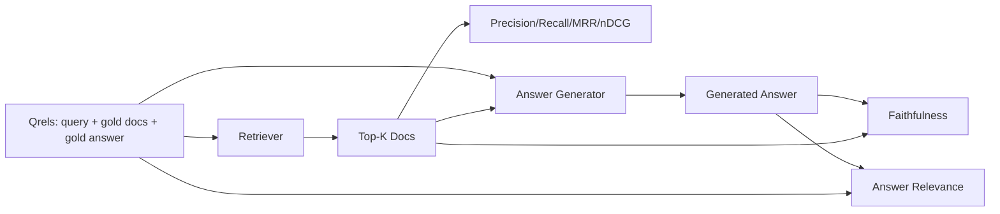

# RAG 评估：精确率、召回率、MRR、nDCG、忠实度和答案相关性

> 如果你不能同时评估你的检索和你的答案，你就不能交付系统。这两者不是同一个指标，同一个提示词在不同的维度上会失败。

**Type:** Build
**Languages:** Python
**Prerequisites:** Phase 11 lessons 06 (RAG), 10 (evaluation); Phase 19 Track B foundations (lessons 20-29); Phase 19 lessons 64, 65, 66, 67
**Time:** ~90 minutes

## Learning Objectives
- 从金标准 qrels 计算四个检索指标：precision@k、recall@k、MRR（平均倒数排名）和 nDCG@k。
- 计算两个答案质量指标：忠实度（每个声明都基于检索到的上下文）和答案相关性（答案针对了问题）。
- 构建一个固定 qrels 文件（查询、金标准文档 id、金标准答案文本），评估端到端读取它。
- 阅读指标值以诊断流水线哪里出错了：检索、排序、生成或事实依据。

## The Problem

一个 RAG 系统至少有四个移动部件：分块器、检索器、重排序器、生成器。其中任何一个都可能成为错误答案的原因。没有逐阶段的指标，你就是在盲目飞行。

用户报告了一个错误答案。是因为分块器截断了答案跨度？是因为检索器没有将分块包含在 top-k 中？是因为重排序器将正确的分块推到了第一个位置之后？是因为生成器忽略了分块并编造了内容？你无法仅从答案中判断。你需要：

- 检索指标来评估检索器输出的内容。
- 排序指标来评估正确分块在顺序中的位置。
- 忠实度来评估生成器是否保持在检索到的上下文中。
- 答案相关性来评估答案是否真正回应了问题。

本课在固定 qrels 文件之上构建全部六种指标。评估是离线的且确定性的；在生产中你将模拟 LLM 作为评判者替换为真实的。

## The Concept



### Precision@k

检索器返回的 top-k 文档中，有多少比例在金标准集中？如果金标准有三个文档，top-3 返回了其中两个和一个错误的，precision@3 是 2 / 3。当不相关检索分块的成本很高时使用精确率（生成器在其上浪费 token，或分块污染了答案）。

### Recall@k

金标准文档中，有多少比例在 top-k 中？如果金标准有三个文档，top-5 包含了全部三个，recall@5 是 1.0。当错过答案的成本很高时使用召回率（你宁愿多看到一个错误的分块，也不愿完全错过答案分块）。

在生产 RAG 中，人们通常引用的指标是 recall@k。生成可以轻松丢弃不相关的分块；它无法从从未见过的分块中编造答案。

### MRR（平均倒数排名）

对于每个查询，找到排序列表中第一个相关文档的位置。倒数排名是 1 / 位置。在查询集上取平均。MRR 是检索器将最佳答案放在最前面的好坏的单一数字摘要。

MRR 对位置 1 赋予很高权重。金标准文档在排名 1 的查询贡献 1.0。排名 2 贡献 0.5。排名 10 贡献 0.1。该指标由列表顶部主导。

### nDCG@k

归一化折损累积增益。完整公式为每个检索到的文档分配增益（通常相关为 1，不相关为 0），按位置的对数折损，求和，然后除以理想 DCG（如果完美排序时所获得的 DCG）。范围 0 到 1。

nDCG 适用于分级相关性：金标准可以说"文档 A 是 3，文档 B 是 2，文档 C 是 1"。MRR 和 recall@k 将所有内容扁平化为二元的。当语料库中每个查询有多个部分相关的文档时使用 nDCG。

### 忠实度

对于生成答案中的每个声明，检查该声明是否被检索到的上下文所支持。标准实现使用 LLM 作为评判者的提示词，输入（声明，上下文）并返回是或否。该指标是通过的声明的比例。

忠实度捕获生成器编造内容的失败模式。即使检索器返回了正确的分块，生成器产生幻觉也是坏的。忠实度也被称为基础性、支持度、归因。

本课使用确定性的模拟评判者实现忠实度，它检查每个声明的 token 与检索到的上下文的重叠是否达到阈值。在生产中你将替换为真实的模型调用。指标的形状是相同的。

### 答案相关性

答案是否真正回应了问题？忠实度问"答案是否基于上下文？"。答案相关性问"答案是否基于问题？"。一个忠实但离题的答案在忠实度上得分高而在相关性上得分低。一个简短、切题但忽略上下文的答案在相关性上得分高而在忠实度上得分低。

标准实现也使用 LLM 作为评判者：输入（问题，答案）并询问答案是否回应了问题。本课实现了一个基于 token 重叠加评判者的替身。

## The fixture qrels

```python
{
  "qid": "q1",
  "query": "what is the abort threshold for multipart uploads",
  "gold_doc_ids": ["d1", "d3"],
  "gold_answer_substring": "three failed parts",
  "graded_relevance": {"d1": 3, "d3": 2},
}
```

每个查询包含：
- 查询字符串，
- 一组金标准文档 id（用于精确率 / 召回率 / MRR），
- 一个分级相关性字典（用于 nDCG），
- 金标准答案子串（作为每个 qrel 上的参考元数据保存；本课中的忠实度是通过对提取的声明与检索到的上下文进行评判来计算的，而不是针对此子串）。

在生产中你标注这些。本课提供一个手工构建的固定语料，使评估开箱即用。

## Build It

`code/main.py` 实现了：

- `precision_at_k(retrieved, gold, k)` - 字面定义。
- `recall_at_k(retrieved, gold, k)` - 字面定义。
- `mean_reciprocal_rank(retrieved_list_of_lists, gold_list)` - 查询上的均值。
- `ndcg_at_k(retrieved, graded_relevance, k)` - 二元或分级增益的 DCG / IDCG。
- `extract_claims(answer)` - 将答案拆分为句子形式的声明。
- `faithfulness(claims, context_texts, judge)` - 被评判为支持的声明比例。
- `answer_relevance(question, answer, judge)` - 评判者判断答案是否回应了问题。
- `MockJudge` - 确定性的 token 重叠评判者，使评估离线运行。
- `evaluate_pipeline(pipeline_fn, qrels, ks)` - 运行每个指标的编排器。
- 一个演示，针对 qrels 运行三种流水线变体（分块器基线、混合检索、混合 + 重排序）并打印指标表。

运行方式：

```bash
python3 code/main.py
```

输出在单个指标表中显示每种变体的 precision@k、recall@k、MRR、nDCG@k、忠实度和答案相关性。混合检索行在召回率上胜过基线分块器；重排序行在 MRR 上胜过混合检索。

## 阅读指标以诊断故障

| 症状 | 可能的原因 | 要修复的内容 |
|---------|-------------|-------------|
| recall@k 低，precision@k 低 | 分块器截断了答案或检索器无法找到 | 分块器边界（第 64 课）或检索器模式（第 65 课） |
| recall@k 尚可，MRR 低 | 正确分块在 top-k 中但不在位置 1 | 重排序器（第 66 课） |
| MRR 高，忠实度低 | 生成器尽管有正确上下文仍编造内容 | 生成提示词；强制引用或拒绝 |
| 忠实度高，相关性低 | 答案有基础但离题 | 查询改写器（第 67 课）或生成提示词 |
| 四项都高，用户仍抱怨 | 评估集没有代表性 | 用真实用户查询扩充 qrels |

## 演示会隐藏的失败模式

**LLM 作为评判者存在偏见。** 模型将自己的输出评判为比实际更忠实。使用与生成器不同模型家族的评判者，或手动评分样本。

**Qrels 腐蚀。** 金标准答案随语料库变化而漂移。2024 年 1 月是 q1 的金标准文档在 2024 年 10 月可能不再是正确答案，因为团队重命名了函数。安排季度 qrels 审查。

**忠实度微检查遗漏了宏声明。** 逐句忠实度可以通过，而整体答案的结构具有误导性。在自动指标之上添加样本级别的定性审查。

**Recall@k 掩盖了每查询的失败。** 90% 的平均召回率可能隐藏了某个查询类别总是失败。按查询类别（字面、释义、多主题）切片 qrels 并报告每切片的数据。

## Use It

生产模式：

- 对每次检索器或生成器的更改运行评估。将 recall@k 下降视为测试失败。
- 持久化每个查询的指标轨迹。当用户抱怨时，查找匹配的 qrels 条目，看看它是否本来可以被捕获。
- 分层 qrels：一个 20 个查询的烟雾测试集在 CI 中运行；一个 200 个查询的回归集每晚运行；一个 2000 个查询的深度集每周运行。

## Ship It

第 69 课连接整个流水线（分块器、检索器、重排序器、生成器）并针对端到端系统运行此评估。

## Exercises

1. 添加第五个检索指标：hit-rate@k。将其与 recall@k 对比。解释它们何时不同。
2. 实现分级忠实度：0（不支持），1（部分支持），2（完全支持）。相应更新指标。
3. 将模拟评判者替换为真实模型调用。测量模拟评判者和真实评判者在固定语料上的分歧。
4. 添加查询类别切片（"字面"、"释义"、"多主题"）。报告每切片的指标。
5. 添加"答案长度"指标并将其与忠实度关联。绘制曲线。

## Key Terms

| Term | What people say | What it actually means |
|------|-----------------|------------------------|
| Precision@k | "检索的命中率" | top-k 中是金标准的比例 |
| Recall@k | "金标准的命中率" | 金标准在 top-k 中的比例 |
| MRR | "首次命中位置" | 1 / 第一个相关文档的排名的均值 |
| nDCG@k | "分级排序质量" | top-k 上的 DCG 除以理想 DCG |
| Faithfulness | "基础性" | 被检索上下文支持的答案声明的比例 |
| Answer relevance | "它回应了问题吗？" | 答案是否匹配问题的意图 |
| Qrels | "金标准标签" | 标注的查询及其金标准文档和答案的集合 |

## Further Reading

- Buckley, Voorhees, "Evaluating Evaluation Measure Stability", SIGIR 2000 - 关于排序指标的经典论文
- Jarvelin, Kekalainen, "Cumulated Gain-based Evaluation of IR Techniques" - nDCG 论文
- [Ragas: Automated Evaluation of RAG Pipelines](https://docs.ragas.io)
- [Anthropic, Evaluating RAG](https://www.anthropic.com/news/evaluating-rag)
- Phase 11 lesson 10 - 评估框架基础
- Phase 19 lessons 64-67 - 此处评估的组件
- Phase 19 lesson 69 - 此评估所评分的端到端流水线
