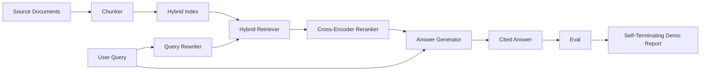

# 端到端 RAG 系统

> 六个课时的组件。一个流水线。一个评估循环。一个自终止演示。这就是你要交付的系统。

**Type:** Build
**Languages:** Python
**Prerequisites:** Phase 11 lessons 06 (RAG), 10 (evaluation); Phase 19 Track B foundations (lessons 20-29); Phase 19 lessons 64, 65, 66, 67, 68
**Time:** ~90 minutes

## Learning Objectives
- 将分块器、混合检索器、查询改写器、交叉编码器重排序器和答案生成器组合成一个单一的端到端流水线。
- 实现一个通过分块锚点引用其声明的答案生成器，带有低置信度时拒绝的回退机制。
- 针对组装的流水线运行第 68 课的评估，并证明分阶段构建在每一项指标上都优于相同组件的独立使用。
- 构建一个自终止 CLI 演示，输入固定语料库，运行固定的查询集，并以摘要报告零退出。

## The Problem

六个独立组件不能证明什么。分块器在对语料库的 recall@5 上赢了，但在系统的 recall@5 上输了，因为检索器无法对分块器发出的内容进行排序。重排序器可以在合成候选集上提升 MRR，但在真实双编码器候选上失败，因为双编码器在重排序预算下的召回率太低。查询改写器可以在单个查询上提升金标准文档的排名，却在下一个查询上失败，因为 LLM 模拟返回了一个退化的假设文档。

集成测试是针对相同固定 qrels、使用相同指标、由一个编排器文件连接所有内容的整个流水线的端到端运行。这就是本课构建的内容。如果集成流水线上的指标在每个阶段的独立演示指标之上获胜，你就证明了这个系统。

## The Concept



### 连接选择

流水线是一个小图。每个阶段是一个具有清晰签名的函数。

| Stage | Input | Output |
|-------|-------|--------|
| Chunker | Document text | List of Chunk records |
| Retriever | Query string | Top-N Chunk records |
| Rewriter (optional) | Query string | List of rewrites + hypothetical |
| Reranker | Query, candidates | Top-K Chunk records with cross scores |
| Generator | Query, top-K Chunk records | Answer string with citations |

当每个签名稳定时，组合是直接的。本课的 `Pipeline` 类持有五个阶段和一个 `query` 方法，按顺序运行它们。每个阶段都是可替换的：传入不同的分块器、检索器、改写器、重排序器或生成器，流水线仍然运行。

### 带引用的答案生成器

生成器是最后一个阶段，也是最容易出错的。本课提供一个确定性的模拟生成器：

1. 接收重排序后的 top-K 分块。
2. 选择最多两个分块，其文本与查询具有最高的内容 token 重叠。
3. 发出由每个选定分块的一个句子拼接而成的答案，每个句子后跟一个 `[doc_id:chunk_index]` 锚点。
4. 如果没有分块的重叠超过拒绝阈值，发出"I do not know"且无引用。

在生产中你将模拟替换为带有以下提示词模板的真实 LLM 调用：

```
You are answering a question using only the snippets below.
Cite every claim with the anchor in parentheses.
If the snippets do not answer the question, say "I do not know".

Question: {query}

Snippets:
{enumerated chunks with anchors}

Answer:
```

低置信度时拒绝路径是记录交叉编码器 rank-1 分数的全部原因。如果它低于语料库阈值，生成器就拒绝。这是防止产生幻觉答案的安全阀。

### 自终止演示

演示端到端运行所有内容。它打印一个查询的逐阶段分解，对四个固定 qrels 运行评估，打印指标表，如果所有第 68 课指标达到演示中设定的阈值，则以零状态退出。如果任何指标低于阈值，演示以非零状态退出并给出命名失败指标的消息。

这是 CI 烟雾测试所采用的形式。流水线离线运行，快速，确定性。阈值在固定语料上故意设定得很紧，这样六个课时中任何一个的回归都会使演示失败。

## Build It

`code/main.py` 实现了：

- `Chunk` - 贯穿所有阶段的记录（扩展第 64 课的形状，添加了 chunk_index 和源 doc_id）。
- `Chunker` - 从第 64 课中选择一个策略（默认递归拆分）。
- `HybridIndex` - 从第 65 课打包 BM25 + 稠密 + RRF。
- `Rewriter` (optional) - 从第 67 课中按查询长度和连接词存在情况选择 HyDE、多查询或分解之一。
- `Reranker` - 第 66 课中训练好的交叉编码器，带有较小的固定训练集，使其在几秒内收敛。
- `Generator` - 带有引用和低置信度时拒绝的确定性模拟生成器。
- `Pipeline` - 用返回 `Result(answer, top_k, latency_ms_per_stage)` 的 `query(question)` 方法组合五个阶段。
- `run_demo()` - 输入语料库，运行三个固定查询，运行评估，打印结果，按阈值设置退出码。

运行方式：

```bash
python3 code/main.py
```

输出是一个打印的查询跟踪，完整的评估表，以及最终的通过/失败状态。在固定语料上返回退出码 0。

## 演示会隐藏的失败模式

**分块器边界漂移。** 如果你在评估 qrels 标注阶段和演示之间交换分块器策略，金标准文档 id 不再对齐。在 qrels 文件中锁定分块器策略。演示包含一个命名分块器的标题。

**重排序器训练集泄漏到评估中。** 第 66 课中的 14 个训练三元组包含与评估查询相似的查询。在生产中，严格留出评估查询。演示的评估查询故意与重排序训练集不重叠。

**模拟生成器隐藏了幻觉风险。** 模拟生成器不能产生幻觉，因为它只从检索到的分块中发出文本。本课注意到这一点，并将生产替换路径指向真实模型。

**无流式输出。** 流水线在每个阶段结束时返回完整答案。生产系统会将生成器的输出流式输出。流式输出超出范围；答案质量指标无论如何都在最终字符串上工作。

**延迟是离线的。** 模拟 LLM 调用是常数时间。真实 LLM 调用主导延迟。在请求范围内规划延迟预算；本课的每阶段计时仅测量 CPU 工作。

## Use It

生产模式：

- 在一个带有显式阶段接口的编排器下交付流水线文件。避免将连接散落在整个仓库中。
- 在每次涉及某个阶段的合并之前运行评估。如果评估下降，合并不落地。
- 持久化每个 CI 运行的指标轨迹，以便将回归归因于阶段更换。
- 添加一个 20 个查询的烟雾测试集（回归集的子集），在 30 秒内运行；完整回归集每晚运行。

## Ship It

本课中的流水线文件是第 19 阶段 Track F 课程的其余部分所假定的形状。后续课程将添加输入自动化、增量重索引、遥测和上层服务层。检索、重排序、改写和评估部分在此完成。

## Exercises

1. 在改写器内部添加每查询策略选择器：来自第 67 课的启发式方法（长度、连接词、术语比率）选择 HyDE、多查询或分解。
2. 在环境标志后为生成器添加真实 LLM 调用。默认使用模拟。测量延迟差。
3. 扩展演示以接受加载真实语料库的 `--corpus path` 标志。重新运行评估和阈值检查。
4. 为分块器添加 `--strategy` 标志。测量每种策略对端到端召回率的贡献。
5. 添加流式生成器接口并将其馈入评估。确认忠实度是在最终字符串上计算的，而不是在流前缀上。

## Key Terms

| Term | What people say | What it actually means |
|------|-----------------|------------------------|
| Pipeline | "RAG 流水线" | 从输入到引用答案的组合阶段 |
| Citation anchor | "来源链接" | 附加到每个声明的 (doc_id, chunk_index) 引用 |
| Refuse-on-low-confidence | "我不知道" | 当重排序器 top-1 分数低于阈值时，生成器不返回答案 |
| Smoke set | "CI 评估" | 在每个 PR 检查中运行的最小 qrels 子集 |
| Stage interface | "函数签名" | 每个流水线阶段的稳定输入和输出类型 |

## Further Reading

- [Anthropic, Building search and retrieval](https://www.anthropic.com/news/contextual-retrieval)
- [Pinterest, MCP internal search](https://medium.com/pinterest-engineering) - 参考生产架构
- [Ragas: Automated Evaluation of RAG Pipelines](https://docs.ragas.io)
- Phase 11 lesson 06 - RAG 基础
- Phase 19 lessons 64-68 - 此处组合的组件
