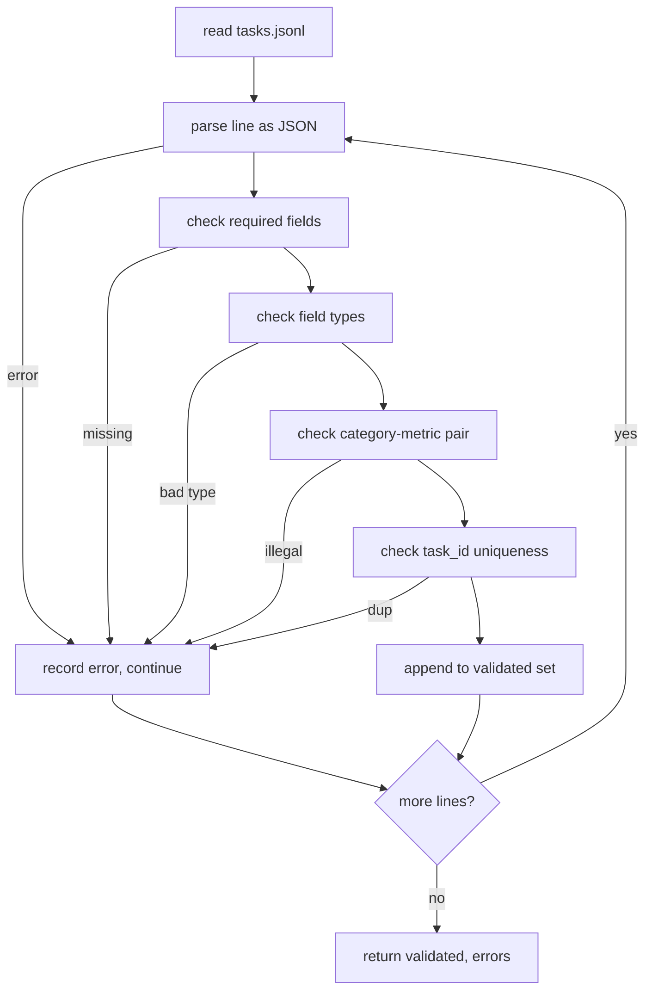

# 任务规格格式

> 评估框架的好坏取决于其任务所遵循的契约。在编写任何评分函数之前，先冻结 JSONL 形状和指标词汇表。

**Type:** Build
**Languages:** Python
**Prerequisites:** Phase 19 Track B foundations
**Time:** ~90 min

## Learning objectives

- 定义一个 JSONL 任务记录模式，用一个形状覆盖算术、多选、代码执行、分类和自由文本摘要。
- 固定一个封闭的指标名称词汇表，以便下游课程（71-73）可以根据单个字段进行分发。
- 将少样本示例和后处理规则指定为任务的一部分，而非运行器的一部分，以便相同的提示词在不同模型上产生相同的目标。
- 实现一个严格的验证器，在记录到达运行器之前拒绝格式错误的记录。
- 提供一个 10 任务固定集，覆盖规格的每个分支，以便验证器有真实的东西来咀嚼。

## 为什么需要冻结的规格

一个研究代码库积累评估脚本的速度会超过积累测试的速度。六个月后，每个 notebook 都有自己的 JSON 形状，每个指标都被实现了两次，没有任何东西可以在不同运行之间进行比较。解决方法很无聊。选择一个模式。编写一个验证器。拒绝其他一切。这就是本课所做的。

形状借鉴了 BIG-bench、HELM 和 lm-eval 风格框架的想法，但字段名是我们自己的。每个字段有一个单一的所有者。运行器读取任务。指标读取目标。后处理步骤将生成标准化。在流水线中间没有字段是可变的。

## 记录形状

任务是单行的 JSON 对象。框架读取 `tasks.jsonl` 并独立验证每一行。一个坏行中止该记录，而非整个运行。

```json
{
  "task_id": "arith_001",
  "category": "arithmetic",
  "prompt": "Compute the result. Question: 17 + 24\nAnswer:",
  "targets": ["41"],
  "metric_name": "exact_match",
  "few_shot_examples": [
    {"prompt": "Question: 2 + 2\nAnswer:", "completion": "4"}
  ],
  "post_process": "strip_whitespace",
  "metadata": {"difficulty": "easy"}
}
```

必填字段是 `task_id`、`category`、`prompt`、`targets`、`metric_name`、`post_process`。`few_shot_examples` 和 `metadata` 是可选的。未知的顶级字段会导致验证失败。

## 字段规则

`task_id` 是不含空格的字符串。验证器强制整个文件中唯一。

`category` 是 `arithmetic`、`mcq`、`code_exec`、`classification`、`summary` 之一。类别约束了哪些指标和后处理对是合法的。`code_exec` 任务必须使用 `metric_name = code_exec`，`mcq` 任务必须使用 `metric_name = exact_match` 针对单字母目标。

`prompt` 是非空字符串。验证器禁止尾部空格，并拒绝在提示词正文中已包含少样本块的记录。少样本渲染发生在运行器中，而非作者处。

`targets` 是非空的字符串列表。对于 `exact_match`，任何匹配的元素都算。对于 `f1` 和 `rouge_l`，得分最高的目标胜出。对于 `mcq`，列表恰好有一个元素。

`metric_name` 是 `exact_match`、`f1`、`bleu_4`、`rouge_l`、`accuracy`、`code_exec` 之一。词汇表是封闭的。新指标需要新的课程和此处的新条目。

`few_shot_examples` 是 `{prompt, completion}` 对的列表。验证器将列表上限设为八个条目，以保持提示词有界。

`post_process` 是 `none`、`strip_whitespace`、`lower`、`extract_letter`、`extract_code_block`、`extract_first_line` 之一。每个规则有单一确定性的行为。验证器禁止组合规则。

## 验证器行为



验证器返回两个列表：已验证的记录列表和错误记录列表，包含违规行、违反的规则和有问题的字段。如果错误列表非空，运行器拒绝启动，除非显式设置了 `--allow-bad-tasks` 标志。

## 少样本渲染

运行器在提示词前面拼接少样本示例，以空行分隔。相同的代码路径为每个模型运行，因此唯一的方差来源是模型本身。作者只需编写一次示例，而非每个提供商一次。

```python
def render(task):
    parts = []
    for ex in task.get("few_shot_examples", []):
        parts.append(ex["prompt"] + " " + ex["completion"])
    parts.append(task["prompt"])
    return "\n\n".join(parts)
```

## 后处理规则

后处理步骤在生成之后、指标之前运行。它是确定性的和无状态的。

- `none` 不变返回字符串。
- `strip_whitespace` 去除前后空白。
- `lower` 将字符串小写。
- `extract_letter` 返回匹配 `[A-E]` 的第一个字符，用于 MCQ。
- `extract_code_block` 返回第一个三重反引号围栏块的正文，用于代码执行。
- `extract_first_line` 返回第一个非空行，用于摘要分类。

需要此列表之外规则的任务属于新的课程。

## 本课不做什么

它不评分。它不调用模型。它不运行代码。这些分别在第 71、72 和 75 课中。本课冻结了它们全部遵循的契约。

10 任务固定集覆盖两个算术项、两个 MCQ 项、两个代码执行项、两个分类项和两个摘要项。验证器在所有 10 个上都通过。一个单独的固定集（`tasks_bad.jsonl`）触发每条规则，验证器返回恰好那么多错误。

## 如何阅读代码

`main.py` 定义了 `TaskSpec`、`validate_task`、`validate_file` 和一个 CLI 入口点。固定加载器是 `load_fixtures`。渲染和后处理辅助函数与验证在一起，以便第 75 课的运行器导入单个模块。

从上到下阅读 `main.py`。然后阅读 `code/tests/test_spec.py`。测试固定了每条验证规则和每个后处理行为。`main.py` 底部的演示验证打包的固定集并打印摘要。

## Going further

真正的评估套件增长类别的方式如同模式增长列。清醒的做法是拒绝在没有同时添加指标、后处理规则和至少一个固定任务的情况下添加类别。像对待数据库迁移一样对待规格。每个更改都需要审查、版本化并附带测试。本课中的验证器就是守门人。
