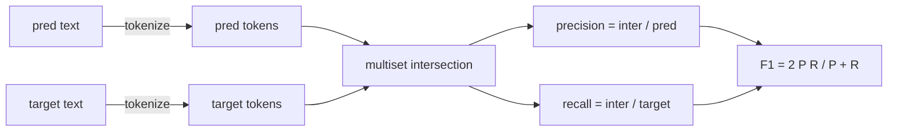
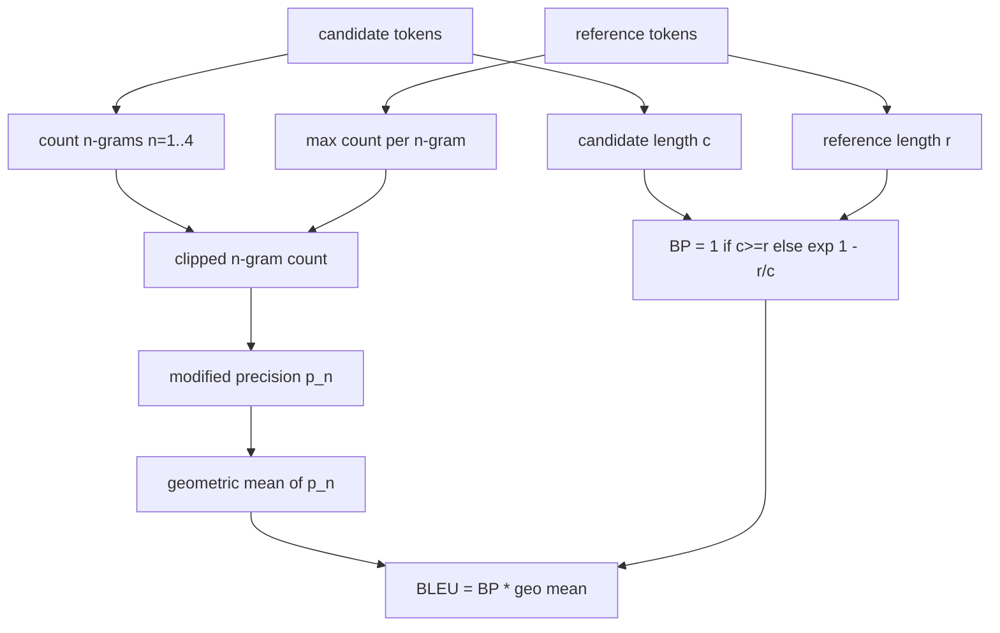

# 经典指标

> BLEU、ROUGE-L、F1、精确匹配、准确率。五个指标仍然占已发布的 LLM 评估数字的大部分。从头实现每个指标，这样你就知道数字意味着什么。

**Type:** Build
**Languages:** Python
**Prerequisites:** Phase 19 Track B foundations, lesson 70
**Time:** ~90 min

## Learning objectives

- 使用显式的分词规则实现 token 级别的精确匹配、F1 和准确率。
- 从头实现 BLEU-4：修正 n-gram 精确率、对 n 从 1 到 4 取几何均值、简短惩罚。
- 使用最长公共子序列实现 ROUGE-L，结合精确率和召回率的 F-beta 组合。
- 根据第 70 课的 metric_name 字段进行分发，使运行器与指标无关。
- 用从手工计算示例中得出的参考向量来固定行为，而非依赖第三方库。

## 为什么重新实现

你会读到报告 BLEU 28.3 的论文，和另一篇报告 BLEU 0.283 的论文。你会发现两个库之间的 ROUGE-L 分数相差十个百分点，因为一个库截断为小写而另一个不。停止困惑的最快方法是自己编写指标，然后指出分词器决定的代码行和平滑处理的代码行。之后，比较论文间的数字就变成阅读指标设置的问题，而非争论库的问题。

标准库加 numpy 就够了。BLEU 是计数和一个截断。ROUGE-L 是动态规划。F1 是 token 上的集合交集。最难的部分是选择分词器并坚持它。

## 分词

分词器是 `re.findall(r"\w+", text.lower())`。全小写，字母数字运行，丢弃标点。本课中的每个指标都使用这个确切的分词器。运行器无权选择。如果你换分词器，你就在运行不同的基准。

```python
TOKEN_RE = re.compile(r"\w+", re.UNICODE)
def tokenize(text):
    return TOKEN_RE.findall(text.lower())
```

这是一个有意的简化。生产设置会关心 CJK、缩写词和代码标识符。本课的要点是分词器是一个契约，而非旋钮。

## 精确匹配

```python
def exact_match(pred, targets):
    return float(any(pred.strip() == t.strip() for t in targets))
```

每个任务返回 1.0 或 0.0。数据集上的聚合是均值。这是算术、MCQ 和短分类任务的主力。

## Token 级别 F1

设置预测和目标的 token 多重集。精确率是多重集交集除以预测的多重集。召回率是相同交集除以目标的多重集。F1 是调和均值。实现处理空预测和空目标的边缘情况。



对于多目标任务，我们在目标列表中取最佳 F1。这与文献中广泛报告的 SQuAD 风格行为一致。

## BLEU-4

BLEU 是经典的机器翻译指标，仍然出现在摘要工作中。我们使用的公式是语料库级别的 BLEU-4，带有标准简短惩罚和对修正 n-gram 计数的加一平滑处理，使得单个缺失的 4-gram 不会将分数推到零。

对于每个候选-参考对，我们对 n 等于 1、2、3、4 计算修正 n-gram 精确率。修正精确率用任何参考中该 n-gram 的最大计数来截断候选 n-gram 计数，因此候选不能通过重复一个短语来膨胀分数。四个精确率的几何均值被简短惩罚包裹。



平滑规则是 Lin 和 Och 称为方法 1 的规则：在取对数之前对每个 n-gram 精确率的分子和分母都加一。这避免了参考没有匹配 4-gram 时的 `log 0`，并在长候选上接近未平滑的值。

## ROUGE-L

ROUGE-L 比较候选和参考 token 序列的最长公共子序列。LCS 捕捉词序而不强制连续性，这就是为什么它是默认的摘要指标。我们使用标准动态规划表计算 LCS 长度，然后推导召回率为 `lcs / reference length`，精确率为 `lcs / candidate length`，并用 F-beta 组合，其中 beta 等于一为对称的 F1 形式。

```python
def lcs_length(a, b):
    n, m = len(a), len(b)
    dp = numpy.zeros((n + 1, m + 1), dtype=int)
    for i in range(n):
        for j in range(m):
            if a[i] == b[j]:
                dp[i+1, j+1] = dp[i, j] + 1
            else:
                dp[i+1, j+1] = max(dp[i+1, j], dp[i, j+1])
    return int(dp[n, m])
```

numpy 表使实现清晰可读；纯 Python 列表也可以。选择 ROUGE-L 的任务每个任务支付 O(n m) 成本。对于典型的摘要长度这在一毫秒内。

## 准确率

对于多目标分类任务，准确率退化为针对单个标准化目标的精确匹配。我们将其作为单独的函数暴露，以便分发器可以在不通过运行器内部进行字符串比较的情况下按 `metric_name` 分发。

## 分发契约

单一入口点是 `score(metric_name, prediction, targets)`。它返回一个 `[0, 1]` 中的浮点数。运行器不在指标名称上分支。它将调用转交并写入结果。这是第 75 课将粘合到第 70 课任务规格的接口。

```python
def score(metric_name, pred, targets):
    if metric_name == "exact_match":
        return exact_match(pred, targets)
    if metric_name == "f1":
        return max(f1_score(pred, t) for t in targets)
    if metric_name == "bleu_4":
        return max(bleu4(pred, t) for t in targets)
    if metric_name == "rouge_l":
        return max(rouge_l(pred, t) for t in targets)
    if metric_name == "accuracy":
        return accuracy(pred, targets)
    raise ValueError(f"unknown metric_name: {metric_name}")
```

`code_exec` 在第 72 课中处理并插入此处的分发器。

## 本课不做什么

它不调用模型。它不在第 70 课后处理规则已经完成的内容之上进一步标准化生成。它不计算置信区间。它不做 BLEURT 或 BERTScore（那些需要模型，在另一课中）。要点是基础：五个指标、一个分词器、一个分发表。

## 如何阅读代码

`main.py` 将每个指标定义为自由函数加上分发器。参考向量存在于文件底部的 `_reference_examples` 块中。演示针对八个示例运行分发器并打印每个指标的分数。`code/tests/test_metrics.py` 中的测试固定参考向量并对每个边缘情况进行压力测试（空预测、空参考、无共享 token、精确匹配、重复短语截断）。

从上到下阅读 `main.py`。函数按复杂度排序。exact_match 和 accuracy 各一行。F1 是六行。BLEU 和 ROUGE-L 是繁重的部分，包含关于平滑规则和 LCS 递推的详细注释。

## Going further

经典指标是必要的，但不充分。它们奖励表面重叠而错过含义。解决方法是等你信任经典底层基础后，在其上叠加基于模型的指标（BLEURT、BERTScore、GEval）。那是后面的课程。现在：让这五个工作，用测试固定它们，你就拥有一个可审计、快速且可复现的指标栈。
