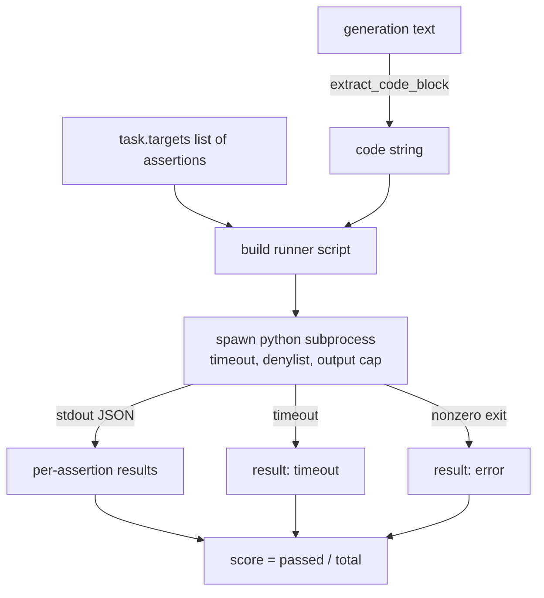
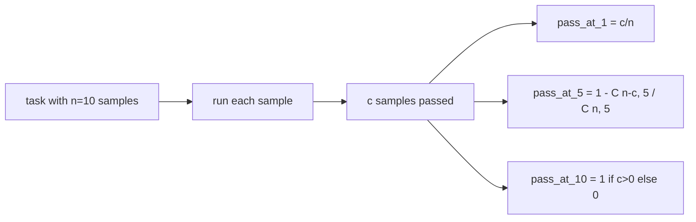

# 代码执行指标

> 生成的代码在通过测试时是正确的。评估框架必须提取代码，在不崩溃宿主机的情况下运行它，并诚实地统计通过率。本课构建那个接口。

**Type:** Build
**Languages:** Python
**Prerequisites:** Phase 19 Track B foundations, lessons 70 and 71
**Time:** ~90 min

## Learning objectives

- 以匹配第 70 课后处理规则的方式从自由形式的生成中提取代码块。
- 在带挂墙时钟超时、输出上限和导入拒绝列表的隔离子进程中执行候选代码。
- 将任务评分计算为通过的断言字符串占候选代码的比例。
- 为每个任务采样多个生成的模型计算 pass-at-k。
- 将沙箱崩溃、语法错误和超时视为具有不同退出码的第一类失败模式，运行器可以记录它们。

## 为什么需要隔离子进程

内联 `exec` 是安全和稳定性风险。生成的 `while True: pass` 会永远阻塞评估。生成的 `import shutil; shutil.rmtree('/')` 的危害与听起来一样灾难性。解决方法是每个候选代码启动一个新的 Python 解释器，通过 stdin 传递代码，将断言结果写入 stdout，并在进程超时时杀死它。宿主评估进程保持运行。

真正的评估如 HumanEval、MBPP、BigCodeBench 和 LiveCodeBench 都使用子进程沙箱。有些在其上叠加 Docker。我们停用子进程有原因：它是可移植的，它是标准库的，并且它捕获了对教育评估重要的失败模式。生产部署添加 seccomp、网络隔离和只读文件系统。关于加固的下一课不在本赛道内。

## 代码执行任务的形状

`code_exec` 任务在 `targets` 中携带断言字符串。运行器从生成中提取围栏代码块，围绕其构建测试框架，并运行结果。



分数是 `[0, 1]` 中的分数。一个有三次断言且两次通过的任务得分为 0.667。运行器无论什么失败都返回相同的形状：子进程崩溃被映射到标准化的错误码，而不是 Python 回溯冒泡到框架。

## 拒绝列表

拒绝列表是基于导入的。在运行候选代码之前，运行器脚本将危险模块的导入重写为引发 `ImportError("denied")` 的存根。列表故意保守：`os.system`、`subprocess`、`socket`、`requests`、`urllib`、`urllib.request`、`urllib.error`、`urllib.parse`、`ctypes`、`shutil`、`http.client`、`asyncio.subprocess`。

我们不假装这是防弹的。决心的对抗代码可以逃避 Python 中的任何进程内沙箱。拒绝列表是最后防线。挂墙时钟超时和输出上限是负载承载的控制措施。

```python
DENIED = {
    "os.system": True,
    "subprocess": True,
    "socket": True,
    "shutil": True,
    "requests": True,
    "urllib": True,
    "ctypes": True,
}
```

我们通过前置 `import sys` 和一个 monkey-patch `os.system` 使其引发的守卫来包裹候选代码。完整模板在 `main.py` 中。

## 挂墙时钟超时

每个子进程获得默认三秒挂墙时钟的预算。运行器使用 `subprocess.run(..., timeout=t)`。如果超时触发，运行器捕获 `TimeoutExpired`，杀死进程，并为该任务记录一个 `timeout` 退出原因。该任务的分数为零。运行器继续。

超时可以通过每个任务的 `task.metadata.timeout_s` 配置。长时间运行的单元测试可以请求更多；第 70 课的验证器将该值上限设为三十秒，以保持套件有界。

## 输出上限

子进程可以淹没 stdout，耗尽宿主内存。运行器将 stdout 流入一个缓冲区，并在运行总量超过 256 KB 时立即杀死子进程。结果记录为 `exit_code = error`，详情字符串为 `"output overflow"`。这在生成意外写入打印的无限循环时在实践中出现。

## Pass-at-k

Pass-at-k 是 HumanEval 等使用的无偏估计器。给定每个任务 `n` 个独立样本和其中 `c` 个通过，从 `n` 中随机抽取 `k` 个样本至少包含一个通过解的概率为：

```
pass_at_k(n, c, k) = 1 - C(n - c, k) / C(n, k)
```

当 `n - c < k` 时分子未定义，值为 `1`。实现直接处理边缘情况。我们暴露 `pass_at_k(n, c, k)` 供第 74 课的排行榜层使用。



## 退出码

运行器每个任务返回五种结果之一：

- `pass` 当所有断言通过时。
- `assertion_fail` 当代码运行但至少一个断言失败时。
- `syntax_error` 当代码无法导入或有 SyntaxError 时。
- `timeout` 当挂墙时钟到期时。
- `error` 对于任何其他崩溃，包括拒绝列表命中和输出溢出（溢出以详情 `"output overflow"` 出现）。

分数仍然是分数。退出码是元数据。下游课程可以决定是将超时计为零还是缺失数据。

## 本课不做什么

它不给你真正的沙箱。它不运行来自开放网络的不受信任代码。它不处理有状态的任务如文件 I/O 或网络调用。那些需要容器或微虚拟机。本课的要点是契约：一个隔离的子进程、一个拒绝列表、一个超时、一个输出上限、一个清晰的退出码词汇表，以及 pass-at-k 数学。

## 如何阅读代码

`main.py` 定义了 `extract_code`、`run_candidate`、`score_code_exec` 和 `pass_at_k`。子进程运行器脚本构建为字符串并以 `-c` 传递给新的 Python 解释器。`code/tests/test_exec.py` 中的测试针对从 HumanEval 风格中提取的手工计算示例，测试四种退出码加上 pass-at-k。

从上到下阅读 `main.py`。运行器模板是负载承载的部分。盯着断言循环直到你可以预测它写回父进程的 JSON 信封。

## Going further

一旦子进程形状工作，下一个关注点就是可移植性。不同的 Python 版本在 Windows 上处理 SIGKILL 的方式不同。最干净的解决方法是把运行器放在 Docker 镜像里。此后就是用品单元测试文件替换断言字符串，使评估匹配生产 CI 做的事情。到那时不要再称断言字符串为测试；它们是玩具测试，有玩具失败模式。
