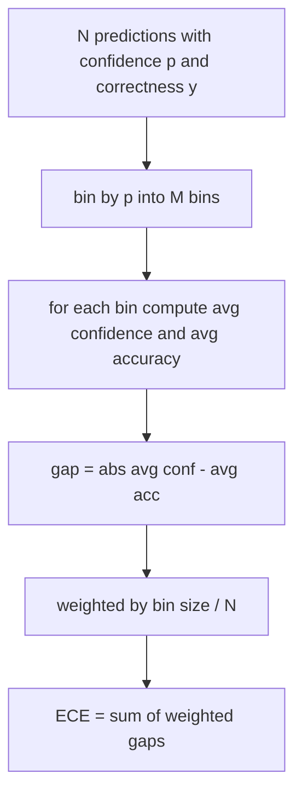
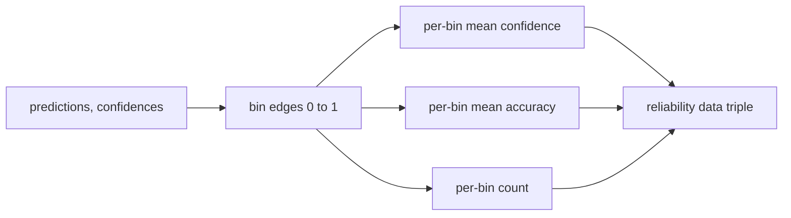

# 困惑度和校准

> 如果你的模型对一千个答案说 90% 置信度，却只对了六百个，那它就没被良好校准。校准是可信评估的一半。另一半是困惑度，它告诉你模型是否认为留出的文本是合理的。

**Type:** Build
**Languages:** Python
**Prerequisites:** Phase 19 Track B foundations, lessons 70 and 71
**Time:** ~90 min

## Learning objectives

- 从模型适配器提供的 token 负对数概率，计算留出语料库上的 token 级别困惑度。
- 从分箱的预测概率计算分类器或多选评估的期望校准误差（ECE）。
- 计算 Brier 分数（对正确性指示器的均方误差）并解释它什么时候做 ECE 不做的事情。
- 构建绘制置信度 vs 准确率曲线所需的可靠性图数据。
- 将三者全部接入评估框架，使运行器可以将 `perplexity`、`ece` 和 `brier` 数字附加到模型报告。

## 困惑度告诉你什么

困惑度是每 token 平均负对数似然的指数化。越低越好。困惑度为 1 意味着模型为每个实际 token 分配概率 1。困惑度为词汇表大小意味着模型是均匀的，什么都没学到。真实数字介于两者之间：2026 年强基础模型在 WikiText-103 上约为 8 到 12。同一文本上的差模型位于 50 以上。

框架不自行计算对数概率。那些来自模型适配器。框架聚合：它接收每 token 对数概率列表、每序列 token 计数列表，并返回语料库困惑度。

```python
def perplexity(neg_log_probs, token_counts):
    total_nll = sum(neg_log_probs)
    total_tokens = sum(token_counts)
    return math.exp(total_nll / total_tokens)
```

实现处理零 token 边缘情况，并断言负对数概率为非负。常见错误是忘记了取反：适配器返回 `log p` 而非 `-log p` 会产生低于 1 的困惑度，这是不可能的。该函数将其作为契约违规来捕获。

## ECE 度量什么

期望校准误差将预测按其置信度分组到固定数量的箱中，然后测量置信度和准确率在各箱之间的平均差距，按箱大小加权。



标准公式在 `[0, 1]` 上使用十个等宽箱。实现支持任何正整数数量。我们暴露一个 `bins` 参数，使运行器可以在发布惯例（10）和比较惯例（15）之间选择。

ECE 受箱数和样本量的偏差影响。有十个箱和一百个预测时，你无法区分 0.02 ECE 和随机噪音。实现返回填充的箱数以及 ECE，使运行器可以在样本太少时拒绝报告单一数字。

## Brier 分数做 ECE 不做的事情

ECE 只关心平均差距。一个在一半箱中过度自信、另一半不自信的模型可以有低 ECE，同时局部校准不佳。Brier 分数测量每个预测相对真实结果的平方误差，因此它直接惩罚分散。

对于二元结果，Brier 是 `mean((p_i - y_i)^2)`。它分解为可靠性、分辨率和不确定性。我们计算分数和分解。运行器报告标量，但记录分解以供仪表板使用。

```python
def brier(p, y):
    return float(np.mean((p - y) ** 2))
```

## 可靠性图数据

可靠性图将预测置信度与每个箱中的经验准确率绘制在一起。对角线是完美校准。该函数返回三个数组：每箱平均置信度、每箱平均准确率和每箱计数。绘图代码在下游；本课止于数据形状。



返回的元组是调用层需要绘制图表或计算自定义 ECE 变体（自适应 ECE、扫描 ECE 等）所需的内容。我们返回 numpy 数组，因此下游代码无需转换。

## 置信度来源

框架不假设置信度来自 softmax。它接受每个预测的 `[0, 1]` 中的任意数字。对于多选任务，自然置信度是选项对数似然上的 `softmax`。对于自由文本，自然置信度是模型自报的概率或平均对数似然的指数。评估只是消费这个数字。它来自哪里是适配器的工作。

## 边缘情况

- 所有预测错误：ECE 是平均置信度，Brier 高，困惑度是模型对文本的看法。
- 所有高置信度预测正确：ECE 接近零，Brier 接近零。
- 完美不确定预测器在 p=0.5：ECE 是 0.5 减准确率，Brier 是 0.25 减修正项。
- 空输入：ECE、Brier 和可靠性返回 `0.0`（或零填充数组）。困惑度对零 token 情况返回 `NaN`。这些路径没有一个发出警告；运行器检查值并决定是报告还是跳过。

这些情况已融入测试中。真实模型在真实基准上不会命中它们，但有问题的适配器或微小样本会，运行器不应崩溃。

## 分发

校准不是像 F1 那样的每任务指标。它是每模型报告。运行器在整个评估过程中累积 `(confidence, correct)` 对，并一次性计算 ECE、Brier 和可靠性数据。困惑度是在留出的文本语料库上单独计算的，独立于逐任务评分。

接口是：

```python
report = CalibrationReport.from_predictions(confidences, correct)
report.ece          # float
report.brier        # float
report.reliability  # tuple of three numpy arrays
report.populated_bins  # int
```

`PerplexityResult.from_token_nll(neg_log_probs, token_counts)` 返回困惑度和每 token 平均负对数似然。

## 本课不做什么

它不调用模型。它不实现 softmax。它不从输出 token 估计置信度；那是适配器的工作。它不做温度缩放或 Platt 缩放；那些是事后修复，属于另一课。本课的要点是使三个数字（困惑度、ECE、Brier）可信和可复现。

## 如何阅读代码

`main.py` 定义了 `perplexity`、`expected_calibration_error`、`brier_score`、`reliability_diagram` 和 `CalibrationReport` / `PerplexityResult` 数据类。演示在已知真实情况的合成预测上运行：一个良好校准的模型、一个过度自信的模型和一个不自信的模型。`code/tests/test_calibration.py` 中的测试固定每个边缘情况以及合成预测器的参考值。

从上到下阅读 `main.py`。函数顺序从标量到向量到报告。每个函数有一个简短的文档字符串，包含数学和契约。

## Going further

校准是已发布评估中最常被忽视的维度。大多数排行榜报告单一准确率数字就结束了。一个在准确率上获胜但在 Brier 上落败的模型，比一个准确率稍低但可靠报告其不确定性的模型在生产部署中更差。一旦你有了校准管道，在留出的验证切片上添加温度缩放，重新计算 ECE，观察差距缩小。那是一节单独的课，但基础在这里。
