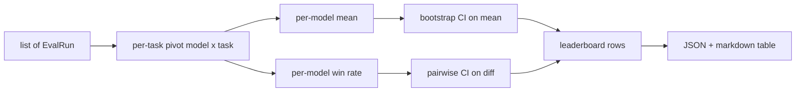
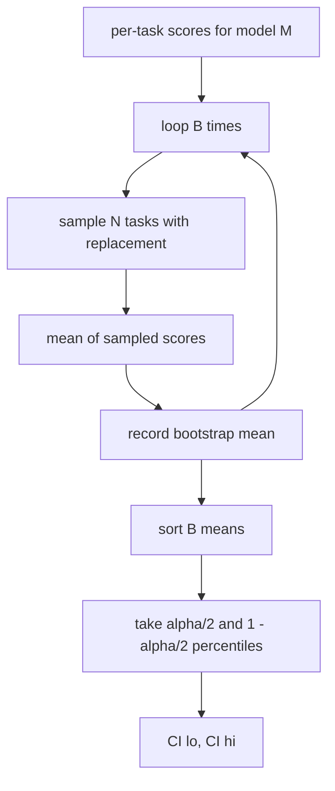

# 排行榜聚合

> 每任务分数是容易的。跨异构任务的每模型排名更难。千次预测排行榜上的统计显著性是被大家跳过的部分。本课不跳过。

**Type:** Build
**Languages:** Python
**Prerequisites:** Phase 19 Track B foundations, lessons 70, 71, 73
**Time:** ~90 min

## Learning objectives

- 将跨多个模型和多个任务的每任务分数聚合为整洁的每模型行。
- 将异构分数归一化，使通过率和 BLEU 值不会过度影响聚合。
- 按均值和按胜率对模型排名，并解释每种方法何时是正确的摘要。
- 对每模型均分和成对差异计算自助法置信区间。
- 将排行榜作为 JSON 报告和 markdown 表输出，第 75 课的运行器可以粘贴到 CI 评论中。

## 输入的形状

聚合器消费一个 `EvalRun` 记录列表：

```python
@dataclass
class EvalRun:
    model_id: str
    task_id: str
    metric_name: str
    score: float          # in [0, 1]
    category: str
```

第 75 课的运行器每个 `(model, task)` 对发出一个记录。聚合器不关心分数是如何产生的。它期望标准化已经完成：每个分数在 `[0, 1]` 中。

## 输出

三张表输出：



排行榜行包含：`model_id`、`mean_score`、`mean_ci_lo`、`mean_ci_hi`、`win_rate`、`tasks_completed`，以及可选的 `categories` 映射用于每类别均值。

## 归一化

如果一个任务在 `[0, 1]` 中评分，另一个在 `[0, 100]` 中，第二个会默默主导均值。聚合器验证每个输入分数位于 `[0, 1]` 中，否则拒绝运行。修复位于上游：指标应该已经返回一个分数。第 71 到 73 课强制执行该契约。

## 均值和胜率

两种排名方案服务于不同目标。

均值得分是一个模型每任务分数的平均值。这是排行榜报告的头条数字。它对异常值和任务不平衡敏感。

胜率计算一个模型在相同任务上击败每个其他模型的频率。对于每个任务，分数最高的模型获胜（平局拆分）。胜率等于获胜次数除以该模型有分数的任务数。它对异常值和尺度差异不太敏感，但会丢失信息。

```python
def win_rate(model_id, runs_by_task, all_models):
    wins, total = 0, 0
    for task_id, runs in runs_by_task.items():
        scores = {r.model_id: r.score for r in runs if r.model_id in all_models}
        if model_id not in scores:
            continue
        total += 1
        best = max(scores.values())
        if scores[model_id] >= best:
            wins += 1
    return wins / total if total else 0.0
```

框架报告两者。第 75 课的运行器默认按均值排名；胜率的 markdown 列也在那里，以备用户喜欢。

## 自助法置信区间

每模型均值附带通过任务上的自助法重采样估计的置信区间。我们带放回地重采样任务 id，在重采样集上计算均值，重复 `B` 次，并在水平 `alpha` 处取百分位区间。



对于成对比较，我们对每任务差异 `score_A - score_B` 进行自助法，取百分位区间，并报告它。用户读取区间是否排除零。如果排除，差异在水平 alpha 上显著。如果不，排行榜将模型视为打平。

低级辅助函数（`bootstrap_mean_ci`、`bootstrap_pairwise_diff`）默认 `B=1000`；公共聚合器（`aggregate`、`pairwise_diffs`）默认 `b=500` 以使演示和测试保持快速。默认 alpha 是 0.05。本课保持自助法纯 numpy，不用 scipy。

## 类别

如果设置了 `EvalRun.category`，聚合器也会报告每类别均值。这是每个排行榜上显示 `math`、`reasoning`、`code`、`safety` 的列。它使运行器能够发现一个模型是否总体上好但在代码上弱，这是头条均值隐藏的信息。

## Markdown 渲染

排行榜渲染为 markdown 表：

```text
| Rank | Model | Mean | 95% CI | Win rate | Tasks |
|------|-------|------|--------|----------|-------|
| 1    | gpt   | 0.78 | 0.74-0.82 | 0.62 | 50 |
| 2    | claude| 0.75 | 0.71-0.79 | 0.34 | 50 |
| 3    | random| 0.10 | 0.07-0.13 | 0.04 | 50 |
```

表按均值得分排序。CI 渲染为两位小数。长模型 id 截断为二十字符。

## 本课不做什么

它不运行模型。它不调用指标层。它不实现自适应 ECE 或其他校准变体；那些在第 73 课。它不实现任务权重。这里每个任务算一样。生产排行榜加权任务；我们通过 `weight` 字段留下钩子，但在聚合器中忽略它。如果你需要，在后续课程中添加权重。

## 如何阅读代码

`main.py` 定义了 `EvalRun`、`LeaderboardRow`、`aggregate`、`bootstrap_mean_ci`、`bootstrap_pairwise_diff` 和 `render_markdown`。演示构建三个模型和十二个任务的合成套件，聚合，并打印排行榜和成对差异表。`code/tests/test_leaderboard.py` 中的测试固定了自助法、markdown 渲染、胜率边缘情况和空输入行为。

从上到下阅读 `main.py`。数据形状（EvalRun、LeaderboardRow）在先，聚合器接下来，自助法第三，渲染最后。每个函数有专注的契约。

## Going further

自然的下一步是配对任务显著性而非非配对自助法。如果模型 A 和 B 都运行了相同的一百个任务，适当的检验是任务逐任务差异上的配对自助法，我们已经实现了。除此之外，你需要一个尊重任务家族的分层自助法（数学问题互不独立；一个算术错误模式影响十个问题）。那是后续内容。本课的要点是把基础搞对，使评估报告一个你能辩护的数字。
