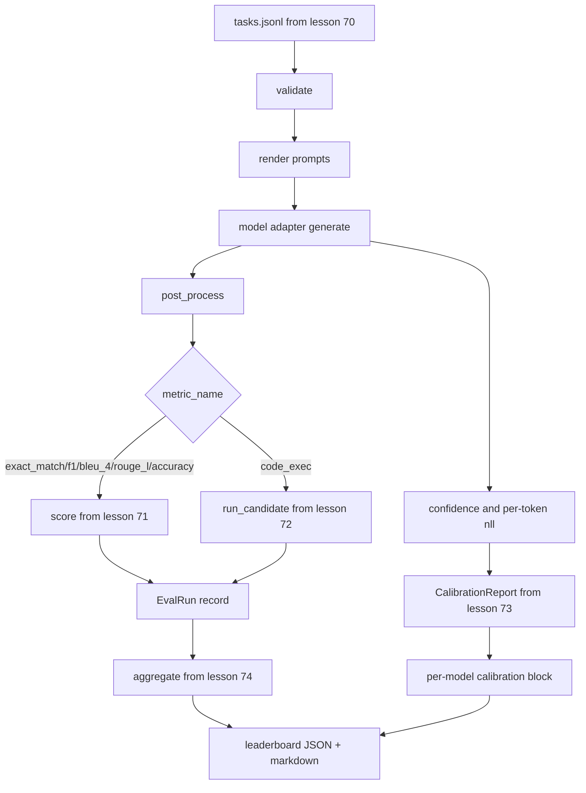

# 端到端评估运行器

> 五节课的管道，一节课将它们粘合。运行器从第 70 课读取任务规格，通过适配器调用模型，用第 71 和 72 课评分，附加第 73 课的校准报告，并发出第 74 课的排行榜。演示自终止。

**Type:** Build
**Languages:** Python
**Prerequisites:** Phase 19 Track B foundations, lessons 70 through 74
**Time:** ~90 min

## Learning objectives

- 定义一个 `ModelAdapter` 接口，任何模型（模拟、本地、API）都可以通过一个小的方法接口满足它。
- 通过工作池在固定 JSONL 文件上运行评估，任务并行执行。
- 在一次传递中组合指标层（exact_match、F1、BLEU-4、ROUGE-L、code_exec）和校准层。
- 发出每模型 `EvalRun` 记录并将其直接馈入排行榜聚合器。
- 输出 JSON 报告和 markdown 表；在干净运行时以零退出，验证或运行时失败以非零退出自终止。

## 流水线



运行器是集成点。第 70 到 74 课各自拥有一个由运行器组合的模块。运行器不复制那些模块的任何逻辑：它导入它们。

## 适配器接口

适配器是运行器和任何模型之间的接缝。接口故意很小。

```python
class ModelAdapter:
    model_id: str

    def generate(self, prompt: str, task: TaskSpec) -> Generation: ...
```

`Generation` 是一个包含以下内容的数据类：

- `text`：模型的自由形式输出
- `confidence`：一个 `[0, 1]` 中的浮点数，表示模型对该答案的自报概率
- `token_nll`：可选，生成 token 的负对数似然之和
- `token_count`：可选，生成 token 的数量

运行器中的模拟适配器提供三种口味：`RuleBasedAdapter`（确定性，接近完美）、`NoisyAdapter`（过度自信，经常错误）和 `BiasedAdapter`（在一个类别上良好，在另一个上糟糕）。演示在第 70 课固定集上运行所有三种。

## 并行执行

运行器使用 `concurrent.futures.ThreadPoolExecutor` 每个模型并行运行任务。工作线程数默认为八和任务数中的较小值。线程就足够了，因为真实模型调用的瓶颈是网络 I/O。代码执行路径在任务内部生成自己的子进程，执行器只调度等待。

对于确定性测试，运行器暴露 `run_eval(adapters, tasks, parallel=False)` 以便测试可以固定执行顺序。

## 单次传递评分循环

对于每个任务：

1. 渲染提示词（少样本前缀加上提示词正文）。
2. 调用适配器并计时调用。
3. 按任务的规则对生成进行后处理。
4. 分发到指标层。
5. 构建带有分数和指标元数据的 `EvalRun` 记录。
6. 将 `(confidence, correct)` 对追加到校准缓冲区。

`correct` 信号对于 exact_match 风格指标（`exact_match`、`accuracy`、`code_exec`）是 `score >= 1.0`，对于分级指标是 `score >= 0.5`。阈值位于 `_correct_from_score` 中，运行器不暴露公共覆写。

## 聚合

在每个任务有了结果后，运行器调用第 74 课的 `aggregate` 和 `pairwise_diffs` 以及第 73 课的 `CalibrationReport.from_predictions`。输出是单个 JSON 信封：

```json
{
  "leaderboard": [...],
  "pairwise": [...],
  "calibration": {
    "model_id_a": {"ece": 0.04, "brier": 0.10, "populated_bins": 8, ...},
    ...
  },
  "summary": {
    "tasks": 10,
    "models": 3,
    "wall_seconds": 1.2
  }
}
```

运行器还将 markdown 表写入 stdout，以便用户可以将结果粘贴到 PR 审查中。

## 自终止演示

演示在第 70 课的十个固定任务上运行三个模拟适配器。挂墙时间应在十秒内。干净运行时退出码为零。

干净运行标准是：

- 每个任务在第 70 课下通过验证。
- 每个任务在第 71 和 72 课下评分。
- 校准报告在第 73 课下无错误聚合。
- 排行榜将基于规则的适配器严格排在随机适配器之上。

如果其中任何一项出问题，运行器以非零退出并在 JSON 信封中给出结构化错误。

## 本课不做什么

它不调用真实模型。它不实现 API 密钥流或速率限制处理。它不实现流式或部分生成；适配器每次调用返回一个生成。它不做重试或缓存。这些关注点位于适配器层；运行器是与指标无关和与提供商无关的。

## 如何阅读代码

`main.py` 是集成。它通过一个小的 `_load_sibling` 辅助函数从其他五个课程模块导入，该辅助函数通过相对路径解析它们。数据类 `Generation`、`EvalReport` 和 `ModelAdapter` 在本地定义。模拟适配器在文件底部。

从上到下阅读 `main.py`。浏览导入，然后看 `run_eval`，然后 `_score_one`，然后适配器。末尾的演示是入口点。

`code/tests/test_runner.py` 中的测试固定了适配器接口、单次传递循环、并行 vs 顺序等价性、校准缓冲区和 JSON 信封形状。

## Going further

这个运行器是基础。生产评估系统添加：按 `(task_id, model_id, model_version)` 键入的结果缓存、跟踪每次运行的美元和 token 值的成本账本、对速率限制进行退避的重试层、pass-at-k 任务的采样策略，以及长套件的流式输出格式。每个关注点都是围绕运行器的单一包装，不改变指标或聚合层。这种分离是契约的要点。

在模拟工作后添加真实提供商的适配器。选一个有免费层的，写三十行粘合代码，看着排行榜亮起来。然后添加第二个提供商，让框架做工作。
