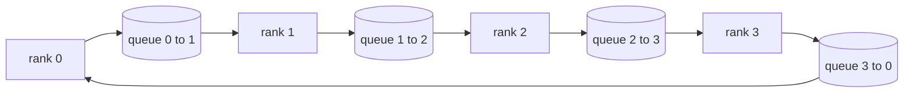

# 从头实现集合操作

> 支撑分布式训练的四个集合操作是 allreduce、broadcast、allgather 和 reduce_scatter。训练框架提供的每个其他原语都是这些的包装器。在 `multiprocessing.Queue` 网格上构建它们一次，对参考实现进行验证，本赛道的其余部分就变成了管道。

**Type:** Build
**Languages:** Python
**Prerequisites:** Phase 19 Track C lessons 42-49
**Time:** ~90 min

## Learning Objectives

- 用两遍传递（reduce-scatter 然后 allgather）实现环 allreduce，并证明每个 rank 的通信量为每个元素 2(N-1)/N 字节。
- 在通过 `multiprocessing.Queue` 的点对点发送之上构建 broadcast、allgather 和 reduce_scatter。
- 对相同输入，对比 `torch.distributed` gloo 参考来验证每个原语。
- 在集群形状、延迟底限和带宽上限上辩护环 vs 树的选择。

## The Problem

一个在 N 个 rank 上的朴素 allreduce 向根发送 N 倍张量并广播 N 倍回来。带宽按每 rank O(N) 缩放，根成为瓶颈，挂墙时钟底限是最慢的链路乘以 N。环 allreduce 将其扁平化为 2(N-1) 个大小为 T/N 的块，因此每 rank 字节降至 2T(N-1)/N，与集群大小无关。树 allreduce 在小的 N 和高延迟链路上胜出，因为深度是 log2(N) 跳而非 2(N-1)。为集群形状选择错误的拓扑，最慢的 GPU 决定步长时间。

你将在本赛道中阅读的每个分布式训练框架都依赖这四个原语。PyTorch DDP 通过每参数桶的一次 allreduce 同步梯度。ZeRO 通过 reduce_scatter 分片优化器状态并通过 allgather 广播更新的参数。FSDP 将整个前向传播变成 allgather 加 reduce_scatter。流水线并行需要对跨阶段组的激活进行 broadcast。如果你不能实现这四个集合操作，你就不能推理为什么训练停滞、为什么梯度不匹配出现在 rank 3，或者为什么切换拓扑时流水线气泡翻倍。

## The Concept



### 两遍传递的环 allreduce

将张量分成 N 个相等块，索引 0..N-1。每个 rank 拥有与其 rank 相等的块索引。第一遍，reduce-scatter，运行 N-1 步。在第 s 步，rank r 发送块 (r - s) mod N 到 rank (r + 1) mod N，并从 rank (r - 1) mod N 接收块 (r - s - 1) mod N，将接收到的块累积到其本地副本中。经过 N-1 步后，rank r 拥有块 r 的完整和。第二遍，allgather，再运行 N-1 步，围绕环旋转完成的块，直到每个 rank 拥有每个块的完整和。

| Primitive | Per-rank bytes | Steps | When to use |
|-----------|---------------|-------|-------------|
| Ring allreduce | 2T(N-1)/N | 2(N-1) | Large T, fat-pipe homogeneous cluster |
| Tree allreduce | T log2(N) | 2 log2(N) | Small T or high-latency links |
| Broadcast | T | log2(N) tree | Parameter init, scalar config |
| Allgather | T(N-1)/N | N-1 | Sharded forward, ZeRO unshard |
| Reduce_scatter | T(N-1)/N | N-1 | ZeRO gradient sharding |

### Queue 网格作为 NCCL 的替身

NCCL 通过 PCIe 和 NVLink 运行，带硬件卸载的归约。在 CPU 上没有这些。每个环边缘的 `multiprocessing.Queue` 给你带单一生产者和单一消费者的有序点对点交付。归约发生在用户空间，所以你支付 Python 开销，但线路模式与 NCCL 环 allreduce 完全相同。在队列版本上推理正确性，集群行为随之而来。

### 对照 gloo 验证

每个原语配有单元测试，将其输出与在相同世界大小、相同张量上用 gloo 后端初始化的 `torch.distributed` 进行比较。如果你的环 allreduce 与 gloo 的偏差超过 float32 epsilon，测试失败。对照参考实现的验证是不可协商的；没有它，原语看起来正确，直到真实训练运行的 10000 步时才发现问题。

## Build It

`code/main.py` 实现了：

- `Mesh` 类，将 N 个 `multiprocessing.Queue` 实例连接成环，并向每个 rank 暴露 `send(dst, tensor)` 和 `recv(src)`。
- `ring_allreduce(mesh, rank, world_size, tensor)` 运行两遍算法。
- `broadcast(mesh, rank, world_size, tensor, src)` 在对数树上运行。
- `allgather(mesh, rank, world_size, tensor)` 使用 N-1 次旋转。
- `reduce_scatter(mesh, rank, world_size, tensor)` 作为 allreduce 的前半部分。
- `_gloo_reference(op, world_size, tensor)` 用 gloo 通过 `torch.distributed` 运行相同输入进行逐字节相等比较。

运行方式：

```bash
python3 code/main.py
```

输出：对比队列网格和 gloo 输出的每原语验证表，随后是证明 2T(N-1)/N 缩放的每 rank 字节计数器。

## 生产实践

三种实践强化原语到可交付水平。

**在 allreduce 之前对梯度进行桶化。** 一个 1B 参数的模型有数万个梯度张量。每个张量一次 allreduce 支付延迟底限 N 次。DDP 将梯度桶化为约 25 MB 的块，对每个桶发出一次 allreduce；小张量搭载在大张量上。没有桶化，延迟开销主导步长。

**重叠通信与计算。** 反向按逆序逐层计算梯度。最后一层梯度一准备好就立即启动其 allreduce，而下一层继续计算。PyTorch DDP 通过桶就绪钩子连接此功能。重叠在网络有余力时将可见通信时间减半。

**按消息大小选择环或树，而非教条。** NCCL 附带一个拓扑检测器，对约 1 MB 以上的消息选择环，以下选择树。交叉点是带宽 vs 延迟：在 1 MB 以上，带宽项 2T(N-1)/N 主导，环胜出；在 1 MB 以下，log2(N) 跳数胜出。硬编码一种拓扑会牺牲错误消息大小下的吞吐量。

## Use It

生产模式：

- **PyTorch DDP。** 在反向之后对桶化梯度调用 `dist.all_reduce`。桶大小可调；对于 100Gbit 以太网，默认 25 MB 是合理的。
- **DeepSpeed ZeRO。** 发出 reduce_scatter 分片梯度，并在前向之前 allgather 重建完整参数。本课原语正是 ZeRO 发出的调用。
- **FSDP。** 前向以 allgather 开始解分片层，计算，然后用 reduce_scatter 归约并丢弃解分片。相同原语，不同调度。

## Ship It

在第 77-81 课中使用队列网格原语。第 77 课将 allreduce 接入 DDP。第 78 课将 reduce_scatter 接入 ZeRO。第 79 课将 broadcast 接入流水线激活。第 81 课将全部四个组合进端到端演示。

## Exercises

1. 添加一个树 allreduce 变体，并按消息大小在环和树之间切换。测量交叉点。
2. 添加 `recv_timeout_ms`，使停滞的 rank 显示截止错误而不是永远挂起。
3. 将 `multiprocessing.Queue` 替换为四个原语的 TCP 套接字。相同测试，真实线路。
4. 添加带宽工具钩子，使每 rank 字节计数器记录到 JSONL。
5. 比较环 vs 树在 4 个 rank 上对 1KB、1MB、16MB 大小张量的挂墙时钟时间。用经验数据辩护交叉点。

## Key Terms

| Term | What people say | What it actually means |
|------|----------------|------------------------|
| Allreduce | "跨 rank 求和" | 调用之后每个 rank 持有相同的归约后张量 |
| Ring | "快速拓扑" | 大小为 T/N 的 N-1 个块在环上流动两次 |
| Tree | "对数拓扑" | 归约遵循二叉树；深度为 log2(N) 跳 |
| Allgather | "拼接分片" | 每个 rank 最终拥有每个其他 rank 的分片 |
| Reduce_scatter | "拆分求和" | 每个 rank 最终仅拥有一个块的求和 |
| Bucket | "融合小张量" | 将 N 个小 allreduce 合并为一个大 allreduce |

## Further Reading

- [PyTorch Distributed: NCCL collectives](https://pytorch.org/docs/stable/distributed.html#collective-functions)
- [Horovod ring allreduce paper](https://arxiv.org/abs/1802.05799)
- [NCCL topology and algorithm selection](https://docs.nvidia.com/deeplearning/nccl/user-guide/docs/index.html)
- [Patarasuk and Yuan, Bandwidth optimal allreduce algorithms](https://www.cs.fsu.edu/~xyuan/paper/09jpdc.pdf)
- Phase 10 Lesson 05 - distributed training overview
- Phase 19 Lesson 77 - DDP wired on top of these primitives
