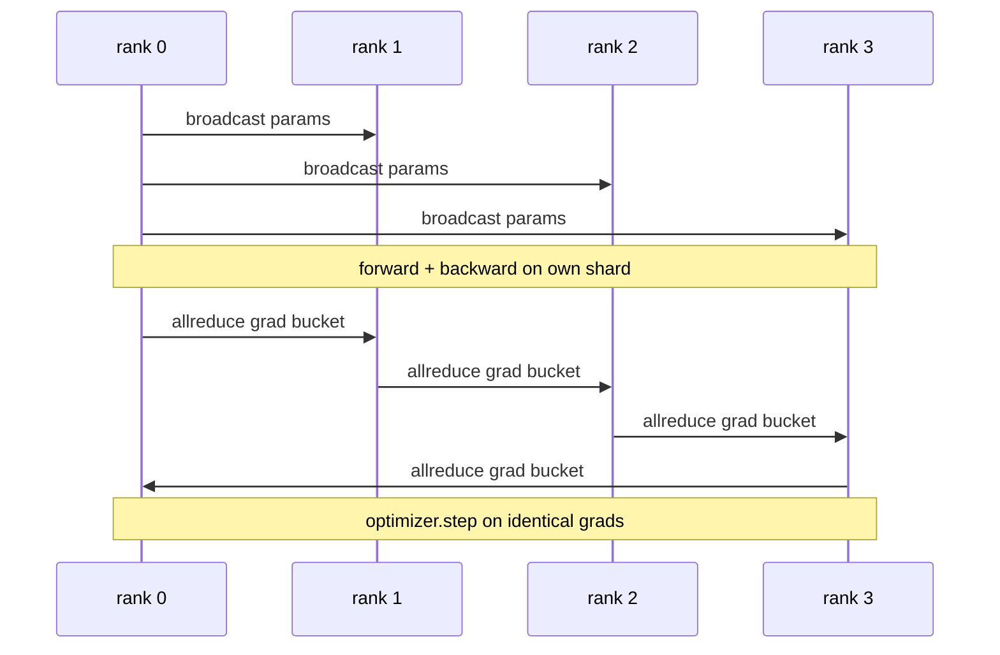

# 从头实现数据并行 DDP

> DistributedDataParallel 是 allreduce 之上的钩子。包装一个模型，从 rank 0 广播初始参数使每个 rank 开始相同，在每个参数上安装一个反向钩子，发出梯度的 allreduce，其余就是梯度下降。整个模式是 200 行。

**Type:** Build
**Languages:** Python
**Prerequisites:** Phase 19 Track C lessons 42-49
**Time:** ~90 min

## Learning Objectives

- 连接一个 `DistributedDataParallel` 形状的包装器，广播初始参数，并在反向之后 allreduce 梯度。
- 用 `torch.multiprocessing.spawn` 通过基于文件的汇合，在 gloo 后端上生成 N 个 CPU rank。
- 通过顺序训练相同模型在相同数据上，并显示每一步的参数等价性，证明梯度同步的正确性。
- 辩护桶化（梯度融合）和重叠（反向期间的通信）作为将工作 DDP 转变为生产 DDP 的两个变化。

## The Problem

一个 10 亿参数模型带 12 GB 激活不适合一个消费级 GPU。即使适合，训练也需要数周。数据并行将批次拆分到 N 个 rank 上，每个 rank 在其分片上计算前向和反向，每一步每个 rank 的梯度求和，使所有 N 个副本保持相同。求和后的梯度是优化器步进的依据。

没有梯度同步，N 个副本在第 2 步就开始发散。模型不再是"一个在更多数据上训练的模型"，而是恰好共享初始权重的 N 个独立模型。梯度同步做得不好（每个参数一次 allreduce，没有重叠，没有桶化），网络就是瓶颈，GPU 空闲等待线路。DDP 的技艺是使梯度同步相对于计算几乎免费。经典的 PyTorch DDP 通过桶化梯度、将 allreduce 与下一层的反向重叠、并在 NVLink 上使用 NCCL 来实现这一点。我们可以在 CPU 上用 gloo 做这三件事，并学到相同的经验教训。

## The Concept



### DDP 需要的三个操作

| Stage | Collective | Why |
|-------|-----------|-----|
| Init | broadcast from rank 0 | 每个 rank 以相同参数开始 |
| After backward | allreduce of each grad | 均值梯度是优化器步进的依据 |
| Sometimes | broadcast of buffers | Batchnorm 运行统计保持同步 |

### 为什么用均值而不是求和

Allreduce-SUM 除以 world_size 得到均值梯度。均值对 world_size 是不变的：在一个 rank 上调好的学习率在四个 rank 上同样有效，因为每步梯度大小不变。不用除法的 Allreduce-SUM 强制你每次更改集群大小时都重新调整学习率。DDP 包裹 SUM 并除以 world_size；在本课中同样做。

### 为什么桶化梯度

Transformer 有数千个参数张量。每个张量一次 allreduce 支付 gloo 延迟底限数千次。DDP 将梯度分组到约 25 MB 的桶中，对每个桶发出一次 allreduce。相同总字节在线路上移动，但延迟在桶上分期偿还。对于本课的小模型，我们将所有内容分组到一个桶中；结构是可以迁移的。

### 为什么固定种子

每个 rank 必须对洗牌调用 `torch.manual_seed(seed + rank)`，但对参数初始化调用 `torch.manual_seed(seed)`。单一共享种子意味着每个 rank 看到相同的批次顺序（违背数据并行）；参数特定的 rank 种子意味着初始参数因 float epsilon 而不一致，梯度同步不再使副本相同。种子模式正确或参数等价性测试在第 1 步就失败。

## Build It

`code/main.py` 实现了：

- `MiniMLP`：一个 3 层 MLP，足够小到在几秒内收敛，足够大到暴露连接。
- `DistributedDataParallel(model, world_size)`：在构造时广播参数，返回一个包装器，其 `sync_grads` 方法将累积的 allreduce 求和梯度除以 world_size。
- `worker(rank, world_size, ...)`：完整训练循环，通过 gloo 初始化 `torch.distributed`，前向，反向，同步，步进。
- `_reference_single_process_loop(...)`：在一个 rank 上顺序训练相同模型在相同数据上，供测试用于每步后的逐字节相等参数等价性。

运行方式：

```bash
python3 code/main.py
```

输出：一个每步训练表，比较单进程损失和参数校验和与 4 rank 上的 DDP 运行。两条路径产生到 float epsilon 的相同损失曲线，证明梯度同步是正确的。

## 生产实践

三种实践强化 DDP 到可交付水平。

**找出未使用参数。** 一些前向路径有条件地跳过参数（提前退出、专家混合路由器）。跳过的参数没有梯度，但 DDP 的桶就绪钩子仍然等待它们，allreduce 死锁。`find_unused_parameters=True` 告诉 DDP 在归约之前查看哪些参数获得了梯度。代价是每步的图遍历，所以除非你的前向分支，否则关闭它。

**静态图优化。** 当前向在步骤间稳定时，`static_graph=True` 使 DDP 可以预先计算桶调度。优化在规模上很重要：预计算每步节省几毫秒，在 10000 步上累积。

**梯度累积需要注意。** 在 K 个微批次上累积梯度而不对每个微批次同步是 10 倍吞吐量胜利。DDP 将 `no_sync()` 暴露为一个上下文管理器，暂停反向后的 allreduce。忘记管理器则你无缘无故 allreduce K 次；吞吐量降到最低。

## Use It

生产模式：

- **PyTorch DDP。** 经典实现。`torch.nn.parallel.DistributedDataParallel(model)` 连接桶化、重叠和 no_sync 上下文。
- **HuggingFace Accelerate。** 添加一个启动器，处理 `torchrun` 环境变量和模型包装。底层相同 DDP。
- **Megatron-LM data parallel。** 将 DDP 与张量并行组合用于大模型；数据并行部分与反向后的 allreduce 模式相同。

## Ship It

第 78 课（ZeRO 分片）将每个参数的 allreduce 替换为 reduce_scatter，使每个 rank 仅存储其优化器状态的分片。第 81 课将 DDP 与 ZeRO 组合进端到端演示。

## Exercises

1. 添加可配置大小的梯度桶，并在更深的模型上测量 vs 每参数一次 allreduce 的加速。
2. 将 `no_sync()` 实现为上下文管理器，并验证梯度累积在 K 个微批次上匹配单进程基线。
3. 添加 `find_unused_parameters` 模式，前向有时跳过其中一个 MLP 层；没有标志运行应该死锁。
4. 将 gloo 替换为仅 `torch.distributed.barrier()` 同步，感受基于 allreduce 和基于 barrier 的同步之间的差异。
5. 测量批量大小为 1、16、256 时梯度同步开销占步时间的比例，并解释缩放规律。

## Key Terms

| Term | What people say | What it actually means |
|------|----------------|------------------------|
| DDP | "数据并行" | 包装器，每步广播参数并 allreduce 梯度 |
| Bucket | "融合梯度" | 将 N 个小 allreduce 分组为一个大 allreduce |
| Overlap | "隐藏通信" | 当后续层仍在计算反向时发出 allreduce |
| no_sync | "累积" | 跳过反向后的 allreduce 用于梯度累积 |
| find_unused | "分支前向" | 在归约之前检测没有梯度的参数 |

## Further Reading

- [PyTorch DistributedDataParallel docs](https://pytorch.org/docs/stable/generated/torch.nn.parallel.DistributedDataParallel.html)
- [PyTorch DDP internals tutorial](https://pytorch.org/tutorials/intermediate/ddp_tutorial.html)
- [Li et al, PyTorch Distributed: Experiences on Accelerating Data Parallel Training](https://arxiv.org/abs/2006.15704)
- Phase 19 Lesson 76 - 构建 DDP 的集合操作
- Phase 19 Lesson 78 - ZeRO 分片将每参数 allreduce 替换为 reduce_scatter
