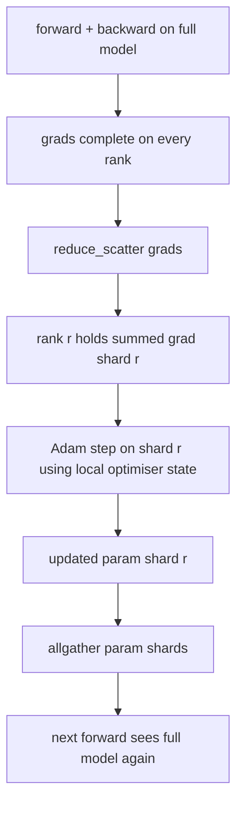

# ZeRO 优化器状态分片

> Adam 为每个参数存储两个动量估计，均在 float32 中。一个 7B 参数模型携带 56 GB 的优化器状态。ZeRO 阶段 1 将其分片到 N 个 rank 上；每个 rank 拥有 1/N 的优化器。在本地步进之后，更新的参数分片广播回来，每个 rank 重建完整模型，下一步开始。胜利是训练栈中最大单一分配上的线性内存下降。

**Type:** Build
**Languages:** Python
**Prerequisites:** Phase 19 Track C lessons 42-49
**Time:** ~90 min

## Learning Objectives

- 将优化器状态（第一动量、第二动量、fp32 主副本）分片到 N 个 rank 上，使每个 rank 拥有 1/N。
- 使用 reduce_scatter 仅向每个 rank 传递其分片的梯度和，然后 allgather 将更新的参数分片广播回来。
- 计算阶段 1、阶段 2、阶段 3 对普通 DDP 的内存节省表。
- 在模型大小和带宽预算上辩护阶段 1 vs 阶段 2 vs 阶段 3 的选择。

## The Problem

普通 DDP 复制一切：参数、梯度和优化器状态在每个 rank 上都完整存在。对于一个 fp16 的 7B 参数模型，意味着每个 rank 上有 14 GB 参数、14 GB 梯度和 28 GB 优化器状态。优化器状态是最大的项，也最容易分片，因为它只在步进期间被触及，而不是在前向或反向期间。

ZeRO 阶段 1 分片优化器状态。每个 rank 持有 1/N 的 Adam 动量。在反向之后，ZeRO 不是 allreduce 完整梯度然后本地步进，而是 reduce_scatter，使每个 rank 只接收其分片的求和梯度。该 rank 对其主参数分片应用优化器步进。然后更新的参数分片 allgather 回来，使每个 rank 都有完整模型用于下一个前向。优化器内存下降 N。每步的线通信量与 DDP 相同：一次 reduce_scatter 加一次 allgather 按带宽等于一次 allreduce。内存赢了，吞吐量保持。

## The Concept



### ZeRO 的阶段

| Stage | What is sharded | Memory per rank | Comm per step |
|-------|----------------|------------------|---------------|
| DDP | nothing | params + grads + optim | 1x allreduce |
| ZeRO-1 | optimiser state | params + grads + optim/N | 1x reduce_scatter + 1x allgather |
| ZeRO-2 | optim + grads | params + grads/N + optim/N | 1x reduce_scatter + 1x allgather |
| ZeRO-3 | optim + grads + params | params/N + grads/N + optim/N | 1x allgather per layer + 1x reduce_scatter per layer |

阶段 1 是最廉价的胜利，因为优化器状态主导预算。阶段 2 需要梯度分片累积逻辑，但带宽相同。阶段 3（FSDP）为每个前向和反向支付每层通信，换取参数分片的内存下降。本课完整实现阶段 1。

### 内存计算，真实数字

对于用 Adam 以混合精度训练的具有 P 个参数的模型：

| Term | Vanilla | ZeRO-1 | Why |
|------|---------|--------|-----|
| fp16 params | 2P bytes | 2P bytes | 前向需要 |
| fp16 grads | 2P bytes | 2P bytes | 反向需要 |
| fp32 master copy | 4P bytes | 4P/N bytes | 仅优化器使用 |
| fp32 first moment | 4P bytes | 4P/N bytes | 仅优化器使用 |
| fp32 second moment | 4P bytes | 4P/N bytes | 仅优化器使用 |
| Total | 16P bytes | 4P + 12P/N bytes |   |

N=8 时：普通 16P，ZeRO-1 5.5P，下降 65%。N=64 时：普通 16P，ZeRO-1 4.19P，下降 74%。

### 为什么 reduce_scatter 优于 allreduce-then-shard

Allreduce 给每个 rank 完整的求和梯度。如果你只需要分片 r，allreduce 中归约的 (N-1)/N 的梯度在 rank r 上被浪费了。Reduce_scatter 精确传递每个 rank 拥有的分片；每 rank 字节与 allreduce 相同（因为 allreduce 是 reduce_scatter + allgather），但后半部分被后面的参数分片 allgather 替代。净线路与 DDP 相同，内存被分割。

## Build It

`code/main.py` 实现了：

- `flatten_params(module)` 和 `unflatten_into(module, flat)`，将模型的参数打包成一个连续张量并解包回来。平坦布局使按 rank 分片成为简单的切片。
- `ZeroOptimizer(model, world_size, rank, lr)`，拥有 rank 的主副本和 Adam 动量分片。
- `step()`，对平坦梯度运行 reduce_scatter，对 rank 的分片应用 Adam，将更新的参数 allgather 回来。
- 一个演示，训练 3 层 MLP 20 步，并打印每步内存预算以及普通 DDP 基线。

运行方式：

```bash
python3 code/main.py
```

输出：每步损失和显示 ZeRO-1 在每个 rank 上持有 1/N 优化器状态 vs DDP 完整副本的内存表。

## 生产实践

三种实践强化 ZeRO 到可交付水平。

**分片检查点很重要。** ZeRO-1 的优化器状态跨 rank 拆分；检查点必须记录哪个 rank 拥有什么。第 80 课构建分片检查点清单，在相同 world size 上恢复 ZeRO 运行。没有它，保存的状态在重启时不可读取。

**混合精度是重点。** ZeRO 是混合精度技术；fp32 主副本是被分片的内容。在没有混合精度的情况下运行 ZeRO，支付 fp32 主副本的内存税而没有对应的 fp16 前向胜利。生产运行总是将 ZeRO 与 autocast 或 bf16 权重配对。

**阶段 1 是接近免费的胜利。** 通信按带宽与 DDP 相同。内存节省按 N 线性。唯一的成本是优化器分片的记账。生产栈默认阶段 1，除非参数分片内存也是问题；然后阶段 2 或 3 用通信换取内存。

## Use It

生产模式：

- **DeepSpeed ZeRO。** 参考实现。`deepspeed_config.json` 选择阶段 1/2/3 和分区大小。
- **PyTorch FSDP。** PyTorch 原生等价物。`ShardingStrategy.SHARD_GRAD_OP` 是 ZeRO-2；`FULL_SHARD` 是 ZeRO-3。
- **HuggingFace Accelerate。** 在统一配置下包装 DeepSpeed 和 FSDP。

## Ship It

第 79 课（流水线并行）是正交的分片轴：不是跨相同模型分片优化器状态，而是跨 rank 分片层。第 81 课在端到端演示上组合 DDP + ZeRO。

## Exercises

1. 通过分片梯度扩展到 ZeRO-2：每个 rank 在反向后仅存储其分片的梯度，通过将非分片部分置零来实现。
2. 添加内存分析器，在 rank 0 上打印实际 fp32 字节使用量 vs 公式预测。
3. 测量普通 DDP vs ZeRO-1 的每步挂墙时钟时间，并分解为前向、反向、通信。
4. 在 ZeRO-1 下实现梯度裁剪：必须通过对放缩范数进行 allreduce 来跨所有分片计算 L2 范数。
5. 用 allreduce 而非 reduce_scatter 实现"朴素 ZeRO"，测量线路时间差异。用数据为 reduce_scatter 选择辩护。

## Key Terms

| Term | What people say | What it actually means |
|------|----------------|------------------------|
| ZeRO-1 | "分片优化器" | 每个 rank 持有 1/N 的 fp32 主副本 + Adam 动量 |
| ZeRO-2 | "梯度也分片" | 每个 rank 在 reduce_scatter 后也丢弃非分片梯度 |
| ZeRO-3 | "参数分片" | 每个 rank 持有 1/N 的 fp16 参数；前向中每层 allgather |
| Master copy | "fp32 权重" | 优化器更新的高精度参数副本 |
| Reduce_scatter | "拆分求和" | 仅向每个 rank 传递其分片的求和梯度 |

## Further Reading

- [Rajbhandari et al, ZeRO: Memory Optimizations Toward Training Trillion Parameter Models](https://arxiv.org/abs/1910.02054)
- [DeepSpeed ZeRO documentation](https://www.deepspeed.ai/tutorials/zero/)
- [PyTorch FSDP documentation](https://pytorch.org/docs/stable/fsdp.html)
- Phase 19 Lesson 76 - 本课所依赖的 reduce_scatter 和 allgather
- Phase 19 Lesson 80 - ZeRO 状态必须使用的分片检查点
