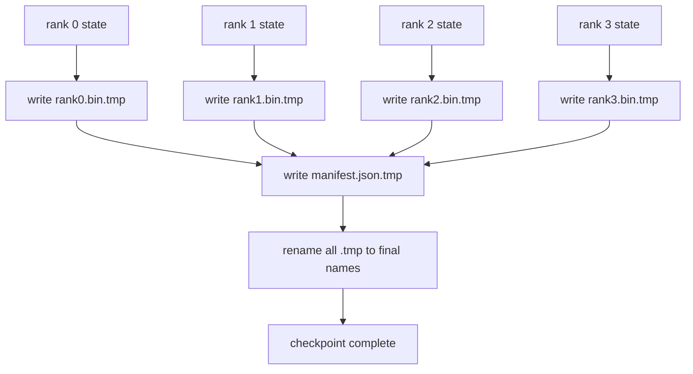

# 分片检查点和原子恢复

> 一个 70B 参数的训练作业每隔几小时就被节点故障暂停。检查点格式决定你是丢失 30 分钟还是 30 小时。分片检查点并行写入每个 rank 的分片，并将所有权记录在清单中。恢复时从自己的文件加载每个 rank 的分片，在相同 world size 上重建状态，优化器步进就像什么都没发生。原子写入可防止半完成的检查点毒化下一次恢复。

**Type:** Build
**Languages:** Python
**Prerequisites:** Phase 19 Track C lessons 42-49
**Time:** ~90 min

## Learning Objectives

- 将多 rank 检查点保存为每 rank 分片文件加上一个记录哪个 rank 拥有什么的清单。
- 使用原子写入模式（写入临时路径然后重命名），使写入中途崩溃永远不会产生半完成的检查点。
- 从清单恢复，在每个 rank 上验证 fp16 参数和 ZeRO 优化器状态的逐字节相等状态。
- 为清单模式辩护三种失败模式：world-size 更改、分片计数不匹配和部分写入。

## The Problem

普通检查点将所有参数和优化器状态读入 rank 0，聚合，并写入单个文件。对于一个 70B 模型，那是通过一个 rank 的网络端口传递 1.1 TB 状态。写入阻塞每个其他 rank，因为它们空转等待聚合。IO 带宽是最慢单个 GPU 的网络链接，而非聚合带宽。在真实集群上，聚合并写入的步骤可能比之前的一小时训练更久，这意味着作业每天交给的检查点不到一个。

分片检查点翻转模式：每个 rank 并行将自己的分片写入自己的文件。清单记录哪个 rank 拥有哪个分片，以便恢复时将每个分片放回原处。聚合写入带宽随集群缩放。一个花费 4 小时通过一个 rank 的 1 TB 检查点通过 64 个 rank 只需 4 分钟。另外，清单为你提供了不兼容恢复的契约：world-size 更改可检测，部分写入可检测，加载路径可以大声失败而非默默使用陈旧数据。

## The Concept



### 清单模式

```json
{
  "world_size": 4,
  "step": 1234,
  "wall_clock_seconds": 4521,
  "shards": [
    {"rank": 0, "path": "rank0.bin", "sha256": "...", "param_shard_offset": 0, "param_shard_numel": 65536},
    {"rank": 1, "path": "rank1.bin", "sha256": "...", "param_shard_offset": 65536, "param_shard_numel": 65536}
  ],
  "schema_version": 1
}
```

三个字段是负载承载的。`world_size` 使在不同大小上恢复大声失败而非默默损坏。每个分片的 `sha256` 捕获部分或损坏的写入。每个分片的 `param_shard_offset` 和 `param_shard_numel` 使加载器在正确位置重建平坦参数张量。

### 原子写入

标准模式：将每个分片写入 `<name>.tmp`，将清单写入 `manifest.json.tmp`，fsync 每个，然后重命名。同一文件系统内的 POSIX 重命名是原子性的；要么新文件完全存在，要么旧的还在。在最终重命名之前的崩溃将先前的检查点保留为活跃的。没有原子写入，崩溃可能留下部分分片且存在指向它的清单，加载在恢复时损坏优化器状态。

### 模式必须防御的三种失败模式

| Failure | Symptom | Defence |
|---------|---------|---------|
| World-size change | 使用 N=4 的清单在 N=8 上恢复 | 清单中的 world_size 不匹配，大声失败 |
| Shard count mismatch | 恢复时看到的 rank*.bin 文件少于清单中的分片 | 枚举分片，验证每个都存在 |
| Partial write | 分片文件在写入中途截断 | 加载时 sha256 验证 |

每种防御早期拒绝坏加载；替代方案是 100 步后损失变成 NaN 时才暴露的默默损坏。

### 为什么每 rank 文件，而非一个大文件

通过 `O_APPEND` 并发写入一个文件在 POSIX 上对字节对齐写入有效，但在实践中，一个分片内的偏移跨 MB 级区域，锁定主导。每 rank 文件没有争用，并在底层文件系统是并行的（Lustre、GPFS）时受益于条带化。生产栈（DeepSpeed、FSDP、NeMo）都因此原因使用每 rank 文件。

## Build It

`code/main.py` 实现了：

- `ShardManifest` 数据类，带有上述模式加上 `to_json`/`from_json`。
- `save_sharded(state_dict_per_rank, dir, step)`，使用原子临时然后重命名模式将每个 rank 的二进制状态写入自己的文件，然后写入清单。
- `load_sharded(dir, expected_world_size)`，读取清单，验证每个分片的 sha256，并返回每 rank 状态字典。
- 往返测试：构建每 rank 状态，保存，加载，断言逐字节相等。

运行方式：

```bash
python3 code/main.py
```

输出：写入 4 个分片文件加清单，然后用逐字节相等验证重新加载。

## 生产实践

三种实践强化检查点到可交付水平。

**异步写入。** 生产栈在单独线程或进程上发出检查点写入，以便训练继续。屏障在下一个检查点：不要在前一个保存完成之前开始下一个保存。DeepSpeed 的 `async_io` 标志正是这样做的。本课将写入保持为同步的，使步骤可见。

**先本地快速磁盘，然后异步上传。** 写入本地 NVMe（快速），然后异步上传到 S3 或 GCS。两层模式保持集群内检查点快速用于恢复，同时交付持久副本到集群外用于归档。清单携带本地路径；上传清单携带远程路径。

**轮换很重要。** 生产运行保持最后 K 个检查点（通常 3-5 个）并轮换最旧的。没有轮换，磁盘在运行中途填满，下一个检查点失败。有轮换，下一个保存首先删除最旧的，释出预算。

## Use It

生产模式：

- **DeepSpeed checkpointing。** `deepspeed.save_checkpoint(tag=step)` 写入每 rank 文件和一个指向活跃标签的 `latest` 文件。
- **PyTorch FSDP checkpointing。** `torch.distributed.checkpoint` 用一个决定每 rank 布局的 `Planner` 保存分片状态。
- **NeMo。** 用统一的 `save_to_checkpoint` API 包装 DeepSpeed 和 FSDP，添加元数据。

## Ship It

第 81 课保存端到端 DDP+ZeRO 运行的分片检查点，并在相同 world size 上重新加载它，证明恢复契约成立。

## Exercises

1. 添加异步写入：在线程中启动保存并让训练继续。阻塞下一个保存直到前一个完成。
2. 添加 `last_5_steps` 轮换：保留 5 个最近的检查点，在保存新检查点之前删除最旧的。
3. 为内部循环重载添加仅 CRC 的快速验证路径（轮换将检查点轮为活跃检查点，无需完整 sha256）。
4. 添加跨 world-size 加载：通过读取清单、连接和重新分片，从 N=4 到 N=8 重新平衡分片。
5. 添加上传到假 S3（第二个目录）并写入上传清单。为两层存储策略辩护。

## Key Terms

| Term | What people say | What it actually means |
|------|----------------|------------------------|
| Sharded checkpoint | "每 rank 保存" | 每个 rank 并行写入自己的分片文件 |
| Manifest | "索引" | 记录分片路径、偏移和 sha256 的 JSON 文件 |
| Atomic write | "临时然后重命名" | 写入 .tmp 然后 POSIX 重命名，使崩溃保留前一个文件活跃 |
| Partial write | "截断的分片" | 写入期间的崩溃产生损坏的分片；sha256 捕获它 |
| Rotation | "保留最后 K 个" | 在写入新检查点之前删除最旧的以限制磁盘使用量 |

## Further Reading

- [DeepSpeed checkpointing](https://www.deepspeed.ai/tutorials/checkpointing/)
- [PyTorch torch.distributed.checkpoint](https://pytorch.org/docs/stable/distributed.checkpoint.html)
- [POSIX rename atomicity](https://pubs.opengroup.org/onlinepubs/9699919799/functions/rename.html)
- Phase 19 Lesson 78 - 此检查点旨在保存的 ZeRO 状态
- Phase 19 Lesson 81 - 端到端演示往返保存的状态
