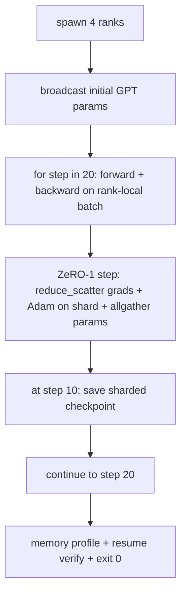

# 端到端分布式训练

> 第 76 到 80 课各自构建了一个部件。这是装配：一个微型 GPT 在 4 个模拟 rank 上训练，使用 DDP 进行梯度同步，ZeRO-1 进行优化器状态分片，并在半程处写入分片检查点。演示运行 20 步，自终止，打印损失曲线加内存概况，并写入可恢复检查点。

**Type:** Build
**Languages:** Python
**Prerequisites:** Phase 19 Track C lessons 42-49
**Time:** ~90 min

## Learning Objectives

- 将 DDP（第 77 课）加 ZeRO-1（第 78 课）加分片检查点（第 80 课）组合进一个训练循环。
- 在小型合成语料库上跨 4 个模拟 rank 训练 2 层 Transformer 语言模型 20 步。
- 打印每步损失表、每 rank 内存概况，以及在相同 world size 上逐字节相等恢复的检查点清单。
- 辩护组合方式：每个部件在前面的课程中可独立测试，本课证明它们可以组合。

## The Problem

顶点项目是各部件能拼在一起的证明。第 76 课实现了集合操作。第 77 课将它们包装成 DDP。第 78 课用 reduce_scatter 分片优化器状态。第 79 课分析了流水线。第 80 课保存了分片检查点。每课独立存在并带有自己的测试。真实训练运行同时使用每个原语；如果组合错误，损失发散，检查点拒绝恢复，或每 rank 内存在应该收缩时增长。

本课运行端到端演示并验证四个不变量：(a) 损失在 20 步内单调下降，在浮点噪声范围内，(b) 每个 rank 在每一步持有相同的参数范数，(c) 每 rank 优化器内存等于 ZeRO-1 公式 12P/N 字节，(d) 第 10 步的检查点在重启时逐字节相等恢复。演示自终止：20 步，单一命令，退出 0。

## The Concept



### 微型 GPT

模型故意设计的很小：2 个 Transformer 块，嵌入维度 32，4 个注意力头，词汇表 64，序列长度 16，批大小 4。几千个参数。足够大到锻炼每个连接决策（多头注意力运行标准掩码路径；LayerNorm 有权重需要同步；LM 头是一个独立的线性投影回词汇表）。足够小到 20 步在 4 个 CPU rank 上数秒内完成。

### 组合规则

| Lesson piece | What it owns | What it leaves to the loop |
|--------------|--------------|----------------------------|
| DDP broadcast | 初始参数同步 | 构造时一次调用 |
| ZeRO-1 step | 梯度同步、主副本更新、参数广播 | 每步一次调用替代 optimiser.step |
| Sharded checkpoint | 持久化每 rank 状态、清单带 sha256 | 在 rank 0 上用通过 allgather 收集的状态调用 |
| Training loop | 前向、反向、损失记录 | 按顺序调用以上三者 |

循环不知道 reduce_scatter 或汇合文件。ZeRO 和检查点模块暴露循环组合的窄接口。

### 为什么是微型 GPT 而不仅仅是 MLP

第 77 课的 MLP 足以验证梯度同步。微型 GPT 添加了三样东西：一个独立的词汇表上的 LM 头（本课中解绑以求清晰；完整 GPT 通常将头与 token 嵌入绑定），softmax+交叉熵作为损失（比 MSE 有更多数值边缘情况），以及非对称前向（每层嵌入然后注意力然后 MLP）。为顶点项目坚持使用 MLP 会隐藏组合是否能正确处理 LayerNorm 或嵌入层的梯度形状。

### 自终止意味着退出 0

循环运行固定 20 步并退出。没有 `while True`，没有人为干预，没有从外部状态恢复。你可以让顶点项目无人值守运行，完成时找到完整日志，这就证明了系统连接正确。如果任何部件死锁，演示永远不会返回，测试框架会捕获它。

## Build It

`code/main.py` 实现了：

- `MiniGPT`：2 层 Transformer，带掩码自注意力和独立 LM 头。
- `make_corpus(seed, total_tokens)`：确定性 next-token-prediction 数据。
- `_train_worker`：每个 rank 生成；广播初始参数，运行循环，调用 ZeRO 步进，在第 10 步写入分片检查点。
- `verify_resume`：在主运行之后，在进程中重新加载第 10 步的检查点，并断言保存的主分片与内存快照逐字节匹配。
- `main`：编排整个演示，打印损失表、内存概况和验证结果。

运行方式：

```bash
python3 code/main.py
```

输出：一个 20 行损失表、一个 4 行每 rank 内存概况、一个检查点清单，以及成功时的 "RESUME VERIFIED" 行。

## 生产实践

三种实践完成真实运行的组合。

**每 K 分钟检查点，而非每 K 步。** 步时间随 seq 长度和微批量数量而变化。10 分钟检查点节奏无论模型大小捕获相同计算量。本课为简单使用基于步的；生产使用基于挂墙时钟的。

**早期检测发散。** 生产运行在反向之后添加 NaN 守卫和损失飙升检测器；如果损失在一步中跳超过 2 倍，回退到前一个检查点，而非让优化器走进退化状态。本课的损失曲线平滑，因此守卫未使用但钩子保留。

**跨 rank 聚合内存概况。** 在真实运行中，每 rank 内存因 rank 而异（具有最大流水线阶段的 rank 持有更多激活）。生产记录跨 rank 的最大值加均值；本课打印每 rank 以显示公式匹配。

## Use It

生产模式：

- **DeepSpeed。** 在一个配置下组合 DDP + ZeRO + 流水线 + 激活检查点。本课的组合是微型化的 DeepSpeed 形状。
- **PyTorch FSDP。** 原生等价物。`FullyShardedDataParallel` 与 `ShardingStrategy.SHARD_GRAD_OP` 即 ZeRO-2。
- **NeMo 和 Megatron-LM。** 对最大模型添加张量并行；否则组合是相同的形状。

## Ship It

完整赛道在此结束。这 6 节课一起是一个真实团队在采用 DeepSpeed 之前会构建的分布式训练子系统；抽象已经对照 gloo 证明，失败模式已经锻炼。阶段 17（基础设施和生产）是将其推向真实集群的地方。

## Exercises

1. 添加注意力头的张量并行拆分并验证损失匹配单 rank 基线。两个 rank：每 rank 一半的注意力头，注意力输出的 allreduce。
2. 添加跨 4 个微批量的梯度累积，并证明梯度等于一个大批次的梯度。
3. 添加一个从第 10 步恢复的路径，实际继续训练到第 20 步，并产生与原始运行相同的最终损失。
4. 添加指标导出（损失、梯度范数、步时间）到 JSONL，使运行可以在事后可视化。
5. 添加一个 NaN 守卫，在损失飙升时回退到前一个检查点，并通过一步学习率乘数强制触发飙升以锻炼回退。

## Key Terms

| Term | What people say | What it actually means |
|------|----------------|------------------------|
| End-to-end | "全部连接起来" | 一次运行组合每个部件，而非每个部件一个单元测试 |
| Memory profile | "每 rank GB" | 每个 rank 上为参数、梯度、优化器状态持有的字节数 |
| Resume contract | "保存和加载" | 检查点往返后每 rank 状态逐字节相等 |
| Self-terminating | "有界运行" | 固定步数，完成时退出 0，循环中没有人类 |

## Further Reading

- [DeepSpeed end-to-end training tutorial](https://www.deepspeed.ai/getting-started/)
- [PyTorch FSDP advanced tutorial](https://pytorch.org/tutorials/intermediate/FSDP_advanced_tutorial.html)
- [Megatron-LM training script reference](https://github.com/NVIDIA/Megatron-LM)
- Phase 19 Lessons 76-80 - 本课组合的每个部件
- Phase 17 - 将组合移至真实集群
