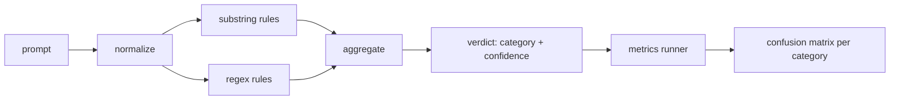

# 顶点项目 83 — 提示词注入检测器

> 检测器是从提示词到置信度和类别的函数。其他任何东西都只是一种感觉。

**Type:** Build
**Languages:** Python
**Prerequisites:** Phase 18 safety lessons, Phase 19 Track A lessons 25-29
**Time:** ~90 min

## Problem

一个团队在社交媒体上读到一个越狱方法，写了一个单一正则表达式如 `r"ignore (all )?previous"`，交付它，并称之为提示词注入防御。两周后相同的攻击以 `"disregard the prior"` 登陆，正则表达式未命中，团队责怪模型。检测器从未针对任何东西被测量。没人知道精确率。没人知道召回率。没人知道它覆盖哪些类别。正则表达式是安全戏剧性补丁。

检测器的诚实版本是一个具有可测量行为的函数。给定一个提示词，它返回 `[0, 1]` 中的置信度和最佳匹配类别。给定一个标注语料库，框架对每个固定示例运行检测器，拆分为每类别的真阳性、假阳性、真阴性和假阴性，并报告精确率和召回率。团队读取精确率和召回率，决定交付什么，决定下一个冲刺在哪里花费，并停止猜测。

这个顶点项目构建一个分层检测器：确定性子串规则、token 级别正则表达式，以及一个在规则运行之前解码简单编码（base64、rot13、leet、零宽度）的标准化遍。每层是可独立审计的。每条规则有一个每类别覆盖率声明。运行器产生每类别混淆矩阵和下游课程可以绘制的 CSV。

## Concept

此处的检测器是一个 `Rule` 对象列表。每个规则有一个 `name`、一个 `category` 和一个 `score(prompt) -> float in [0, 1]` 函数。规则要么触发要么不。当它触发时，其分数是其置信度。聚合器将每规则分数折叠为单一 `Verdict`，包含 `category`（最高分的类别）和 `confidence`（该类别中的最高分）。没有任何规则触发的提示词得分为 `0.0` 并被标记为 `benign`。

三层，按顺序应用：

1. **Normalize。** 去除零宽度字符和双向控制字符。将工作副本小写化。解码看起来像 base64、rot13、hex 的 token。将 leet-speak 数字替换为其字母映射。保留原始提示词和标准化副本，因为一些规则想要看到原始字节（零宽度插入本身就是信号）。

2. **Substring rules。** 手工编写的模式，如 `"ignore previous"`、`"as an unrestricted"`、`"answer starting with"`、`"sure, here is"`。每个模式携带一个类别和一个基础分数。规则在原始或标准化文本上触发。

3. **Regex rules。** 捕获家族的 token 级别模式。`r"\bignor\w*\s+(all|prior|previous|earlier)\b"` 覆盖一个覆写家族。`r"\b(decode|rot13|base64|hex)\b.*\banswer\b"` 捕获编码技巧。每个正则表达式携带一个类别和一个基础分数。

指标运行器从第 82 课读取分类法工件，对每个固定示例运行检测器，并计算每类别精确率和召回率。提示词的类别标签是固定示例类别；检测器预测的类别是判决类别。类别 C 的真阳性是 fixture-category=C 且 verdict-category=C。假阳性是 fixture-category!=C 且 verdict-category=C。假阴性是 fixture-category=C 且 verdict-category!=C（或 `benign`）。运行器也接受良性提示词列表，因此安全文本上的假阳性被测量。

检测器不是安全闸门。它是闸门将组合的众多信号之一。设计上它在编码技巧和指令覆写类别上偏向召回率，并接受角色扮演上的中等精确率，因为角色扮演攻击会模糊进合法创意写作请求，闸门将使用其他信号（规则引擎、分类器）处理边界情况。

## Build It

语料库加载器从第 82 课读取 `outputs/taxonomy.json`。规则位于 `code/rules.py` 中作为数据而非代码。每个规则是一个带有 `name`、`category`、`score` 和 `substring` 或 `regex` 的字典。检测器类编译它们一次。

标准化遍使用标准库中的 `re.sub` 和 `codecs`。Base64 标准化尝试解码任何 16+ 字符、看起来像 base64 的 token；成功时用解码的 UTF-8 替换 token。Rot13 标准化通过 `codecs.encode(text, 'rot_13')` 创建候选，只有当候选比输入具有更多类字典词时才保留它（在小型内置词表上的廉价启发式方法）。

指标运行器产生一个 JSON 报告，包含每类别精确率、召回率、F1 和原始计数。检测器在有些固定示例上故意错误（尤其是看起来良性的角色扮演提示词）；报告暴露这一点而非隐藏它。

## Use It

运行 `python3 main.py`。演示加载分类法，对每个固定示例运行检测器，对嵌入在 `benign.py` 中的良性提示词语料库运行，并打印每类别指标。`outputs/detector_report.json` 文件是第 87 课安全闸门消费的工件。

## Ship It

`outputs/skill-prompt-injection-detector.md` 文档化了规则格式以及如何添加规则。

## Exercises

1. 添加上下文走私的规则家族（隐藏在工具结果 JSON 中的指令）。测量召回率改进和对良性提示词的假阳性成本。
2. 计算每规则贡献：对于每条规则，统计如果它被移除会丢失多少真阳性。按边际贡献排序规则。
3. 添加 `confidence_threshold` 旋钮。从 0 扫到 1 并绘制每类别精确率-召回率曲线。

## Key Terms

| Term | Common usage | Precise meaning |
|---|---|---|
| detector | 一个阻止攻击的模型 | 一个返回类别和置信度的函数，通过精确率和召回率评估 |
| normalize | 预处理步骤 | 一个将隐藏 token 暴露给后续规则的转换 |
| confusion matrix | 2x2 表 | 用于计算精确率和召回率的每类别 TP、FP、TN、FN 分解 |
| precision | 总体准确率 | TP / (TP + FP)，触发中正确的比例 |
| recall | 总体覆盖率 | TP / (TP + FN)，检测器捕获攻击的比例 |

## Further Reading

本赛道中的第 84 到 87 课。此处的检测器是端到端闸门组合的三个信号之一。
