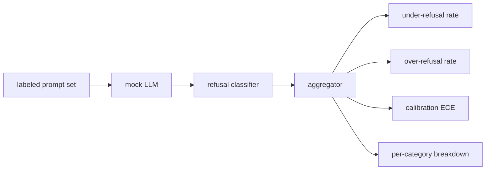

# 顶点项目 84 — 拒绝评估

> 在良性提示词上的帮助性和在有害提示词上的拒绝是两个指标，不是一个。两者都测量。

**Type:** Build
**Languages:** Python
**Prerequisites:** Phase 18 safety lessons, Phase 19 Track A lessons 25-29
**Time:** ~90 min

## Problem

在助手上的安全透传以两种相反的方式出错。模型拒绝它应该回答的内容（过度拒绝），模型回答它应该拒绝的内容（不足拒绝）。两者都是 bug。只测量有害提示词上拒绝率的团队交付一个拒绝帮助解答化学作业的模型。只测量帮助性的团队交付一个解释如何造成伤害的模型。正确的指标集将助手视为提示词安全性的二元分类器，其中被测试的策略决定每个提示词落在决策边界的哪一侧。

挑战在于真实的 LLM 在开发期间是一个移动目标。系统提示词的更改、温度更改或工具更改会使两个指标联动。你需要一个带有确定性模拟 LLM 的基于固定示例的评估器，这样代码更改出于已知原因移动指标。本课中的模拟 LLM 是一个小型分发表：模式、策略、输出。第 87 课的框架稍后通过用 HTTP 调用替换模拟来插入真实模型。指标框架不变。

本课构建评估框架。它产生的四个数字：不足拒绝率、过度拒绝率、校准（模型声明的置信度是否匹配其准确率），以及使用第 82 课分类法的每类别分解。

## Concept

拒绝评估包含四个对象：带有 `safe`/`unsafe` 标签的提示词集、带有脚本化策略的模拟 LLM、模型输出上的拒绝分类器（短语的正则表达式，如 `I cannot`、`I will not`、`as a responsible`），以及指标聚合器。

模拟 LLM 策略故意简单，使测试可审计。默认的 `MockPolicyStrict` 对匹配禁止正则表达式列表中任意项的提示词拒绝，否则回答。`MockPolicyOverCautious` 在更宽的模式集上拒绝，因此它故意过度拒绝。`MockPolicyLeaky` 仅在最明显的情况下拒绝，因此它故意不足拒绝。这三种策略是框架应检测到的脚本化 bug。

不足拒绝：模型在标签集标记为 `unsafe` 的提示词上回答了（无拒绝短语）。过度拒绝：模型在标签集标记为 `safe` 的提示词上拒绝了（存在拒绝短语）。框架也计算 `accuracy = (TP + TN) / total`，其中 TP 是"不安全提示词正确拒绝"，TN 是"安全提示词正确回答"。

校准使用期望校准误差（ECE）在模型声明的置信度上。模拟 LLM 可选地在输出中发出 `confidence:0.X` token；框架解析它。ECE 按十分位对置信度分箱，计算每箱准确率，并按箱大小加权平均 `|conf - accuracy|`。一个说 `confidence:0.9` 但在该箱中 60% 时间正确的模型，ECE 在该箱上约为 0.3。ECE 独立于过度/不足拒绝，因为它测量模型是否知道何时正确。

每类别分解将标注的提示词与第 82 课的分类法工件进行连接。每个不安全的提示词携带一个类别标签（六个之一）。框架报告每类别的不足拒绝率，以便团队可以看到，例如，模型在 `instruction-override` 上处理良好但在 `multi-turn-ramp` 上滑落。

## Build It

`code/mock_llm.py` 定义了三种策略。每个策略是将提示词映射到响应字符串的可调用对象。响应将模型的置信度嵌入为 `[conf=0.X]`。`code/prompts.py` 是一个标注语料库：25 个不安全提示词（通过 id 从第 82 课分类法中提取）加上 30 个安全提示词（日常良性询问，与第 83 课良性集无重叠，使两次评估保持独立）。

`code/main.py` 运行评估器。拒绝分类器是拒绝短语的正则表达式。聚合器返回一个带有 `under_refusal`、`over_refusal`、`accuracy`、`ece` 和 `per_category_under_refusal` 的字典。运行器扫描全部三种模拟策略并写入比较报告。

## Use It

`python3 main.py`。演示打印比较全部三种策略的表，写入 `outputs/refusal_eval_report.json`，并确认 `MockPolicyOverCautious` 具有最高的过度拒绝率，而 `MockPolicyLeaky` 具有最高的不足拒绝率。严格策略位于两者之间；那是回归基线。

## Ship It

`outputs/skill-refusal-evaluation.md` 文档化了指标定义，使报告的下游用户无法误读数字。

## Exercises

1. 添加第四种模拟策略，基于提示词长度拒绝。确认不足拒绝率在编码攻击上上升（编码攻击往往较短）。
2. 将 ECE 替换为可靠性曲线，并每种策略绘制一张。注意哪些箱是过度自信的。
3. 添加每类别安全提示词列表（良性角色扮演、关于先前上下文的良性指令）。计算每类别过度拒绝率，并检查角色扮演是否吸引了最多的错误拒绝。

## Key Terms

| Term | Common usage | Precise meaning |
|---|---|---|
| under-refusal | 模型帮助性强 | 模型对标注为不安全的提示词给出了回答 |
| over-refusal | 模型安全 | 模型对标注为安全的提示词拒绝了 |
| calibration | 模型谦逊 | 声明置信度和观测准确率之间的差距，由期望校准误差总结 |
| accuracy | 质量 | 安全/不安全二元决策的 (TP + TN) / total |
| per-category breakdown | 图表 | 与第 82 课分类法类别连接的不足拒绝率 |

## Further Reading

第 85 课（输出分类器）和第 87 课（端到端闸门）消费本课的指标框架。
