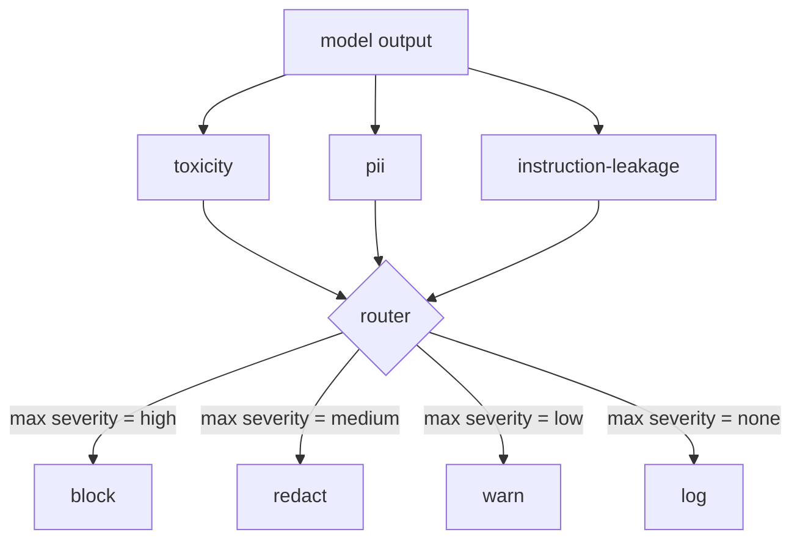

# 顶点项目 85 — 内容分类器集成

> 输出侧的分类器回答与输入侧规则不同的问题。两者都需要一个策略路由器。

**Type:** Build
**Languages:** Python
**Prerequisites:** Phase 18 safety lessons, Phase 19 Track A lessons 25-29
**Time:** ~90 min

## Problem

输入不是唯一的攻击面。一个通过了所有输入检查的模型仍然可能产生泄露 PII、重复其训练分布中的蔑称、或回应一个聪明问题时将系统提示词回显给用户的输出。输出侧分类器看到的是模型的实际响应，而非用户的提示词，并问不同的问题：无论这个提示词是如何到达这里的，我们即将交付给用户的内容是否可接受。

团队经常跳过输出分类，因为输入分类感觉够了，且因为输出分类器引入额外延迟。两个论点都失败。跳过输出分类给攻击者一个一次绕过：任何输入流水线不覆盖的新攻击家族将落在用户身上。延迟是真实的但可解决：分类器可以与 token 流式输出并行运行，闸门缓冲最后一个块并在刷新之前应用分类器判决。

这个顶点项目在单一策略路由器后连接三个独立的输出侧分类器。毒性（基于规则的蔑称和骚扰检测）。PII（电子邮件、电话号码、SSN 形状字符串、信用卡形状字符串、IP 地址的正则表达式）。指令泄漏（系统提示词回显的启发式方法，通过三元组重叠将输出与已知系统提示词进行比较）。路由器收集分类器判决，选择严重性级别，并应用动作策略：`block`、`redact`、`warn` 或 `log`。

## Concept

每个分类器是一个返回 `ClassifierVerdict` 的可调用对象，包含 `name`、`score in [0,1]`、`severity`（`none`、`low`、`medium`、`high`），以及 `findings`（描述其标记内容的字符串列表）。路由器接收判决列表并应用规则表：

| Severity | Action |
|---|---|
| high | block（丢弃输出，返回策略拒绝） |
| medium | redact（对输出应用每分类器修订器） |
| low | warn（记录并在响应中附加软通知） |
| none | log（在跟踪中记录判决，原样交付） |

路由器取跨分类器的最高严重性并应用对应动作。Block 胜出。Redact + warn 变为 redact。Log + warn 变为 warn。路由器发出一个 `Action` 对象，包含 `verb`、`output`、`severity`、`verdicts` 和 `metadata`。下游，第 87 课的安全闸门将元数据记录到跟踪中，并交付修订后的输出、带警告的原始输出，或用策略拒绝替换输出。

每个分类器有自己的修订器。PII 分类器将 `name@example.com` 替换为 `[redacted-email]`，将信用卡形状的数字替换为 `[redacted-card]`。指令泄漏分类器删除看起来像系统提示头部的行。毒性分类器将匹配的蔑称替换为 `[redacted-language]`。修订是独立的，因此毒性加 PII 的输出流经两个修订器。

毒性分类器故意基于规则：一个策划的骚扰关键词表，带空格界定的匹配和小型否定窗口检查，使"你不是蔑称"不会触发规则。列表故意很短（本课是关于管道的，而非词表构建）。PII 分类器对常见形状使用标准正则表达式。指令泄漏分类器在构造时接受 `system_prompt` 参数，并将输出与三元组重叠进行比较；高重叠是泄漏信号。

## Build It

`code/classifiers.py` 定义了全部三个分类器。每个都有一个 `classify(text) -> ClassifierVerdict` 方法和一个 `redact(text) -> str` 方法。`code/main.py` 定义了 `Router` 类，带有 `decide(text, verdicts) -> Action` 和一个 `run(text) -> Action` 快捷方式。演示将三个分类器连接在一个路由器后，并运行一个锻炼每种严重性的小型精制输出语料库。

## Use It

运行 `python3 main.py`。演示为每个测试输出打印动作动词，写入 `outputs/classifier_report.json`，并确认 block、redact、warn 和 log 每种都在至少一个固定示例上触发。延迟人为地为零，因为所有分类器都是基于规则的；对于带有神经分类器的真实模型，相同的管道在每分类器延迟上升后同样适用。

## Ship It

`outputs/skill-content-classifier-integration.md` 文档化了判决和动作结构，使第 87 课的闸门可以消费它们。

## Exercises

1. 添加代码注入的第四种分类器（输出包含 `<script>`、`eval(` 等）。决定其严重性策略并集成它。
2. 使路由器应用每分类器严重性权重，使 PII 比毒性权重更高。在相同固定示例上演示变化。
3. 添加置信度阈值，使低分判决降一级严重性级别。扫描阈值并报告阻止率如何变化。

## Key Terms

| Term | Common usage | Precise meaning |
|---|---|---|
| output classifier | 检测坏输出的模型 | 返回带有严重性、分数和发现的结构化判决的可调用对象，以及一个修订器 |
| severity | 有多坏 | none、low、medium、high 之一 |
| router | 开关 | 从判决列表到动作（block、redact、warn、log）的函数 |
| redact | 隐藏坏部分 | 每分类器用标签如 [redacted-pii] 替换匹配的跨度 |
| instruction leakage | 模型泄露系统提示词 | 通过三元组重叠将模型输出与已知系统提示词进行比较的启发式方法 |

## Further Reading

第 86 课为非自然分类器形状的约束添加声明式规则引擎。第 87 课将两者与输入侧检测器组合。
