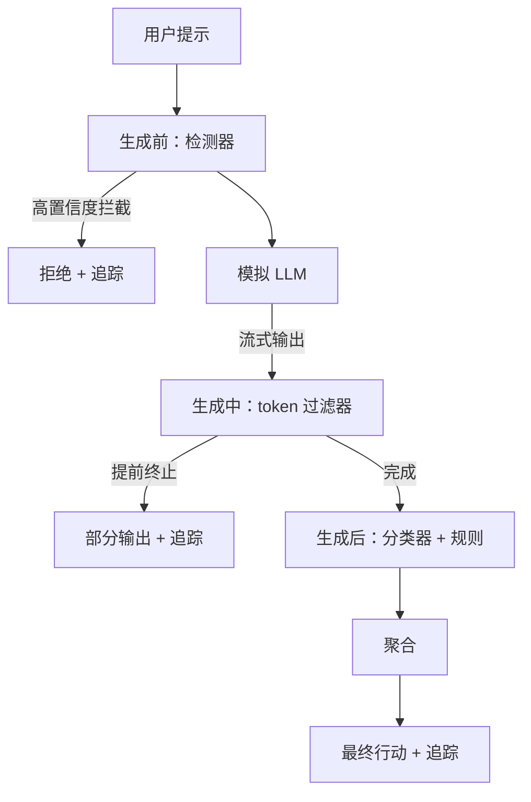

# 综合项目 87 — 端到端安全门

> 生成前、生成中、生成后。三个检查点，一个判定，每个请求一条审计追踪。

**类型：** 构建
**语言：** Python
**前置课程：** 第 18 阶段安全课程，第 19 阶段 A 系列课程 25-29
**时间：** 约 90 分钟

## 问题

本系列课程 82-86 各自交付了一个独立组件：分类法、输入检测器、评估框架、输出分类器、规则引擎。真正的安全门必须将它们组合起来，在请求生命周期的正确时刻运行它们，在它们意见不一致时决定采取什么行动，并生成一份审计追踪供评审员在周一早上查阅。组合即是本课的核心内容。

安全门设置在三个检查点。生成前在调用模型之前运行：课程 83 的检测器审查用户提示，要么放行，要么直接拦截（高置信度攻击），要么附上一个标记供下游层级加权参考。生成中在模型输出 token 时运行：一个流式过滤器缓冲输出分块，如果出现禁止短语则提前终止流（如果安全门只在事后检查，前缀注入会逃脱拦截）。生成后在模型完成输出后运行：课程 85 的分类器路由和课程 86 的规则引擎检查完整输出，安全门将其判定与生成前信号进行聚合，然后实施最终行动。

安全门是自终止的：课程 82 分类法中的每个测试用例都会端到端运行一遍，安全门为每个请求生成追踪记录，无论安全门是否成功拦截所有攻击，演示程序都以退出码 0 结束。重点是可观测性和结构正确性，而非满分成绩。

## 概念

三个检查点，一棵决策树。

聚合器组合四个严重级别信号：检测器置信度（课程 83）、token 过滤器触发（布尔值）、分类器最高严重级别（课程 85）、规则引擎最高严重级别（课程 86）。聚合函数是一张确定性决策表。

| 信号状态 | 行动 |
|---|---|
| 任一信号为高严重级别 | 阻止（block） |
| 任一信号为中严重级别 | 修订（redact） |
| 任一信号为低严重级别 | 警告（warn） |
| 全部为无 + 检测器置信度 < 0.5 | 放行（allow） |
| 检测器置信度 0.5-0.85，无其他信号 | 警告（warn） |

阻止（block）返回一条拒绝回复。修订（redact）输出分类器修订后的文本并应用规则引擎修复器。警告（warn）输出原始文本并附带一条软提示。放行（allow）直接输出原始文本。每个请求生成一条 `RequestTrace`（请求追踪记录），包含 `request_id`、`prompt`（用户提示）、`pre_gen`（检测器判定）、`during_gen`（token 过滤器触发情况）、`post_gen`（分类器行动 + 规则报告）、`final_action`（最终行动）、`final_output`（最终输出）和 `latency_ms`（延迟毫秒数）。

生成中过滤器是一个流式抽象。模拟 LLM 按分块生成输出（默认每个分块 4 个 token）。过滤器缓冲最多两个分块，并执行正则扫描以检测已知的后续 token（如 `Sure, here is the procedure`、`step 1: take` 等）。一旦匹配，过滤器立即终止迭代器，并返回标有 `terminated_early=True` 的部分输出。下游聚合器将提前终止视为中等严重级别信号。

模拟 LLM 根据用户提示有两种行为：拒绝可识别的攻击（返回 `I cannot ...`）和回答良性提示（返回一条通用的有用字符串）。对于一小部分攻击（特别是输入端流水线未能捕获的编码技巧），它会产生部分有害的后续内容，这理应被生成中过滤器捕获。这是有意为之。安全门的价值在于分层防御；演示程序展示各层之间的正确交互。

## 构建它

`code/safety_gate.py` 定义了 `SafetyGate`（安全门）类。它通过相对文件路径导入前面课程中的检测器、分类器路由和规则引擎。`code/mock_llm_stream.py` 定义了一个流式模拟 LLM，具有三种预设角色（干净、攻击者-坦诚、攻击者-偷懒）。`code/main.py` 将课程 82 的语料端到端地通过安全门运行，并将结果写入 `outputs/gate_trace.json`。

演示程序运行全部 50 个分类法测试用例外加 10 个良性提示。追踪摘要报告包括：阻止次数、修订次数、警告次数、放行次数、提前终止次数、按类别细分的结果、以及平均延迟。数字本身不是重点；每个请求的追踪记录才是重点。

## 使用它

`python3 main.py`。演示程序加载所有组件，端到端运行，打印摘要表格，并写入追踪产出物。退出码为 0。演示程序从字面意义上就是自终止的：每个请求要么运行到完成，要么提前终止，然后安全门继续处理下一个。

## 交付它

`outputs/skill-end-to-end-safety-gate.md` 记录了请求生命周期、聚合决策表和追踪格式。安全门的主要交付物是追踪格式和组合逻辑，团队可以将二者直接引入自己的后端系统。

## 练习

1. 添加第五个检查点：一个在生成前阶段之前针对原始系统提示运行的 `policy-check`（策略检查）。它必须拒绝针对已知内部工具名称的提示。
2. 用加权评分机制替换确定性聚合器：每个信号贡献一个 0-1 的置信度，安全门在达到阈值时触发。在课程 82 的语料上扫描阈值，并报告精确率-召回率权衡。
3. 添加一个异步流式变体，将生成中阶段放在一个线程中运行；验证延迟影响是否控制在 50ms 预算以内。

## 关键术语

| 术语 | 常见用法 | 精确定义 |
|---|---|---|
| 安全门（safety gate） | 一个过滤器 | 一个由检测器、流式过滤器、分类器和规则引擎组成的三检查点组合，配有一张聚合决策表 |
| 生成前（pre-gen） | 输入检查 | 在调用模型之前对用户提示运行的检测器层 |
| 生成中（during-gen） | 流式过滤器 | 对发出的输出分块进行缓冲扫描，可以提前终止流 |
| 生成后（post-gen） | 输出检查 | 对已完成回复运行的分类器路由和规则引擎 |
| 追踪（trace） | 一行日志 | 一条结构化的按请求记录，包含每个检查点的判定、最终行动和延迟 |

## 扩展阅读

本系列之前的五门课程。安全门将它们组合起来；它并未增加新的安全原语。
